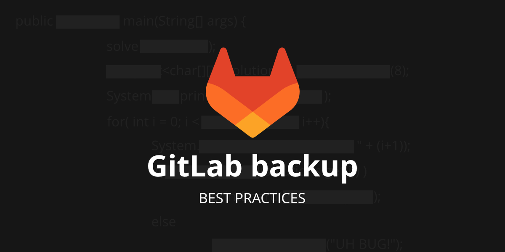
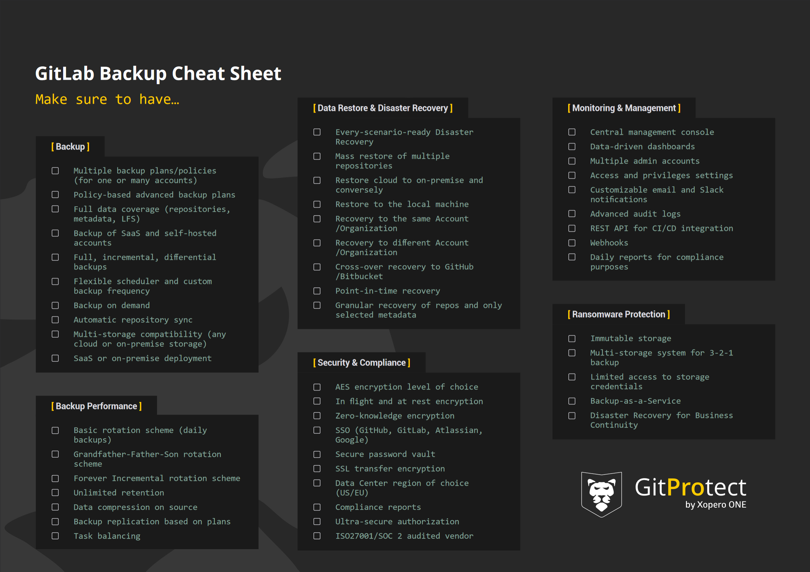

**Security, availability, solidity** - that’s what comes to mind when somebody mentions GitLab. This Git hosting service is one of the most trustworthy when it comes to security. Thus, no surprise that more than 30M developers worldwide have already chosen to build their source code on GitLab. 

**However, what if your data is still at risk regardless of all the security measures the service provider has?** Yeap… that’s true. And the best way to have peace of mind that your GitLab source code and metadata information remain safe and available in any event of failure is backup. 

<!-- truncate -->

**So, let's look at the reasons why backup should be present in your GitLab security strategy and what backup best practices can help you guarantee continuous workflow.**

## Backup is on guard: Top reasons to start backing up your GitLab environment

Well, you may be overwhelmed with pushing your code, dealing with CI/CD pipelines, and keeping things running smoothly, but what if something happens to your work? Not having a solid GitLab backup strategy is like playing Jenga with your critical data - just one wrong move and things can come crashing down. 

Let’s cut to the chase and speak about the most reasonable argument that can work for you to start backing up your GitLab repositories and metadata. 

### The Shared Responsibility Model

All SaaS providers, GitLab isn’t an exception, operate within the [Shared Responsibility Model or Limited Liability Model](https://gitprotect.io/blog/gitlab-shared-responsibility-model-a-guide-to-collaborative-security/). It means that the service provider and its users work as a team, sharing their duties on security and data protection. 

To make a long story short, GitLab ensures that its systems are top-notch in terms of accessibility, availability, and security while you, as a customer, should bear responsibility for protecting your authorization credentials, and all the data in your code repository. Thus, if something happens to your data, it’s you who will deal with the consequences of data loss.

### Security Compliance

Compliance with security audits, like SOC 2, ISO 27001, GDPR, or HIPAA are critical steps in a software company’s development. If the company has passed security audits, it gets proof of presenting itself as a safe, dependable, and trustworthy service - that’s a solid reason to pass a security audit, yeah? 

However, successful completion of security audits is impossible without a reliable and professional backup strategy. By backing up your GitLab environment, you can meet retention and Disaster Recovery requirements that ensure you have all the historical data you need to pass those audits with flying colors.

### Ransomware protection

Attackers are always eager to get unauthorized access to your data. Just simple statistics - ransomware attacks happen on average every 11 seconds. Moreover, hackers are becoming more and more creative in their attacks. They search for vulnerabilities in GitLab systems and by using these security flaws gain access to GitLab users’ repos to push ransomware to them. Only in 2023, [GitLab patched 6 critical vulnerabilities](https://gitprotect.io/blog/gitlab-vulnerabilities-and-security-incidents-2023-in-review/) that attackers could use to place ransomware, perform data theft, and other follow-on attacks. 

### Outages, human errors, and other data loss incidents

If you think that GitLab can’t go down, you’re mistaken. Let’s track the history - in 2017 GitLab had one of its [largest outages](https://techcrunch.com/2017/02/01/gitlab-suffers-major-backup-failure-after-data-deletion-incident/) when due to the unintentional deletion of data from the primary database servers (human mistake!), GitLab.com service was unavailable for hours. 

No one is perfect… human mistakes, outages, and natural disasters - all of that can lead to data loss and, with it, threaten business continuity. What’s more, they can result in financial loss. 

## GitLab backup best practices & secure backup tips

As soon as we get the threat landscape and the reasons to integrate backup into CI/CD processes, let's look at the backup options available. First, we should mention that GitLab has its own dependability measure for its users to do backup jobs - a built-in backup and restore utility, GitLab rake. This function permits GitLab users to create an archive file that includes all their GitLab data - Git repositories and attachments. 

However, the GitLab rake function doesn’t include GitLab users' configuration files, TLS keys, system filers, and certificates due to encrypted data the database contains, 2FA, the CI/CD ‘secure variables’, and other reasons. What’s more, using this option, you can restore your data only to the same GitLab version and type - whether it’s Community Edition or Enterprise Edition - it was created on. 

Another option is to write your backup scripts, which again is a manual process that requires a delegated developer from your team to perform backups on a daily basis and check if those copies work well. From the beginning, it may appear useful and a little bit of resource commitment, though, over time it will end up requiring a significant amount of both time and money. Moreover, your team will need to write an additional script, a recovery one, and there is no guarantee that it will work out. 

The third option is to integrate an automated, professional, third-party [GitLab backup and Disaster Recovery software](https://gitprotect.io/gitlab.html), like GitProtect.io into your CI/CD processes. Thus, you will be able to set your backup policy, get access to numerous professional security features, including ransomware protection, reach out to an experienced support team, and, in the event of failure, quickly respond with restore and Disaster Recovery that foresee any data loss scenario, ensuring your team stays on top of security regulatory, and compliance standards. 

Let’s move on and dive into the heart of the matter and find out which backup tips and backup best practices can help you create a reliable GitLab backup strategy for your business continuity and healthy hygiene of your DevOps environment.  

### Full data coverage

It’s obvious that if you expect to get all your GitLab organization’s data back fast in the event of failure, your backup policy should cover all the data in your company’s GitLab repository. Precisely, your backup needs to include repositories, wikis, issues, issue comments, deployment keys, pull requests, pull request comments, labels, milestones, webhooks, pipelines, actions, tags, LFS, branches, variables, releases, commits, snippets, GitLab groups, and project’s topics. 

### Unlimited retention can be a game-changer

GitLab as any Git hosting service wouldn’t keep your data forever. The service provider permits its users to keep their data for up to 90 days after deletion. However, what if your organization requires to keep such data for a much longer time, let’s say to meet security, legal, or compliance requirements, like SOC 2 or ISO 27001? Implementing professional GitLab backup software, you should have an opportunity to ensure unlimited retention of your GitLab data. Thus, you will be able to overcome storage constraints on the platform, archive old unused repositories in case you need them in the future, restore your critical GitLab data from any point in time, and retain your data for as long as required by legal or your company’s needs. 

### Ransomware protection

Since ransomware is one of the biggest threats the DevOps world faces today, it makes sense to consider using backup software that has some sort of built-in ransomware protection package. Immutable or WORM-compliant storage, that forbids an attacker to change, modify, or delete your data in copies, should be part of this ransomware protection. 

Hover, it’s not enough… It’s worth checking if your backup option allows you to choose the preferred Data Center location for compliance, offers in-flight and at-rest AES encryption with the opportunity to set your own encryption key, and foresees any disaster scenario with its complete Disaster Recovery technology. 

### The 3-2-1 backup rule

It has already been proved that the 3-2-1 backup rule is the classic backup method that helps to ensure data protection. That’s why, it’s critically important that your GitLab backup software enables you to follow this rule and assist in keeping at least 3 copies of data in 2 separate locations, one of which is maintained off-site.

What’s the best way to achieve it? Make sure that your repository and metadata software allows you to add as many data storage instances as you need (both on-premise and cloud ones). If you already use one, your GitLab backup software should support it, whether it’s AWS Storage, Azure Blob Storage, NFS, SMB, Google Cloud, local disk resources, or any other. Moreover, it’s essential that your backup software permits you to replicate the backup copy within all the storage destinations you use for backup. 

### Backup as part of the CI/CD process

Let’s not forget that the DevSecOps approach is based on the necessity of integrating security measures through the entire software development process. Thus, your backup software should allow you to quickly and easily revert data to the earlier version of the source code in the event of a human error or any other malfunction. Furthermore, once you include backup in a well-organized CI/CD approach, you will be able to ensure flawless and predictable delivery. You may “set and forget” the process to guarantee peace of mind that everything works as a clock with the best security measures. 

### Backup monitoring features

When it comes to managing and monitoring backup performance, third-party backup software brings lots of advantages. Unlike GitLab backup scripts that are extremely time-consuming in management, the GitLab backup app simplifies it by providing an organization with intuitive data-driven dashboards and a central management console - all in one place. Thus, it’s easier to add additional admins to manage GitLab backups, set roles, and grant permissions within your team. In this case, you have more control over access while sharing responsibilities for data protection with your teammates. 

What’s more, professional backup tools usually provide ongoing monitoring like audit logs, email reports on backup performance, Slack notifications, and compliance reports, which makes it easier to meet strict security audit requirements. 

Finally, with third-party backup software monitoring possibilities, your DevSecOps team will have all the appropriate control and information to respond immediately to any issue on backup, restore, and data protection. 

### Disaster Recovery

Immediate data restore is probably the most important thing related to backups. Actually, why perform backups if there is no guarantee to restore data quickly? As we have already mentioned, backup scripts and DIY methods require you to write an additional restore script to get your data back, which needs time yet there is no guarantee that it will work. On the contrary, backup software provides Disaster Recovery technologies that guarantee data restore in any data loss scenario. 

For example, if your organization faces a service downtime or a threat actor’s attack, you should have different options to restore your entire GitLab environment. It can be the same or a new GitLab account, another Git hosting service provider (GitHub or Bitbucket), or your local machine. Let’s remember that Disaster Recovery’s primary objective is to guarantee DevOps process continuity, eliminating downtime, data loss, and consequent financial and reputational damage. 

To immediately get your data backup in case of a human error, it’s vital to have the possibility to granularly restore only those repositories or pieces of data without the need to restore your entire GitLab ecosystem. Point-in-time restore allows you to recover necessary GitLab data from any moment in time, whether it’s hours, days, months, or even years. 

## Takeaway

DevOps security is no longer a domain of a few security specialists. It’s the entire company’s team that shares responsibilities for protecting their critical source code data and addressing security issues prior to the software being developed and deployed. Given the growing number of threats and “shifting left” approach, GitLab backup should be considered a key security measure in data protection strategy. However, we shouldn’t forget that security functions as an integrated system. That’s why, it’s more than necessary to enable security scanning, and detection of vulnerabilities, bugs, flaws, etc. 

By putting security first and adopting the “everyone is responsible for security” technique, you can improve your devs’ productivity, ship faster, and ensure that your software is secure. 
