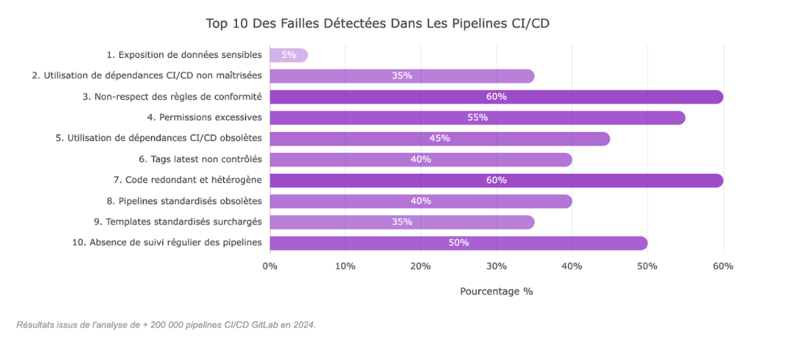

🚨 **Attention** – Ce rapport révèle les vulnérabilités critiques cachées dans les pipelines CI/CD – pas dans le code applicatif. Ne confondez pas les deux.

## Panorama des Failles CI/CD

### Résultats issus de l'analyse de + 200 000 pipelines CI/CD GitLab en 2024.

## Impacts pour les entreprises

| Problème | Impact pour l'entreprise |
|----------|--------------------------|
| 1. Exposition de données sensibles | Fuite d'informations confidentielles, vol de données stratégiques |
| 2. Utilisation de dépendances CI/CD non maîtrisées | Risque élevé d'attaque supply chain et d'injections malveillantes |
| 3. Non-respect des règles de conformité | Risque de sanctions de conformité, perte de contrats et d'image |
| 4. Permissions excessives | Compromission, suppression ou vol de données critiques |
| 5. Utilisation de dépendances CI/CD obsolètes | Vulnérabilités connues exploitables par des attaquants |
| 6. Tags latest non contrôlés | Intégration de versions non sécurisées, impossible à auditer |
| 7. Code redondant et hétérogène | Maintenance coûteuse, complexité accrue, dette technique élevée |
| 8. Pipelines standardisés obsolètes | Perte de temps, absence d'adoption des "best-practices" |
| 9. Templates standardisés surchargés | Configuration incohérente, non sécurisée et non conforme |
| 10. Absence de suivi régulier des pipelines | Risque accru d'erreurs, de dérives et de non-conformité |

## Analyse approfondie : Problèmes, impacts ISO 27001 et solutions possibles

### 1. Exposition de données sensibles
**Problèmes :** Certains pipelines exposent directement des clés d'API, tokens et identifiants dans leur configuration.  
**Impacts :** Un attaquant peut exploiter ces informations pour voler des données ou prendre le contrôle d'autres services internes.  
**Solutions :** Utiliser un stockage sécurisé des secrets (ex: HashiCorp Vault). Auditer et scanner automatiquement le code des pipelines pour détecter toute exposition involontaire.

### 2. Utilisation de dépendances non maîtrisées
**Problème :** Des packages tiers sont utilisés sans validation de leur origine.  
**Impact :** Un attaquant peut injecter du code malveillant dans une mise à jour d'un package compromis.  
**Solutions :** Mettre en place une liste de confiance des sources de dépendances autorisées. Intégrer des scans de vulnérabilités.

### 3. Non-respect des règles de conformité
**Problème :** Security gates et quality gates non respectées.  
**Impact :** Fausse perception de contrôle et de sécurité, violations passent inaperçues.  
**Solutions :** Définir des règles de conformité CI/CD centralisées. Automatiser les contrôles de conformité.

### 4. Permissions excessives
**Problème :** Des utilisateurs non contrôlés peuvent modifier les pipelines.  
**Impact :** Risque de compromission des pipelines.  
**Solutions :** Restreindre les accès selon le principe du moindre privilège. Auditer régulièrement les permissions.

### 5. Utilisation de librairies obsolètes
**Problème :** Les pipelines utilisent des dépendances non mises à jour.  
**Impact :** Exposition à des failles de sécurité critiques.  
**Solutions :** Automatiser la détection et la mise à jour des dépendances.

### 6. Tags latest non contrôlés
**Problème :** Utilisation d'images Docker taguées latest de manière incontrôlée.  
**Impact :** Risque d'injection de code malveillant.  
**Solutions :** Appliquer une politique stricte sur les images utilisées.

### 7. Code redondant et hétérogène
**Problème :** Les pipelines sont dupliqués sans standardisation.  
**Impact :** Augmentation des coûts de maintenance.  
**Solutions :** Déployer des templates CI/CD centralisés.

### 8. Pipelines CI/CD standardisés obsolètes
**Problème :** Les templates ne sont pas mis à jour régulièrement.  
**Impact :** Utilisation de pratiques dépassées.  
**Solutions :** Automatiser l'audit et la mise à jour des templates.

### 9. Templates standardisés surchargés
**Problème :** Les utilisateurs modifient les templates standardisés.  
**Impact :** Configuration non conforme.  
**Solutions :** Automatiser l'observation des dérives.

### 10. Absence de suivi régulier
**Problème :** Certains pipelines ne sont jamais contrôlés.  
**Impact :** Accumulation de failles de sécurité non détectées.  
**Solutions :** Documenter les pipelines CI/CD. Mettre en place des revues régulières.

---

**Source**  
Analyse de +200 000 pipelines CI/CD sur GitLab en 2024.

---

**Mots-clés SEO :** CI/CD, sécurité des pipelines, conformité ISO 27001, vulnérabilités CI/CD, gestion des dépendances, meilleures pratiques CI/CD.

