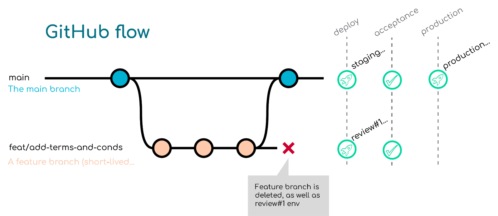

#more

# Tips for beginners in CI/CD and automation

We gathered for you the tips and tricks from people already doing CI/CD. It’s all the advices they would have love to get when they begin their own journey, learned (sometimes) the hard way! 👏

## Tips n°1: think your Git workflow strategy

It all starts here: your branch strategy will impact your CI/CD pipelines. You need to think of it before building your pipeline, in order to make sure it will be the more efficient possible!

You can find some good [Git branch strategy](https://www.gitkraken.com/learn/git/best-practices/git-branch-strategy.) on GitKraken. You can also use the tool to visualize all your branches for your projects!

Here is the GitHub flow we prefer and use at R2Devops:

<!-- truncate -->

Retrieve all details about git workflows on [ToBeContinuous](https://to-be-continuous.gitlab.io/doc/understand/)!

:::info
    You need to create your pipeline so it can be easily tested in a feature branch with minimal changes.
:::

Use forks carefully while creating your pipeline. If there are steps you only execute on "main", make sure you don’t do it in the  "main" of a forked repo. You need to be careful while working with branches.

## Tips n°2: Keep It Simple and Stupid

You don’t need to do complicated things for your CI/CD. Actually, the simpler, the better!

:::note[3 reasons why you should keep your pipeline simple]

    1. It’s easy to understand for you and your coworkers

    2. It will take less time to execute

    3. It requires less work for the maintenance
:::

## Tips n°3: keep your pipeline fast and safe

Two factors are important to keep in mind when you build your pipeline: its speed of execution and its security.

:::info[To ensure its speed, you can use jobs that perform better.]

The second major factor is the security of your pipeline. To keep it safe, you’ll have to maintain the jobs in it! It means checking once in a while if updates are available for them, checking if you need the improvements on every job, and adapt your pipeline. You should also stay informed about security issues in other programs your jobs may rely on.
:::

:::info[You can easily manage the updates of your CI/CD pipelines using [R2Devops](https://r2devops.io/)!]

    Logging into the platform, you can link all your projects and use the **Pipelines Updates** features to be warned every time one of your pipeline can be updated!
:::

## **Tips n°4: Try again and again**

Theory is important, but only practices will make you perform in CI/CD. Every company and environment are different, and we are not talking about the number of platforms you can use to build your pipeline, with each of them their specifications, languages and requirements.

:::note[Some CI/CD platforms]

    * [GitLab Auto DevOps](https://docs.gitlab.com/ee/topics/autodevops/)

    * [GitHub marketplace](https://github.com/marketplace?type=)

    * [Jenkins](https://www.jenkins.io/)

    * [Circle CI](https://circleci.com/)

    * [Bitbucket](https://bitbucket.org/)

    * …
:::

## Tips n°5: use declarative pipelines

You have to use declarative pipelines. They support the use of conditional statements, allow access to environment variables, and offer the possibility to add logging and error handling. To improve the readability and understanding, you may commit the pipeline definition in your git repository.

You will maintain easily your pipeline if you can understand quickly what your pipeline was made for.

:::note[To sum up, comment and document your code!]
:::

## Tips n°6: Rely on Docker agents

Docker agents can give you flexibility and allow you to avoid using a set of synchronized runner hosts with dependencies. You can run your pipeline in a container that include an image of whether application you need, and you don’t have to install it directly on the host.

:::info[Visit the [Docker](https://www.docker.com/products/docker-hub/) website for more information about Docker Hub.]
:::

## Tips n°7: think about reducing clutter in your artifact repositories

Reducing clutter can save you time and energy. For example, if your commit is not on the main directory, there is no need to use a brand-new artifact in the registry. You just have to use a floating version for your latest commit of the dev branch for pulling and deploying it!

## Tips n°8: Avoid Private Libraries and Submodules

Dependencies such as private npm modules or submodules may give you problems during the setup process of the CI configuration. For example, if you have a submodule and by default your CI can only access your repository via http and an authorization token, your local machine configuration via git will not work. To make it work, you need to override your submodule, but only a few CI tools have this functionality.

## Tips n°9: Start with a container-native system

Newer pipelines queue containerized jobs with input and output. Each job you want to run is defined like a container. This makes things more flexible, as your CI/CD nodes don't need any other special setup/configuration than being able to run containers.

:::info[Global tips: Learn bash/vim/terminal navigation, its what holds CI/CD together!]
:::