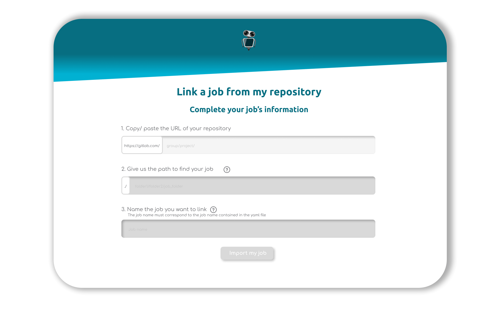

#more

# R2Devops is registered as a GitLab alliance partner

Since February 2022, R2Devops has joined [GitLab technical partners’ list](https://about.gitlab.com/partners/technology-partners/#continuous-integration)! It’s a stamp validating our engagement to simplify developers life and improve the solutions for the DevOps community.

<!-- truncate -->

## Promote continuous integration and ease CI/CD onboarding

Continuous integration and Continuous Deployment are one of many cornerstones of DevOps processes. In GitLab, jobs are the resources used in your .gitlab-ci.yml file allowing you to **check continuously your code** and push it to your users as soon as it’s validated.

But creating those jobs requires a lot of time, as well as maintaining them. Not to mention the competences needed in your team to implement the first pipeline. Using R2Devops, you will **access official jobs and jobs developed by the community** to build easily your pipelines. 

Furthermore, in order to simplify the collaboration with GitLab, we developed a new version of R2Devops, in which you can **link your own GitLab's jobs**. Now you can **share them with anyone without effort**, and enjoy all the features of R2Devops. Among them, your documentation will now be build automatically from the data of your README file.

##  Shared values between partners: the power of open source

As GitLab, **we promote transparency, efficiency and collaboration**. These are the 3 essential values to build an open source project. 💪 

But it’s not only the project that is **open source**: our mindset follows the same road. We promote these values in every step of our work!

The joint alignment of our values is the confirmation of our mutual goal: **make CI/CD a must-have for every tech company, and revolutionize the way projects are developed**. 

### What’s next

We plan on conquering the world and see R2Devops in every GitLab’s pipelines. But first, we want to extend our jobs’ library in order to support every developer in its CI/CD tasks. **If you want to build the open source CI/CD of tomorrow, join us on [Discord](https://discord.r2devops.io?utm_medium=website&utm_source=r2devopsblog&utm_campaign=partnergitlab)!**

