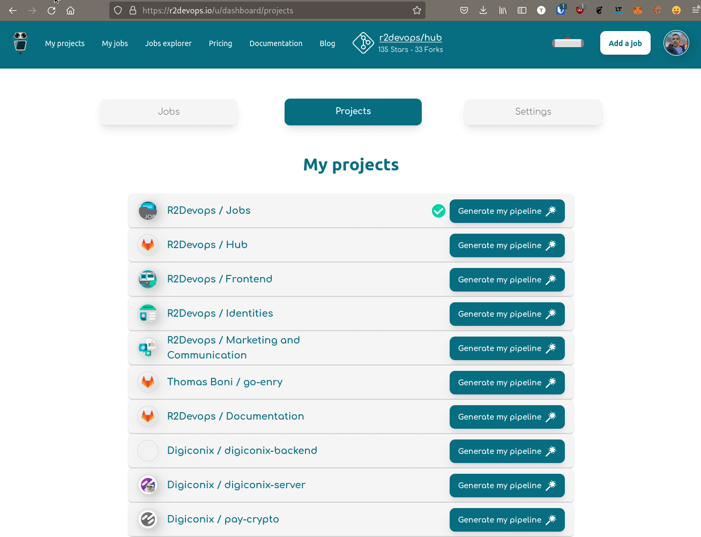

<p hidden>#more</p>


# How to implement faster your CI/CD?

CI/CD increases the frequency of application distribution through automation. Indeed, it automates the process at the application development stage. The main concepts related to the CI/CD approach are Continuous Integration, Continuous Delivery and Continuous Deployment. CI/CD is a best practice for DevOps development. Today, many platforms exist to help you to set up your CI/CD pipeline. GitLab is one of them! Let’s see how this one works.

## How to normally implement a CI/CD pipeline on GitLab?

Implementing a CI/CD pipeline can be scary if you don’t know where to start. Let’s see how you can implement it on GitLab!

### The first step: define stages

In order to set up your pipeline, the first thing you need to do is to define the [stages](https://docs.gitlab.com/ee/ci/yaml/index.html#stages). They are really important in CI/CD because they define when a job will be executed.

A typical GitLab pipeline may consist of four steps, executed in the following order:

1. Build
2. Test
3. Staging
4. Production

<!-- truncate -->

Of course, you can still define more stages! There are no right or wrong ones for your pipeline, only the one you need. (Obviously, you can’t build your application after the deployment!). To configure your pipeline and define stages, you have to use the keyword “stages” in the .gitlab-ci.yml configuration file.

Here is an example:

```

stages:

- Build
- Test
- Staging
- Production

```

### Write CI/CD jobs for your projects

Speaking of jobs, let's go into a little more detail on the subject! The second thing you have to do for implementing a CI/CD pipeline on GitLab is to write some [jobs](https://docs.gitlab.com/ee/ci/jobs/). They are the core of the pipeline. Like we said earlier, jobs are defined by stages, which rules when they should be executed. A job contains at least the script. Moreover, you can define as many jobs as you wants in the configuration file of your pipeline.

Below, you can see  how you define a job in a yaml file:

```

job1:  

script: "execute-script-for-job1"

job2:  

script: "execute-script-for-job2"

```

The problems with writing jobs, is that it takes a lot of time. Developers don’t like to spend too much time setting up their CI/CD because they want to focus on their core activity: coding. 

Moreover, defining jobs requires specific technical abilities, and it may not be the priority of a developer, even if implementing CI/CD in projects is nowadays almost inevitable. Indeed, CI/CD allows automation and speed up the development and the deployment of your projects while ensuring a good code quality.

## How to quickly implement your CI/CD with R2Devops?

We have seen how to implement a CI/CD pipeline on GitLab, let’s see how we can solve these problems with R2Devops.

### Use directly jobs created by CI/CD developers

As we said, the main part to configure a CI/CD pipeline is writing jobs. It’s a task that requires a lot of time. In order to support you and help you save time, we have built the [hub](https://r2devops.io/_/hub).

Here, you can access a multitude of jobs, plug-and-play and customizable, for many programming languages! To use them, you only need to copy/paste the include link found in the documentation of each job.

You can also access all the code, copy and modify it as you want. This CI/CD jobs library will help you gain a lot of time implementing your CI/CD!

### Save even more time with the Pipeline Generator

**⚠️this feature is currently disabled on R2Devops⚠️**  
  
The hub helps you to save time, but can we ease even more the pipeline creation? Of course, we can! Thanks to the R2Devops’ [Pipeline Generator](https://pipeline.r2devops.io), you can save up to 1 hour per day per developer.

The Pipeline Generator is based on an IA who automatically checks the code of your project and builds the most efficient CI/CD pipeline for it. In one click, your gitlab-ci.yml file is created, and your pipeline is deployed on your project. This includes the definition of stages, and the implementation of jobs! Naturally, you can still add customization to your pipeline if you need it. 

!!! info "Read our article about [how to automatically generate your pipeline](https://blog.r2devops.io/blog/Good_practices/generate_pipeline_r2devops/) to learn more about the Pipeline Generator."




### Having trouble setting up your CI/CD?

You still have issues with your CI/CD? The open source CI/CD community on discord will assist you! Developers from all around the world have joined R2Devops community on Discord and can support you to create your CI/CD pipeline. Join the [CI/CD force](https://discord.r2devops.io/?utm_medium=website&utm_source=r2devops_blog&utm_campaign=blog) now!