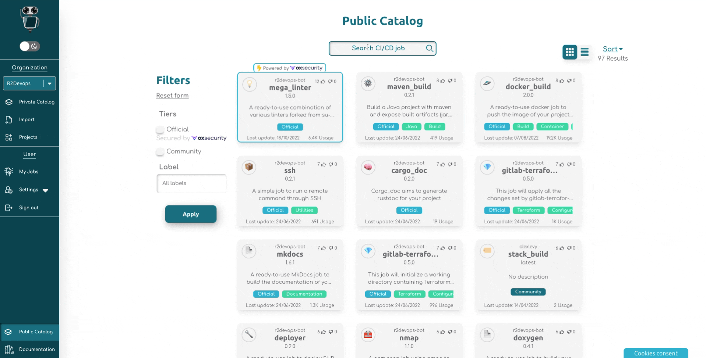

<p hidden>#more</p>

# Update my CI/CD configuration with R2Devops

CI/CD is nowadays mandatory to ensure a good developer experience. It’s primordial to test your code, ensure security, package, build documentation, deploy…  
Today, the challenge is to do all of this faster and faster, while maintaining a high standard of quality. Fortunately, R2Devops can simplify your CI/CD processes and ease the updates of your configuration.

## Why should you use R2Devops for your CI/CD configuration?

As you probably know, configure a strong CI/CD pipeline requires a lot of knowledge, and you spend too much time doing it. Another negative point is that developers usually rewrite their code from a project to another because they don’t centralize their code.

R2Devops is a collaborative and open-source platform of CI/CD jobs, made by developers for developers. Using the platform, it’s the promise to save a considerable amount of time and avoid code duplication. You need only a few clicks to implement a powerful ready-to-go pipeline.In addition, R2Devops also has a strong community of DevOps developers that will help for every question you have about CI/CD.Let’s see how to use the hub to configure a strong pipeline 👇

<!-- truncate -->

## Search for interesting jobs in the hub

The first step is to go on r2devops.io and search for all the jobs you may need.Thanks to the labels, you can see directly what the job is for, and you can also notice at a glance if the job is written by the community or if it’s an official one (developed by R2Devops’ team). You want to know a bit more about official or community jobs? You can check our [FAQ](https://docs.r2devops.io/faq/#r2devops-hub)!  

If you are looking for a specific job, you can use the search bar and retrieve it easily. You can find in the library a job for the most popular languages (Angular, Docker, Go, Gradle,  HTML, Java, JavaScript, Markdown, NPM, PHP, Python, Rust, YAML, Yarn…). Obviously, all jobs are open source and totally free to use!




Below, you will see four useful jobs often used to build, to secure, document, and deploy your code.

### Use docker_build to build your code

[Docker_build](https://r2devops.io/_/r2devops-bot/docker_build) is a job created to build a docker image from a Dockerfile found at the root of your project. Then, it pushes it on one or many remote registries. To build your project, docker_build use kaniko, a tool to build a container image from a Dockerfile. By default, your image is pushed to the GitLab Container Registry of your GitLab instance.

### Secure your development with Gitleaks

[Gitleaks](https://r2devops.io/_/r2devops-bot/gitleaks) is made to find out hardcoded secrets like tokens, passwords, api keys push in your git repository. It’s written in go, a programming language created by Google and inspired by C and Pascal, so it’s really faster than the majority of the others tools you can find.

### Document your work using Mkdocs

[Mkdocs](https://r2devops.io/_/r2devops-bot/mkdocs) is a ready-to-use job to build the documentation of your projec. It allows you to build HTML documentation from a Markdown source. It’s done using  Mkdocs (a static site generator for documentation).  
Thanks to this job, all requirements of Material for Mkdocs are taken care of (installation with Docker image, build the documentation).

### Deploy your documentation with Pages

[Pages](https://r2devops.io/_/r2devops-bot/pages) allow publishing a static website on a web server linked to your project. It is plug and play with all official jobs producing static website in the hub. No need for additional configuration !

## Copy the include URL

Once you have found all the jobs you need for your proHow to miject, you just have to click on them and access the documentation. On the documentation, you will retrieve all the useful information about the job and how to use it. You can also choose the version you want to use for your project thanks to the drop-down button on the right of the page.


Just below, you can find the include URL to use directly the job on your project! Some jobs from the hub are totally plug and play, and to work, they only require this line of code. You just have to put it in the include part of your configuration file.

Moreover, if you want to see all the code, you just have to click on the .gitlab-ci.yml button, and you can reach the job code.

## Configure your jobs with the variables

Some jobs are totally plug and play, but some need some configuration. No panic, everything is provided! On the documentation of each job, you can retrieve all the customizable variables, with their description and their default values.  
You also can find just below an example of the CONFIG_FILE, to see how you can customize the job! To configure the job’s variables, you only have to write the job name and use the variables found in the documentation into your configuration file.

Here’s an example:
```
Docker_build:	variables:		COMMIT_CREATE_LATEST : true
```
In this example, we update the variable “COMMIT_CREATE_LATEST” of the job Docker_build to true. This variable, in a commit context, update the latest tag.This work in the same way to configure all other variables of each job!

## Launch your pipeline

Once your configuration file is done, what you have to do now is to save and commit it. You can now go directly to GitLab in order to launch your pipeline. And it’s done! Pretty cool, isn’t it?  
Now, you can see your whole pipeline and have a look at all the jobs you use. With a single glance, you can see which job passed or not. You can click on each job’s result and identify directly if there are some warnings.

### Join the community of CI/CD developers

Configure your pipeline has never been easier thanks to R2Devops! In only a few clicks, you can implement a strong pipeline for your projects. Moreover, the committed community can answer all your questions and help you on any issue you may have.  
So, don’t hesitate to join [our Discord](https://discord.r2devops.io/?utm_medium=website&utm_source=r2devops_blog&utm_campaign=blog) to be part of a strong CI/CD community!  
See you soon on [R2Devops](https://r2devops.io/)!