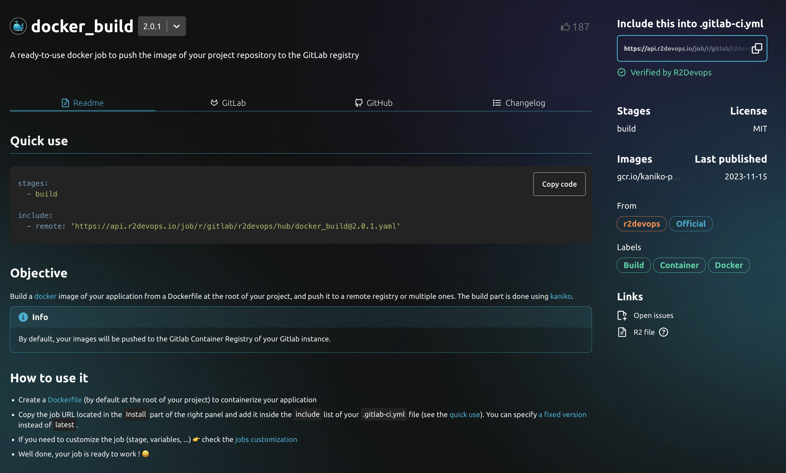
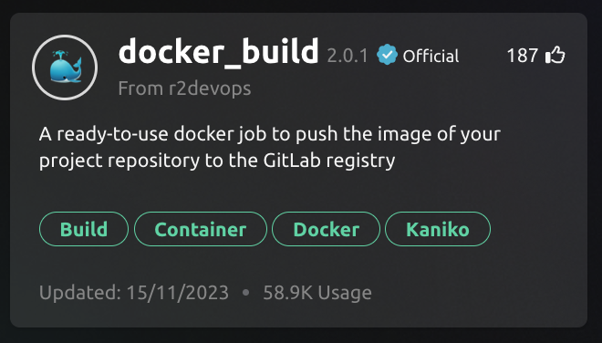

Tired of reinventing the wheel every time you start a new project? R2Devops not only puts an end to this tiresome cycle but also transforms the way your developers interact with and reuse code within your organization.

## 🤯 The CI/CD experience

import Button from '@site/src/components/Button/Button.component';

### ❌ Without R2Devops:

In the pre-R2Devops era, developers often scoured various sources, from existing projects to the vast expanses of the internet, in search of code snippets and configurations. This scattered approach led to inconsistency, wasted time, and the risk of incorporating suboptimal solutions.

### ✅ With R2Devops:

Your developers experience a paradigm shift. Templates become the backbone of your inner source culture. Imagine a centralized catalog of pre-approved, company-specific templates that developers can easily access. The days of searching the internet or project repositories are over.

<!-- truncate -->

#### Enhanced Developer Experience

The developer experience is revolutionized. No more grappling with disparate sources or deciphering convoluted configurations. R2Devops provides a unified, user-friendly interface, allowing developers to browse, select, and implement templates seamlessly.

1. Browse a single source of trust to find your template
2. Select the template version you want to apply to your project
3. Commit with confidence

## 🧩 Innersource CI/CD Templates Benefits

R2Devops introduces the concept of "Innersource Template 🧩" Developers tap into a curated catalog of templates that encapsulate best practices, compliance standards, and optimized configurations specific to your organization. This internal catalog ensures that every piece of code adheres to your company's guidelines.

### 1. Continuous Template Evolution
Imagine a scenario where a team has created a template to automate a specific process. Now, with the evolving needs of projects, updates and improvements are inevitable. In a conventional setup, propagating these updates across all projects could be an intricate process, involving manual adjustments for each implementation.

### 2. Versioning for Seamless Updates
Here's where R2Devops transforms the developer experience. With robust versioning capabilities, any updates or enhancements made to a template are seamlessly versioned and cataloged. This means that when an improved version of a template is released, it becomes instantly available to the entire team.

### 3. Centralized Repository
R2Devops acts as a centralized repository for all templates. This ensures that developers always have access to the latest and most refined versions. The centralization eliminates the need for each team member to manage and track template updates individually.

### 4. Streamlined Collaboration
This centralized and versioned approach simplifies collaboration. Developers can confidently use templates, knowing that any updates will be seamlessly integrated into their workflows. This streamlined process not only saves time but also encourages a collaborative and efficient development environment.

## 💥🚀 Conclusion

With R2Devops, the age-old practice of reinventing the wheel is a thing of the past. Your developers now operate in an environment of collaborative innovation, leveraging the collective expertise of your organization to propel projects forward.

The combination of versioning and centralization in R2Devops empowers developers by providing them with a system where updates are effortless, consistent, and immediately accessible to the entire team. This approach significantly elevates the developer experience, allowing them to focus on innovation rather than struggling with CI/CD updates.

## **Details of an Innersource template:**
- Versioned
- Documented

*Documentation of your Docker_build template*

---

### **Consistency and Compliance Icons:**
- Quickly identify the template purpose
- Apply official badge for your compliant templates
- Add labels to describe your template

*Example of your Official docker_build template*

---

<Button customStyles={{width: "100%"}} type='primary' href="https://r2devops.io">
    🧩 Create my Innersource CI/CD catalog
</Button>
