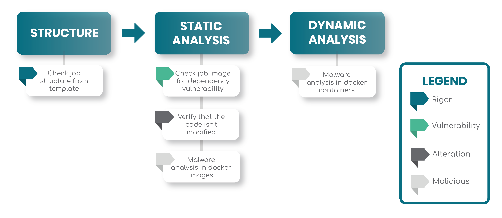

#more

# Why using R2Devops’ official jobs
You probably already heard about CI/CD. If not, we recommend you to read those two articles about [Continuous Integration](https://go2scale.io/continuous-integration-key-step-of-devopss-process/) and [Continuous Deployment](https://go2scale.io/continuous-deployment-in-devops-process-a-must-have/).

As a reminder, a job is a set of instructions to perform actions on your project. Comining several jobs together is the key to create a powerful pipeline. We will explain to you why you should use R2Devop’s official jobs. 👇🏼

## Guaranteed security with official jobs

 On r2devops.io, you will find a [library of CI/CD jobs](https://r2devops.io/_/hub), some are officials and some are published by the community. Official jobs are jobs written or reviewed by R2Devops’ technical team. The community ones are personal jobs put online by the community, without examination from us.

All our official jobs go through a strong security pipeline. We made it to ensure tthey are all safe to use in your pipelines!
Here is a schema of our security pipeline, where you can retrieve all the steps:

<!-- truncate -->

### Guaranteed safety thanks to frequent job updates

We regularly update our jobs so that they receive the latest security patches and remains as efficient as possible. Obviously, we are fully transparent with you, and if a problem occurs on one job, you will be informed immediately. Plus, the issue will be fixed as soon as possible!  
If you want to be notified of the jobs updates, you can join us on [our Discord community](https://discord.r2devops.io?utm_medium=website&utm_source=r2devops_blog&utm_campaign=blog)! This server is more than a way to communicate about R2Devops, our community will truly help you on concerns you may have about CI/CD, on any platform or programming language.

### Use officials jobs to secure your project

In addition to this pipeline, you can find plenty of jobs in the [hub](https://r2devops.io/_/hub), for a multitude of programming languages. Among the official jobs, you retrieve some of them dedicated to security. You can build strong pipelines for your projects with them!   
For example, you can find [php_security_checker](https://r2devops.io/_/r2devops-bot/php_security_checker) job, which checks if your PHP application depends on PHP packages with known security vulnerabilities.  
Other jobs like [gitleaks](https://r2devops.io/_/r2devops-bot/gitleaks) warns you about secrets (passwords, api keys…) you may have pushed in your code.
Put together, all this jobs allow you to strengthen the security of your projects!

## Jobs written by CI/CD experts

All the official jobs you may find on r2devops.io are written or reviewed by our technical team, who are CI/CD experts!

### R2Devops’ ambition

At R2Devops, we want to simplify developer’s life. We are aware that the CI/CD requires a lot of time, and that’s not the first thing developers wants to do.   
That’s why we first created R2Devops: an open-source library of CI/CD jobs. Setting up a pipeline may be time-consuming and hard, but it’s even harder when you have to write all the jobs first.   
Now, the platform is also collaborative. All the members of the community can add their own jobs and contribute to simplify the CI/CD world! Stop losing time, and focus on what you love: coding? That’s what we want to help you achieve with R2Devops.

### The skills of our technical team

How can we talk about the hub without talking about the technical team behind it? It’s thanks to them that we have amazing jobs for the community to really simplify their life!

Let’s describe quickly the technical team:

**Thomas Boni**  
He is the CTO and Co-Founder of R2Devops!  
He holds the position of solutions Architect & DevSecOps expert.  
His philosophy: Passionate about his work, he is a lifelong learning enthusiast!  

**Thibaud Van den Berghe**  
He is the Lead frontend of R2Devops!  
He holds the position of Front-end developer & DevSecOps beginner at R2Devops.  
His philosophy: Creativity and determination 🎤🎶  

### Towards a super pipeline for your projects
We presented to you the strength of our official jobs. Now, imagine you can build an efficient pipeline for your project in one click, with our official jobs: that’s what we have created!  
Our [Pipeline Generator](https://pipeline.r2devops.io) analyzes your git project and automatically creates the best pipeline for you! You could save up to 1 hour a day per developer and focus on your development!
See you soon on r2devops.io 👋

