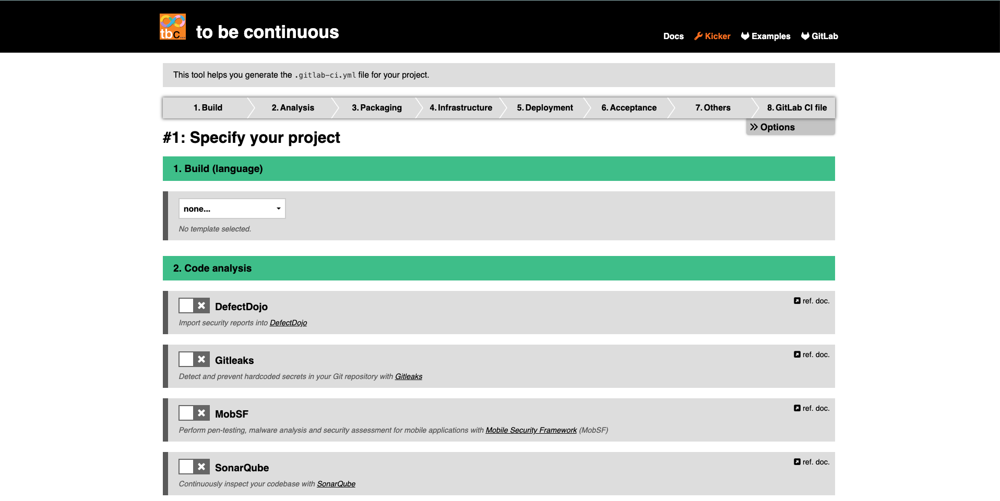

In the world of CI/CD, there is currently a notable absence of projects that
facilitate the knowledge sharing and collaboration among developers. This often
results in developers duplicating efforts and reinventing the wheel. To address
this issue, initiatives like R2Devops and to be continuous have emerged. These
projects promote collaboration and innovation within the open source community,
aiming to improve the quality and reusability of code in the world of CI/CD.
Let's take a closer look at those projects 👇

## What are R2Devops & to be continuous?

Both R2Devops and to be continuous are open-source projects that aim to
simplify the process of creating CI/CD pipelines for developers on GitLab.

The [R2Devops platform](https://r2devops.io) offers a marketplace of open
source CI/CD templates that are versioned & documented. This allows developers
to quickly and easily access a range of pipeline templates, saving them time
and effort in building and maintaining their own pipelines from scratch.

<!-- truncate -->

[to be continuous](https://to-be-continuous.gitlab.io/doc/) is also an
open-source project providing ready-to-use templates developed and maintained
by DevOps & technology experts.  These templates not only save time and effort
but also promote and enforce the best DevOps practices, such as efficient Git
workflows, standard CI/CD stages, shortened dev cycles, DevSecOps tools, and
standardized deployment environments. To easily discover and configure these
templates, developers can rely on
[Kicker](https://to-be-continuous.gitlab.io/kicker/), an interactive tool
designed to generate pipeline code.

Overall, both R2Devops and to be continuous are valuable resources for
developers seeking to simplify and standardize their CI/CD pipeline authoring
processes and improve the efficiency of their software development workflows.

## Collaboration between R2DevOps and to be continuous

R2Devops and to be continuous share a common goal and, as a result, have
collaborated to create benefits for both projects and the community.

One notable outcome of this collaboration is the integration of to be
continuous templates into the R2Devops Marketplace, expanding the range of
options made available to developers when building their pipelines. By
leveraging their strengths, both projects now offer a more comprehensive
solution for the community, resulting in a more seamless experience for
developers and valuable resources to simplify their pipeline authoring
processes.

## Accelerating Standardization through Open-Source

In addition to the obvious benefits of code sharing and reuse, open-source has
the ability to accelerate the emergence of standards.

Proprietary software lacks this capability. One of the beauties of free
software is its ability to catalyze the emergence of standards through the
confrontation of practices in a process of pseudo-natural selection and
self-organized democracy.

R2Devops and to be continuous are clear examples of how providing reusable and
well-maintained resources to developers and businesses can significantly reduce
time, costs and allow developers to focus on other tasks that actually bring
value. But our aspirations are much more ambitious than that. Our ultimate
objective is to contribute to the standardization of the CI/CD domain, so that
one day all DevOps engineers speak a common, trivialized language, just like so
many other areas of IT.

## Conclusion

The recent collaboration between R2Devops & to be continuous marks a
significant breakthrough in the field of open source CI/CD. The pooling of
resources is the first step of a collective construction, that will benefit all
GitLab developers worldwide! By collaborating and promoting open-source
standards, R2Devops and to be continuous are driving innovation and making it
easier for developers to improve their software development workflows.
