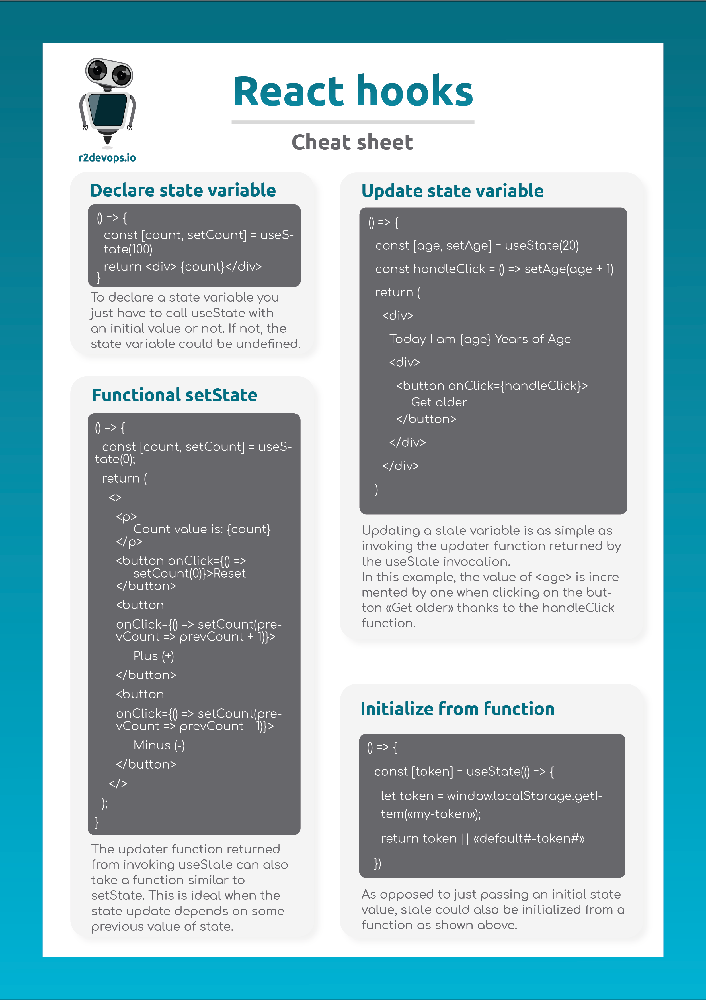
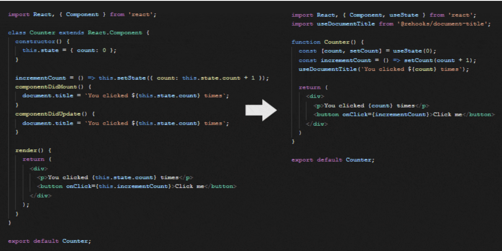

# Start with React Hooks

Hooks have arrived with React 16.8. They allow you to use `state` and other React features without having to write a class. How does it work exactly? Let's check together! 👇🏼



## What are React hooks?

React is a JavaScript library, created by Facebook, used only for the "view" side of the Model View Controller or MVC. Therefore, it is different from other JavaScript frameworks like AngularJS or EmberJS, which are complete frameworks from this point of view. React (without hooks) allowed you to define your components with classes.

React hooks are functions that allow you to use all the functionalities of React classes in functional components. Each React hook’s name is prefixed with the word “use”. Thanks to them, we can develop a React application made only of functional components. Moreover, functional components using hooks are fully compatible with React classes.

:::info
If you want to switch to hooks on your application, you can do it without breaking it. These hooks allow you to replace the state and lifecycle methods of a React class. As they are not classes, the keyword 'this' has no more interest in your code.
:::

You can see the difference between React class and React hooks just below. 👇🏼



<!-- truncate -->

You need to know two things when using hooks:

* They are called at the highest level of a component. This means that you can't call them from a function or sub-function.
* Hooks are called only in functional components. They will not work in a class.

## Benefits of using hooks in your code

React hooks have two major advantages. Let's explain a little more precisely what these are.

### No more mix up between react classes 

Classes not only make code reuse and organization difficult, but they can also be a major barrier to learn React. Moreover, the keyword ‘this’ (uses only in classes), is no longer required with React hooks.

Why is it an improvement? Because, you need to understand how “this” works in JavaScript, which is very different from how it works in most languages. 
Another difficulty is to remember to bind event handlers when you don’t use hooks. There are no unstable syntax suggestions, and the code is difficult to assimilate. 

:::info 
People are pretty good at understanding props, state, and top-down data flow, but still struggle with classes. Thanks to hooks, all of this is only a bad memory!
:::
### Shorter components and better readability

The difference between function and class components in React can lead to disagreements, even among experimented developers. Classes also cause problems with today's tools. For example, classes don't scale down well, making dynamic reloading unreliable.

To solve these problems, hooks allow you to use more features of React without classes. In their conception, components have always been closer to functions. 

:::info
Hooks embrace functionality without sacrificing the practical spirit of React. It provides access to mandatory escape routes, without the need to learn complex reactive or functional programming techniques. 
:::
Class components are much more complex. You need a class to extend React, a constructor to initialize its state, and you need to reference the "this" keyword everywhere. Using functional components eliminates a lot of these problems, making your code shorter, easier to read and maintain.

## Some useful hooks examples

Now that we've seen what are React hooks and their advantages, let's introduce some useful ones. We can find 15 hooks in the [React documentation](https://reactjs.org/docs/hooks-reference.html), and we focused on the two most commonly used.

### UseState 

The useState hook allows you to create, update, and manipulate state inside functional components. React has this concept of state, which are variables that contain data our components depend on and that can change over time. Whenever these variables change, React updates the UI by rendering the component in the Document Object Model, or DOM, with the current values of the state variables.

:::info[The hook takes a single optional argument: an initial value for the state. Then it returns an array of two values:]
* The state variable,
* A function to update the state.
:::

Let's focus on the example of a counter component:

To use a hook, the first step is to import the hook at the top of the file:
`import { useState } from "react";`


Then initialize the hook with a value. Because it returns an array, you can use array destructuring to access the individual elements of the array, like this:
`const [count, setCount] = useState(0);`


You can now write all your components easily:

```
import { useState } from "react";
function Counter() {
    const [count, setCount] = useState(0);
    return (
        <div>
          Current Count: {count}
            <div>
               <button onClick={() => setCount(count - 1)}>
                 Plus(+)
               </button>
               <button onClick={() => setCount(count + 1)}>
                 Minus(-)                                           
               </button>
            </div>
        </div>
    );
}
```

By clicking on the “Plus (+)” or “Minus (-)” button, the value of the number of state variables will change, and the component will be returned with the updated state value.

### UseEffect

The useEffect hook allows you to perform side effects in function components. Side effects are actions that can be performed in parallel with the main operations of a component, such as external API interactions, changing state variables, and retrieving data.

:::info[The useEffect hook accepts 2 arguments:]
* A function with the code to execute,
* An array that contains a list of the component's scope values (accessory, context, and state variables), known as the dependency array. It tells the hook to execute whenever its value is updated. If not provided, the hook will execute after each rendering.
:::

Example:

```
import { useState, useEffect } from "react";

function Counter() {
    // Declare state variables
    const [count, setCount] = useState(0);
    const [product, setProduct] = useState("R2");
    useEffect(() => {
    	console.log(`${product} will rule the world!`);
    });

    return (
        <div>
          Current {product}'s count: {count}
            <div>
               <button onClick={() => setCount(count - 1)}>
                 Plus(+)
               </button>
               <button onClick={() => setCount(count + 1)}>
                 Minus(-)                                           
               </button>
               Change Product:{" "}
               <input type="text" 
                 onChange={(e) => setProduct(e.target.value)} 
               />                        
            </div>
        </div>
    );
}
```

In this example, the effect will run after every state update. The name of the product will automatically change for the user, and we will retrieve the message “[new_name] will rule the world!” in the console.

### Try it, and you will love it!

Hooks are really powerful and simplify React use. Thanks to them, you don’t need to write complicated classes for your projects anymore, and the code readability is improved! You also gain a considerable amount of time using them!

Speaking of saving time, you can read another article we wrote about some [Git commands](/blog/git-command/) we use at R2Devops. See you soon! 👋