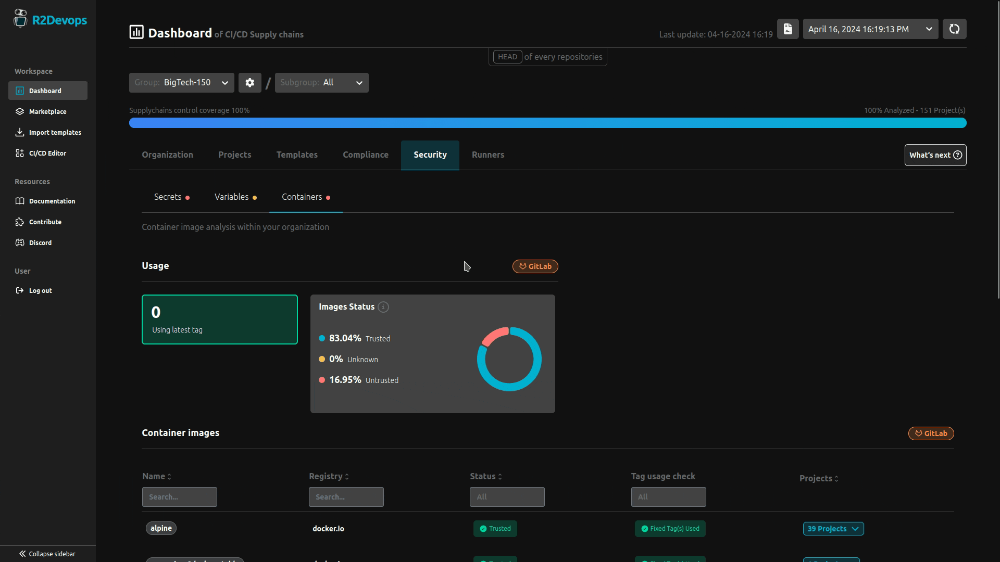

# R2Devops 1.36 Release

import ReleaseBottomButton from '@site/src/components/ReleaseBottomButton/ReleaseBottomButton.component';

:::info[Docker Image Versions]
    - Backend: `v1.36.2`
    - Frontend: `v1.32.3`
    - Helm chart: `v1.36.2`
:::

<!-- truncate -->

## 🔒 Controls Trusted Container Registries | **Self-Managed Only**
- Define your trusted container registries to ensure the security of your
  entire supply chain.

- Quickly identify and secure your supply chain by filtering out untrusted container registries in your projects.

## 🔍 Improve Templates Analysis

- Identify the usage of ci/cd templates in your projects

- We now highlight projects using the latest tag on marketplace templates.

## ⚙️ Minor Updates

- Rename the `Maintainability` dashboard tab to `Templates`.
- Several bug fixes
- Performance improvements

-----

<ReleaseBottomButton />
