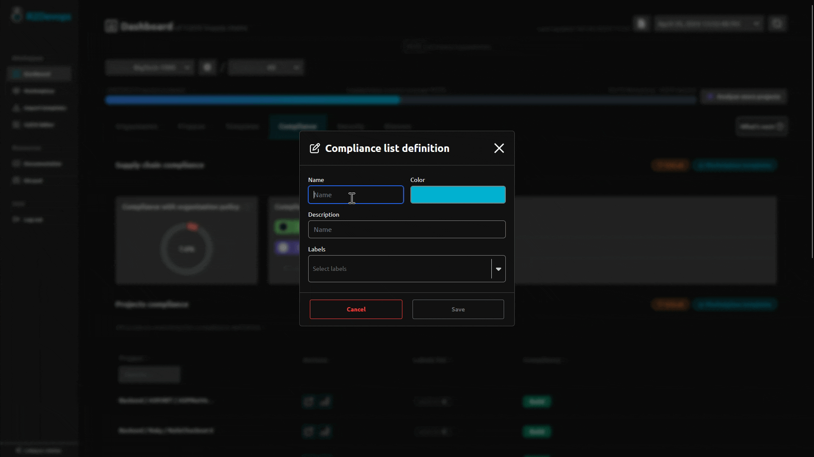

# R2Devops 1.37 Release

import useBaseUrl from '@docusaurus/useBaseUrl';
import ReleaseBottomButton from '@site/src/components/ReleaseBottomButton/ReleaseBottomButton.component';

:::info[Docker Image Versions]
    - Backend: `v1.37.0`
    - Frontend: `v1.33.2`
    - Helm chart: `v1.37.0`
:::

<!-- truncate -->

## 🔍 CI/CD Compliance Settings | **Self-Managed Only**

:::info[What is the 'compliance tab'?]
    The compliance tab inside the R2Devops dashboard allows you to check if projects respect a defined compliance established by the organization.
:::

You can create a compliance list definition, shared across your organization.

**For each list:**

1. Select a name
2. Select a color (optional)
3. Select a description (optional)
4. Select labels (labels assigned to your 'Marketplace templates')
5. Save
6. Your list is now shared across your organization
7. Identify all compliant and non-compliant projects with this list

## ⚙️ Minor Updates

- CI/CD Editor:
     - Improve graphic view to prevent window resizing while typing
     - Restore page access in self-managed localhost instance
- Introduce a debug mode to facilitate support for self-managed R2Devops instances
- Marketplace: Improve loading skeleton design when changing tabs
- Dashboard: Improve registry settings text

-----

<ReleaseBottomButton />
