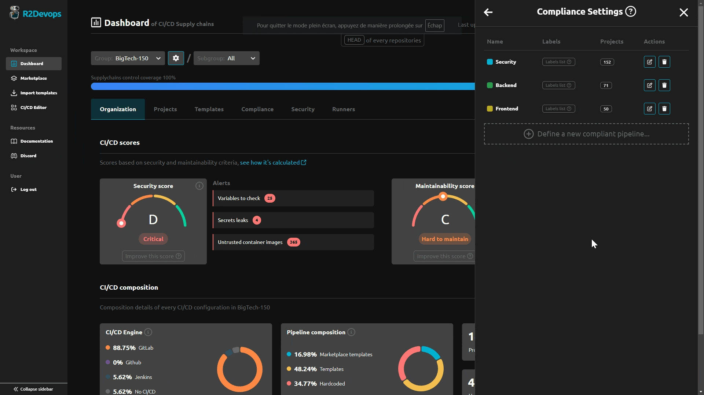
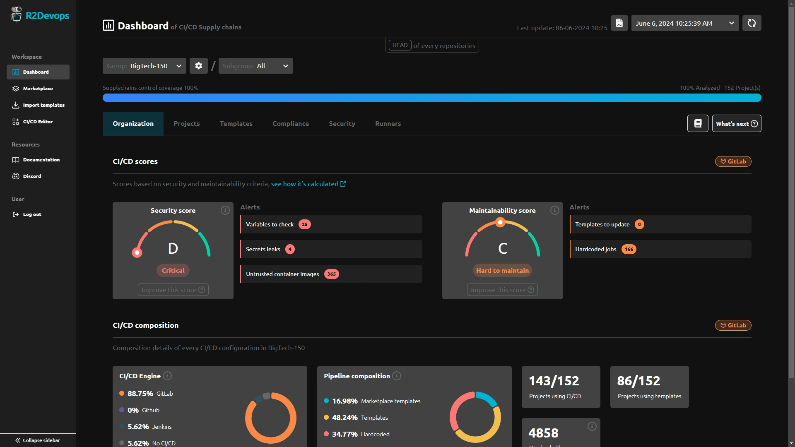

# R2Devops 1.38 Release

import useBaseUrl from '@docusaurus/useBaseUrl';
import ReleaseBottomButton from '@site/src/components/ReleaseBottomButton/ReleaseBottomButton.component';
import ReleaseLabels from '@site/src/components/ReleaseLabels/ReleaseLabels.component';

:::info[Docker Image Versions]
    - Backend: `v1.39.0`
    - Frontend: `v1.34.0`
    - Helm chart: `v1.38.0`
:::

<!-- truncate -->

## 🔍 Enhanced CI/CD Compliance

<ReleaseLabels licenses={[2]} selfManagedOnly />

:::info[What is the 'compliance tab'?]
    The compliance tab inside the R2Devops dashboard allows you to check if projects respect a defined compliance policy established by the organization.
:::

We've expanded the compliance policies to include the ability to assign a list of projects to each policy. This allows for different policies to be set for different projects.

## 📚 Streamlined Dashboard Documentation & New Certifications Section

<ReleaseLabels licenses={[0, 1, 2]} />

:::info[What is the 'Dashboard documentation'?]
    The Dashboard documentation helps you to understand how you can improve CI/CD spotted issues by the analysis. 
:::

We've made the Dashboard documentation more accessible and easier to navigate. Additionally, a new section has been added to guide you on improving your CI/CD based on certifications recommendations.

## ⚙️ Minor Updates

- Introduced a "Save & Analyse" action when modifying organization settings

-----

<ReleaseBottomButton />