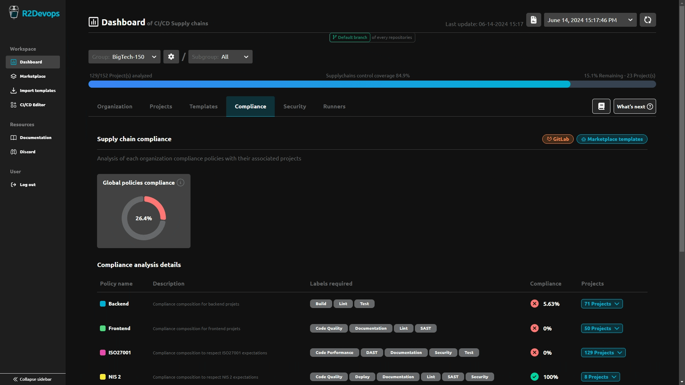
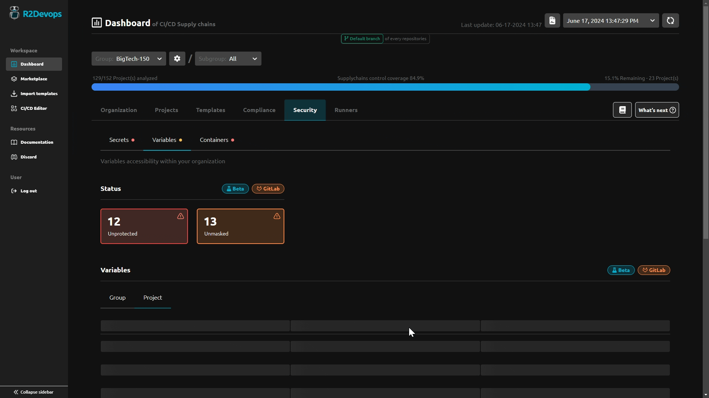

# R2Devops 1.39 Release

import useBaseUrl from '@docusaurus/useBaseUrl';
import ReleaseBottomButton from '@site/src/components/ReleaseBottomButton/ReleaseBottomButton.component';
import ReleaseLabels from '@site/src/components/ReleaseLabels/ReleaseLabels.component';

:::info[Docker Image Versions]
    - Backend: `v1.39.0`
    - Frontend: `v1.35.0`
    - Helm chart: `v1.39.0`
:::

<!--truncate-->

## 📋 CI/CD Compliance Templates Candidate Listing

<ReleaseLabels licenses={[2]} selfManagedOnly />

If a project is non-compliant with his compliance composition policy, you can now list the candidates templates to resolve the non-compliant projects. This feature allows you to easily identify the templates that can be applied to resolve the non-compliant projects.

## 👁️ Reveal CI/CD Variables Values

<ReleaseLabels licenses={[0, 1, 2]} />

You have now the ability to reveal the values of CI/CD variables analysed directly from the R2Devops dashboard allowing you to easily identify the values of the variables used.

## ⚙️ Minor Updates

- Improving label describing that we only analyze default branch on each projects
- Add FDI Urmet logo to the list of clients
- Prevent referencing of R2Devops self-managed public instance project
- Improve home page loading performance

-----

<ReleaseBottomButton />