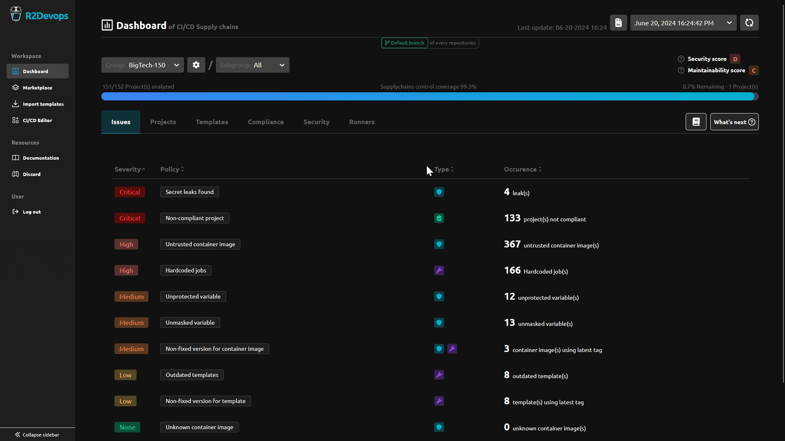

# R2Devops 1.40 Release

import useBaseUrl from '@docusaurus/useBaseUrl';
import ReleaseBottomButton from '@site/src/components/ReleaseBottomButton/ReleaseBottomButton.component';

:::info Docker Image Versions
- Backend: `v1.39.0`
- Frontend: `v1.36.0`
- Helm chart: `v1.40.0`
:::

<!-- truncate -->

## 📋 CI/CD Policies Issues

:::info[What is the 'CI/CD Policies Issues'?]
    It's a summary of the CI/CD issues detected in projects during the analysis
:::

The main view of the dashboard now displays a table of issues related to CI/CD policies, allowing you to:

- Quickly identify issues
- Easily navigate to see more details
- Take action to resolve the issues

-----

<ReleaseBottomButton />