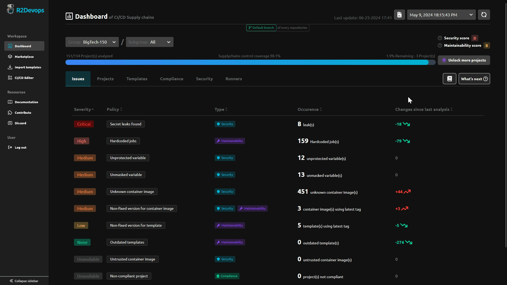
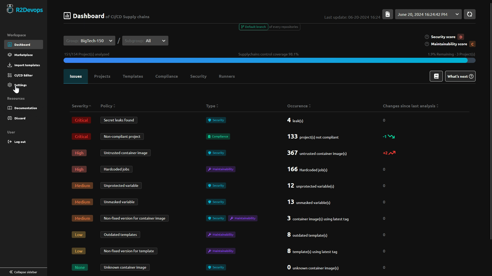

# R2Devops 1.41 Release

import useBaseUrl from '@docusaurus/useBaseUrl';
import ReleaseBottomButton from '@site/src/components/ReleaseBottomButton/ReleaseBottomButton.component';

:::info Docker Image Versions
- Backend: `v1.39.0`
- Frontend: `v1.37.0`
- Helm chart: `v1.41.0`
:::

<!-- truncate -->

## 📋 CI/CD Policy Changes

:::info[What are 'CI/CD Policy Issues'?]
    It's a summary of the CI/CD issues detected in projects during the analysis.
:::

You will now be able to see the changes in the CI/CD policies since the last analysis. This will help you track the evolution of your CI/CD.

## ⚙️ R2Devops Settings Page

:::info[What are 'R2Devops Settings'?]
    These settings allow you to configure:
    - Projects for which you want to use R2Devops
    - Define trusted registries
    - Define compliance policies
:::

Previously, these settings were located on the dashboard. Now, they have their own page.
Descriptions and guidelines have also been improved.

-----

<ReleaseBottomButton />