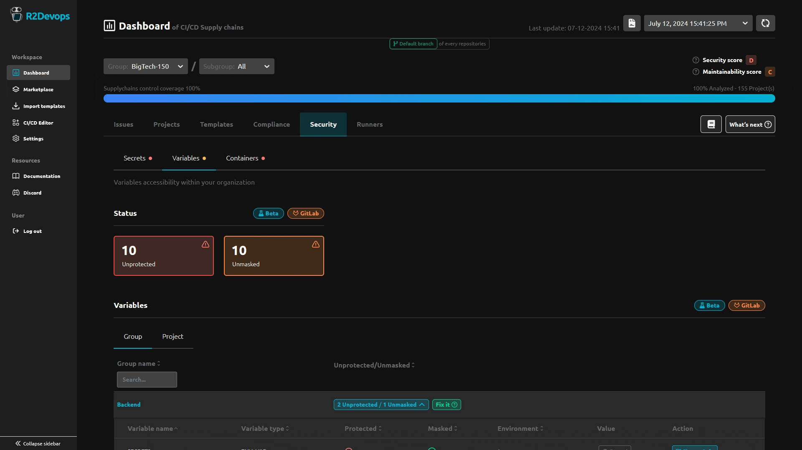

# R2Devops 1.43 Release

import useBaseUrl from '@docusaurus/useBaseUrl';
import ReleaseBottomButton from '@site/src/components/ReleaseBottomButton/ReleaseBottomButton.component';
import ReleaseLabels from '@site/src/components/ReleaseLabels/ReleaseLabels.component';

:::info Docker Image Versions
- Backend: `v1.42.0`
- Frontend: `v1.38.1`
- Helm chart: `v1.43.1`
:::

<!--truncate-->

## 🔧 Improve Variables Configurations Security Management

<ReleaseLabels licenses={[2]} selfManagedOnly />

You will now be able maintain a list of safe variables configurations, allowing you to ensure all your variables are securely managed

## 🛠️ R2Devops instance versions 

<ReleaseLabels licenses={[0, 1, 2]} selfManagedOnly />

Inside the Dashboard settings page, you can now see the versions of your R2Devops instances. This will help you to keep track of the versions you are using and quickly spot if your instance is outdated

{/*  */}

-----

<ReleaseBottomButton />