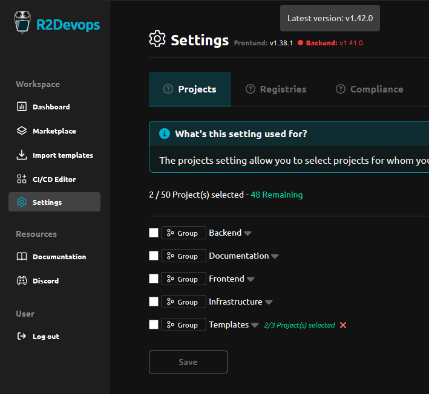

---

title: 1.43 Release  
description: This release introduces enhancements to CI/CD variables controls and R2Devops instance version information.  
tags: [Releases, Analysis, Settings, Variables]  
date: 2024-07-15  

---

# R2Devops 1.43 Release

import useBaseUrl from '@docusaurus/useBaseUrl';  
import ReleaseBottomButton from '@site/src/components/ReleaseBottomButton/ReleaseBottomButton.component';

:::info Docker Image Versions
- Backend: `v1.42.0`
- Frontend: `v1.38.1`
- Helm chart: `v1.43.1`
:::

<!-- truncate -->

## 🔧 Improved Variables Configuration Security Management

You can now maintain a list of safe variable configurations, ensuring all your variables are securely managed.

## 🛠️ R2Devops Instance Versions 

On the Dashboard settings page, you can now view the versions of your R2Devops instances. This feature helps you track the versions in use and quickly identify if your instance is outdated.

-----

<ReleaseBottomButton />