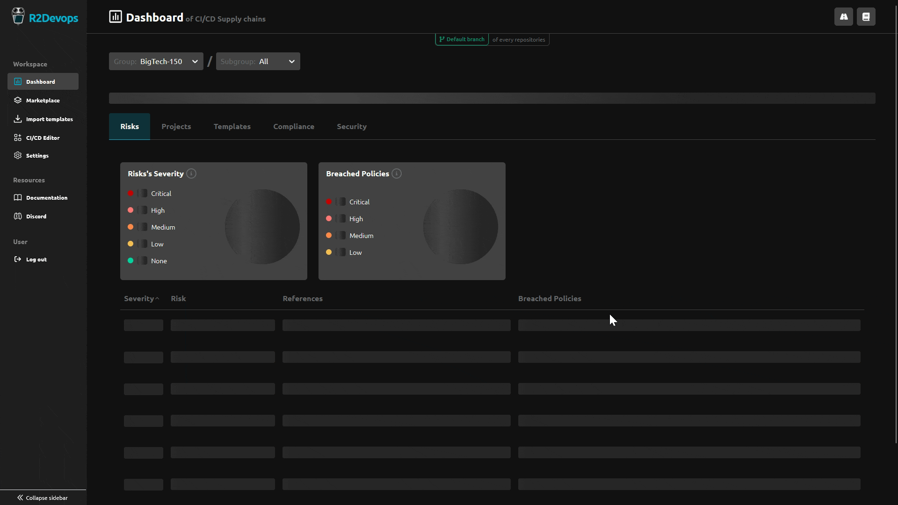

---

title: 1.44 Release  
description: This release introduces a view highlighting exposed CI/CD risks.  
tags: [Releases, Analysis, Risks]  
date: 2024-07-31  

---

# R2Devops 1.44 Release

import useBaseUrl from '@docusaurus/useBaseUrl';  
import ReleaseBottomButton from '@site/src/components/ReleaseBottomButton/ReleaseBottomButton.component';  
import ReleaseLabels from '@site/src/components/ReleaseLabels/ReleaseLabels.component';

:::info Docker Image Versions
- Backend: `v1.42.0`
- Frontend: `v1.39.1`
- Helm chart: `v1.44.1`
:::

<!--truncate-->

## ⚡ Exposed CI/CD Risks

<ReleaseLabels licenses={[0, 1, 2]} />

The main view of the analysis now displays exposed CI/CD risks based on the [Top 10 CI/CD Security Risks from OWASP](https://owasp.org/www-project-top-10-ci-cd-security-risks/).
Each risk is highlighted with a color representing its severity, and you can click on each risk to see more details.

The details section displays the policies associated with each risk, showing the number of occurrences of breached policies. You can click on each policy to see the analysis details and resolve the breached policies.

## ❌ Runners Page Removal

The Runners page has been removed from the analysis dashboard. 
The page did not provide any new value beyond what is available in the GitLab interface. You can manage your runners directly from the GitLab interface.

## ⚙️ Minor Updates

- Added a new navigation bar that contains all global actions of the analysis dashboard.
- Resolved the incorrect display of template names in the Dashboard/Templates tab.
- Improved the loading display of all tables in the analysis dashboard.

-----

<ReleaseBottomButton />