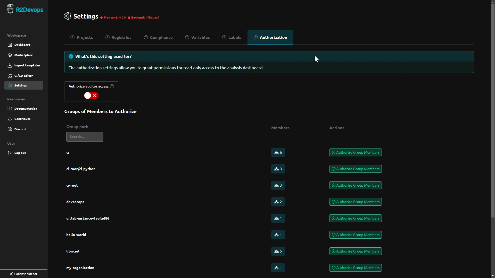

---

title: 1.46 Release  
description: This release introduces the ability to create custom template labels and grant special permissions to access analysis dashboards.  
tags: [Releases, Analysis, Labels, Permissions]  
date: 2024-08-09  

---

# R2Devops 1.46 Release

import useBaseUrl from '@docusaurus/useBaseUrl';  
import ReleaseBottomButton from '@site/src/components/ReleaseBottomButton/ReleaseBottomButton.component';  
import ReleaseLabels from '@site/src/components/ReleaseLabels/ReleaseLabels.component';

:::info Docker Image Versions
- Backend: `v1.44.1`
- Frontend: `v1.41.5`
- Helm chart: `v1.46.3`
:::

<!--truncate-->

## 🔐 Authorization Settings

<ReleaseLabels licenses={[2]} selfManagedOnly />

You can now grant permissions for read-only access to the analysis dashboard. These permissions can be assigned to users with [GitLab Auditor access rights](https://docs.gitlab.com/ee/administration/auditor_users.html) or to all groups' members.

## 🏷️ Label Settings

<ReleaseLabels licenses={[2]} selfManagedOnly />

The label settings allows you to create custom labels for your templates. This feature enhances your control over your organization's CI/CD pipeline steps (compliance) by enabling you to define and manage your own standards.

## ⚙️ Minor Updates

- Improved the loading display for the "Flag as Safe" action on variables.
- Updated content on the Roadmap page.
- Improve consistency between template visibility and repository visbility.

-----

<ReleaseBottomButton />