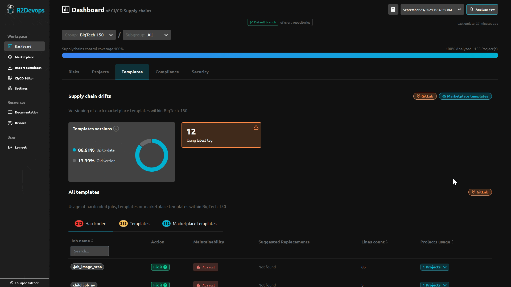

---

title: 1.48 Release  
description: This release introduces template override detection.  
tags: [Releases, Analysis, Labels, Permissions]  
date: 2024-09-24  

---

# R2Devops 1.48 Release

import useBaseUrl from '@docusaurus/useBaseUrl';  
import ReleaseBottomButton from '@site/src/components/ReleaseBottomButton/ReleaseBottomButton.component';

:::info Docker Image Versions
- Backend: `v1.46.2`
- Frontend: `v1.42.2`
- Helm chart: `v1.48.0`
:::

<!-- truncate -->

## 🔍 Template Overrides Detection

This feature helps you identify when a template has been overridden in a repository, ensuring that template usage complies with organizational rules.

On the **Templates** page:

    - In the **Hardcoded** sub-tab, if a job within a template has been overridden, it will be marked as **Hardcoded** and displayed in the table.
    - In the **Templates** and **Marketplace Templates** sub-tabs, if any jobs within a template have been overridden, those overridden jobs will be listed under the corresponding template row.

On the **Compliance** page:

    Projects that have overridden templates will be marked as **Partially compliant**, and the labels of the overridden templates will be displayed.

## ⚙️ Minor Updates

- Added a banner to Self-managed instances indicating when the instance is outdated.
- Added exposition of run metrics for backend API and workers to improve the ability to run R2Devops in production.
- Fixed an issue on the **Templates** page that caused a crash when a template was sourced from a GitLab CI/CD Catalog.
- Prevented tooltips from overflowing on the **Authorization Settings** page.

-----

<ReleaseBottomButton />