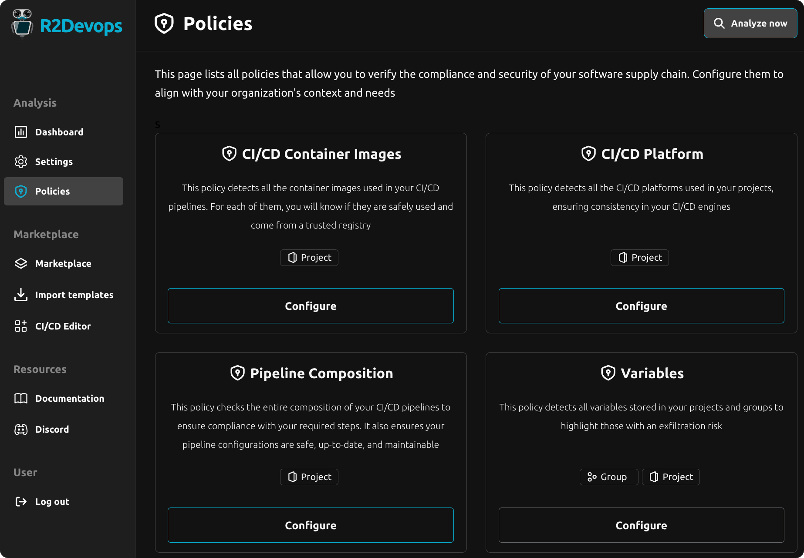
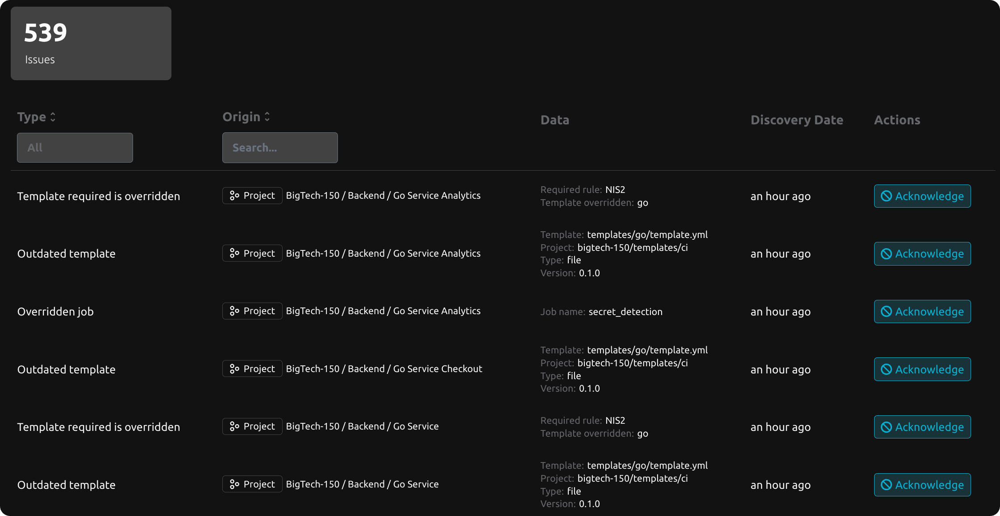
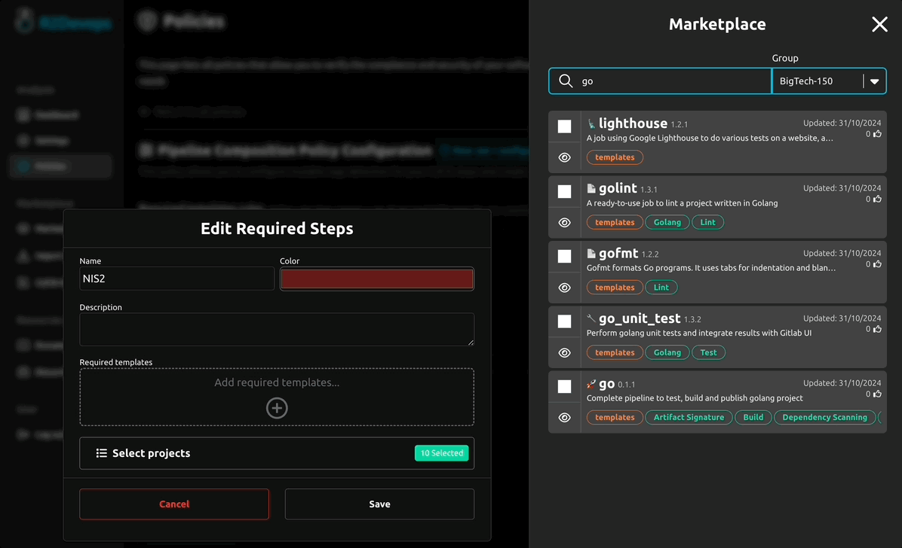

---

title: 2.0 Release
description: R2Devops 2.0 released with Policies and Issues detection
tags: [Releases, Analysis, Policies, Issues]
date: 2024-11-01

---

# R2Devops 2.0 Release

import useBaseUrl from '@docusaurus/useBaseUrl';
import ReleaseBottomButton from '@site/src/components/ReleaseBottomButton/ReleaseBottomButton.component';
import ReleaseLabels from '@site/src/components/ReleaseLabels/ReleaseLabels.component';

**Today, we are excited to announce the release of R2DevOps 2.0! This new
version introduces an enhanced experience for defining supply chain policies, a
brand-new issue dashboard, improved pipeline composition compliance, and much
more!**

<!-- truncate -->

## 🛡️ Policies

<ReleaseLabels licenses={[0, 1, 2]} />

**Policies** are now available in R2Devops. They are the building blocks that
analyze supply chain for compliance and security issues. Each policy focuses on
a specific area and can be customized to align with any organization goals.

The new "Policies" page offers a transparent view of all available policies,
making it easy to view and configure them. Access it from the main navigation
menu to get started.

## 📈 Issues dashboard

<ReleaseLabels licenses={[0, 1, 2]} />

Previously, compliance and security issues were scattered across multiple
dashboard tabs. To improve clarity and allow quick identification of issues at
a glance, we’ve introduced the "Issues" page.

This page consolidates all issues identified by policy analyses in one place.
They can be acknowledged to prevent them from appearing again.

## ✅ Pipeline composition compliance

<ReleaseLabels licenses={[2]} />

We’ve enhanced pipeline composition compliance detection. Now, with just a few
clicks, it's possible to specify which CI/CD templates must be used in projects
to ensure compliance.

In addition to verifying template usage, the policy detects forbidden overrides
that may compromise compliance.

## ⚙️ Minor Updates

- Enhanced dashboard navigation
- Dashboard > Platform: refocused display to highlight projects
- Dashboard > Templates: improved UI to distinguish official and unofficial templates; added detection for unofficial template versions
- Dashboard > Variables: grouped display by variable, rather than by project/group
- Various bug fixes

<ReleaseBottomButton />

---

:::note Versions
- Backend: `v2.0.0`
- Frontend: `v2.0.0`
- Helm chart: `v2.0.0`
:::
