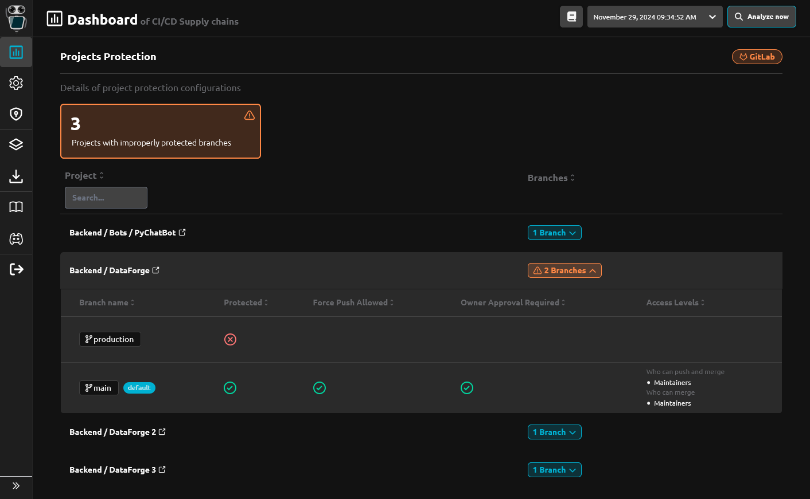
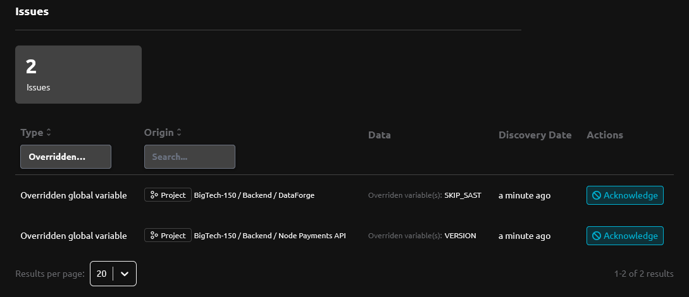
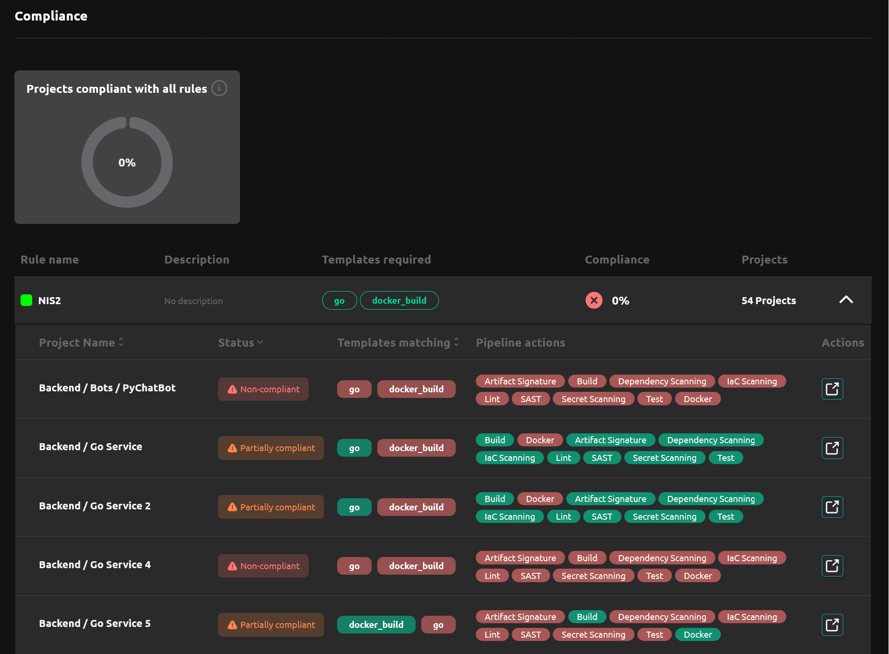

---

title: 2.1 Release
description: R2Devops 2.1 released with CI/CD variables override control, branch protection policy, and enhanced compliance.
tags: [Releases, Analysis, Policies, Issues]
date: 2024-11-29

---

# R2Devops 2.1 Release

import useBaseUrl from '@docusaurus/useBaseUrl';
import ReleaseBottomButton from '@site/src/components/ReleaseBottomButton/ReleaseBottomButton.component';
import ReleaseLabels from '@site/src/components/ReleaseLabels/ReleaseLabels.component';

**We are thrilled to introduce R2Devops 2.1! This release brings a powerful new policy for managing branch protection and access rights on projects, an enhanced method for controlling variable overrides, and improved compliance for pipeline composition.**

<!-- truncate -->

## 🛡️ Projects Branch Protection Policy

<ReleaseLabels licenses={[1, 2]} />

This policy allows you to ensure that your projects branches are correctly protected. You will be alerted by issues if your branches are not protected with correct configuration regarding force push, code owner approval, push and merge access right.

## ⚙️ Variables Overrides Control

<ReleaseLabels licenses={[2]} />

You can now enable an authorized variable list and define patterns for variable names that are allowed to be overridden. Any variables that do not match these patterns will be treated as forbidden overrides and you will be alerted with an issue.

## 🔍 Pipeline Actions Compliance

<ReleaseLabels licenses={[2]} />

We’ve enhanced pipeline composition compliance detection. Now, you can review each action performed or missing in your project's CI/CD pipelines.

## ⚙️ Minor Updates

- New pipeline composition option that ensures every project adheres to at least one required template rule.
- Improved project selector behavior
- Renamed `Mutable tags` to `Forbidden tags`
- Added new issues related to new policies
    - Branch protection missing
    - Force push allowed on protected branch
    - Code owner approval not enforced on protected branch
    - Branch protection merge access is to permissive
    - Branch protection push access is to permissive
    - Overridden global variable
    - No pipeline composition requirement defined on the project
- Improved policy configuration text, design, and behavior
- Fix various analysis bugs

<ReleaseBottomButton />

---

:::note Versions
- Backend: `v2.1.0`
- Frontend: `v2.2.2`
- Helm chart: `v2.1.1`
:::