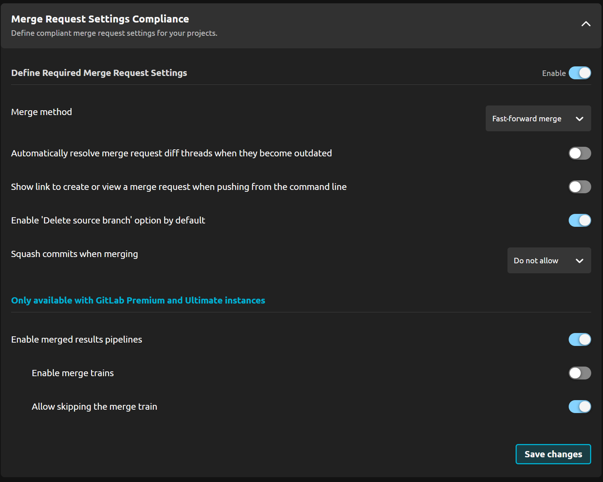
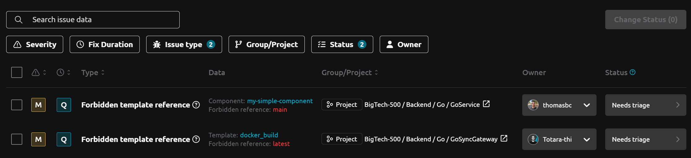

# R2Devops 2.10 Release

import useBaseUrl from '@docusaurus/useBaseUrl';
import ReleaseBottomButton from '@site/src/components/ReleaseBottomButton/ReleaseBottomButton.component';
import ReleaseLabels from '@site/src/components/ReleaseLabels/ReleaseLabels.component';

**We are thrilled to announce R2Devops 2.10! This release brings GitLab Catalog Components support, enhanced merge request compliance controls, and improved dashboard issues management.**

{/* truncate */}

## 📦 GitLab Catalog Components Integration

<ReleaseLabels licenses={[0, 1, 2]} />

Track and manage GitLab Catalog Components across your projects:

- Monitor usage across projects
- Identify outdated components
- Identify components included with forbidden versions
- Access GitLab Catalog directly from the `Catalog` page

## 🔒 Merge Request Compliance Controls

<ReleaseLabels licenses={[1, 2]} />

Enforce organization standards with merge request compliance policies. Configure specific requirements in the `Access and Authorization` policy to standardize merge request settings across teams.

## 📊 Advanced Issues Management

<ReleaseLabels licenses={[0, 1, 2]} />

Collaborate more effectively on issues:

- Add comments to issues for better team communication
- Bulk update status or add comments to multiple issues
- Assign owners to issues
- Each issue now has a `Fix duration` and `Severity` status that can be sorted and filtered
- All filters persist through the page URLs to allow sharing results with your team

## 🔧 One-Click Auto-Fixes

<ReleaseLabels licenses={[0, 1, 2]} />

Quickly resolve issues with one-click auto-fixes, reducing manual intervention and accelerating remediation.

- Available from the `Fix` button in the issue page
- Covers multiple compliance issues:
  - Branch protection missing
  - Branch protection configuration not compliant
  - Merge request approval rule is below the minimum level of approvals required
  - Merge request approval settings are not compliant
  - Unmasked variable

## 👤 Automatic Owner Assignment

<ReleaseLabels licenses={[0, 1, 2]} />

Streamline issue management with automatic owner assignment.

- Enable this feature from the `Settings > Organization` page
- Automatically assigns issue owners by searching in member lists of the project or group related to the issue
- Selection logic prioritizes owners first, then maintainers if no owners are found

## 🔄 Branch Protection Rules

<ReleaseLabels licenses={[1, 2]} />

Define protection requirements for different branch patterns in GitLab. Create specific rules based on branch name patterns to enforce consistent security practices.

## 🐳 Docker Hub Image Trust

<ReleaseLabels licenses={[2]} />

Simplify container security with automatic trust for `Official` Docker Hub images in the `CI/CD Container Images` policy.

## ⚙️ Minor Updates

- Improved loading behavior
- AI pipeline analysis explanation for each project inside an AI requests
- Added detection for links between R2DevOps templates and components
- Excluded bot users from issue owner candidates
- Fixed component name display
- Fixed pipeline composition chart
- Improved repository access rights consistency
- Improved performance with cached GitLab requests
- Added centralized HTTP logging to track all requests to GitLab

<ReleaseBottomButton />

---

:::note Versions
- Backend: `v2.14.0`
- Frontend: `v2.13.0`
- Helm chart: `v2.10.6`
:::
