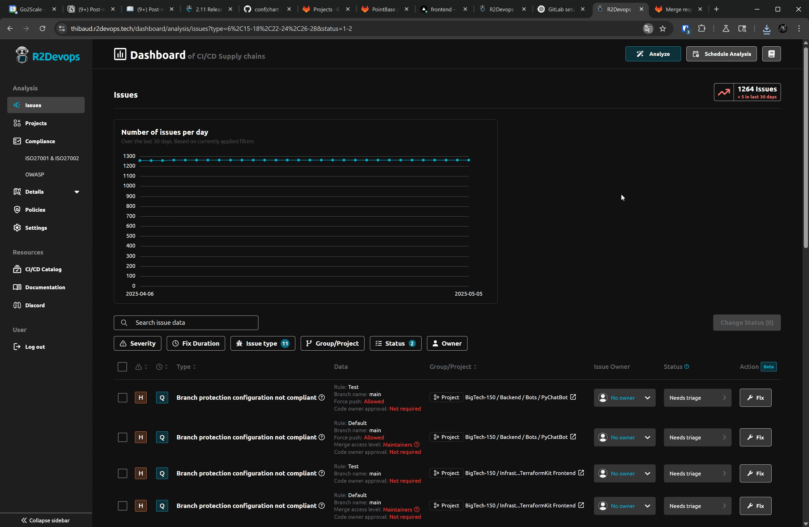
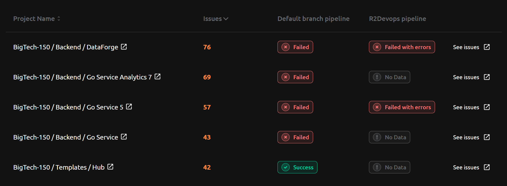

# R2Devops 2.11 Release

import useBaseUrl from '@docusaurus/useBaseUrl';
import ReleaseBottomButton from '@site/src/components/ReleaseBottomButton/ReleaseBottomButton.component';
import ReleaseLabels from '@site/src/components/ReleaseLabels/ReleaseLabels.component';

**We are excited to announce R2Devops 2.11! This release brings pipeline composition compliance with GitLab CI/CD Catalog Components, custom AI model configuration, enhanced issue remediation, and a project analysis page.**

{/* truncate */}

## 📦 GitLab CI/CD Catalog Components Compliance

<ReleaseLabels licenses={[1, 2]} />

Ensure pipeline composition compliance with GitLab CI/CD Catalog Components:

- Select GitLab Catalog Components as required in your pipeline composition rules
- Enforce compliance for components included with the `component` keyword in your projects' CI/CD configuration
- Maintain organization standards without needing to check projects one by one

## 🧠 Custom AI Model Configuration

<ReleaseLabels licenses={[0, 1, 2]} />

Set up your own AI model in the `Settings` > `Organization` > `AI Configuration` page, previously limited to Anthropic. This allows you to leverage your preferred AI provider.

## 🔧 Enhanced Issue Remediation

<ReleaseLabels licenses={[0, 1, 2]} />

Resolve issues faster with improved remediation capabilities:

- Get AI-generated remediation recommendations for complex issues
- Instantly fix issues with one-click remediation when available
- Remediate missing components and templates in pipeline composition
- View remediation summaries before applying changes

## 📊 Project Analysis

<ReleaseLabels licenses={[0, 1, 2]} />

Gain deeper insights into your project health:

- Identify projects with the highest number of issues
- Monitor pipeline status on default branches
- Track R2Devops branch status when remediation merge requests have been created
- Prioritize remediation efforts based on comprehensive project data

## ⚙️ Minor Updates

- Improved clarity about `Forbidden version` for `Image containers` and `Templates/Components`
- Enhanced saved filters in `Issues` page
- Added quick links to `Issues` page with specific filters
- Improved visibility of inputs for images registry patterns
- Renamed some texts in `Issues` page for better clarity
- Added more metrics to `Templates` page:
    - `Custom templates or components used`
    - `Using forbidden version`
    - `Catalog templates or components used`
- Removed policy cards that cannot be configured

<ReleaseBottomButton />

---

:::note Versions
- Backend: `v2.16.10`
- Frontend: `v2.15.5`
- Helm chart: `v2.11.1`
:::
