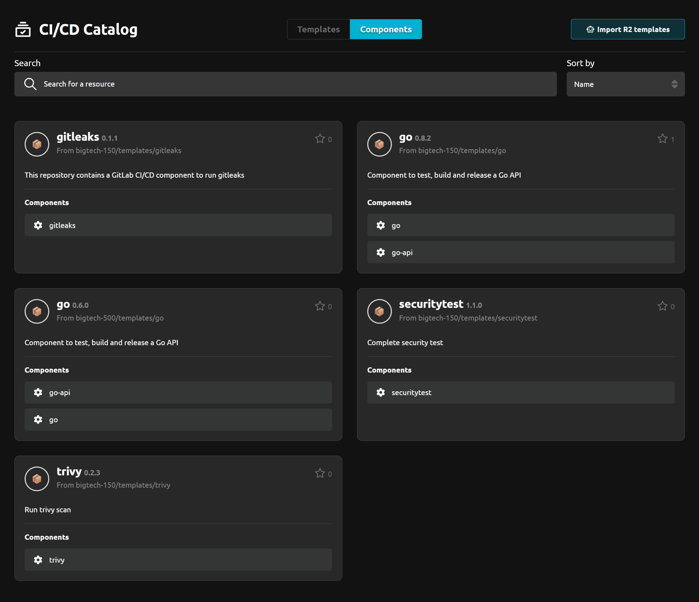
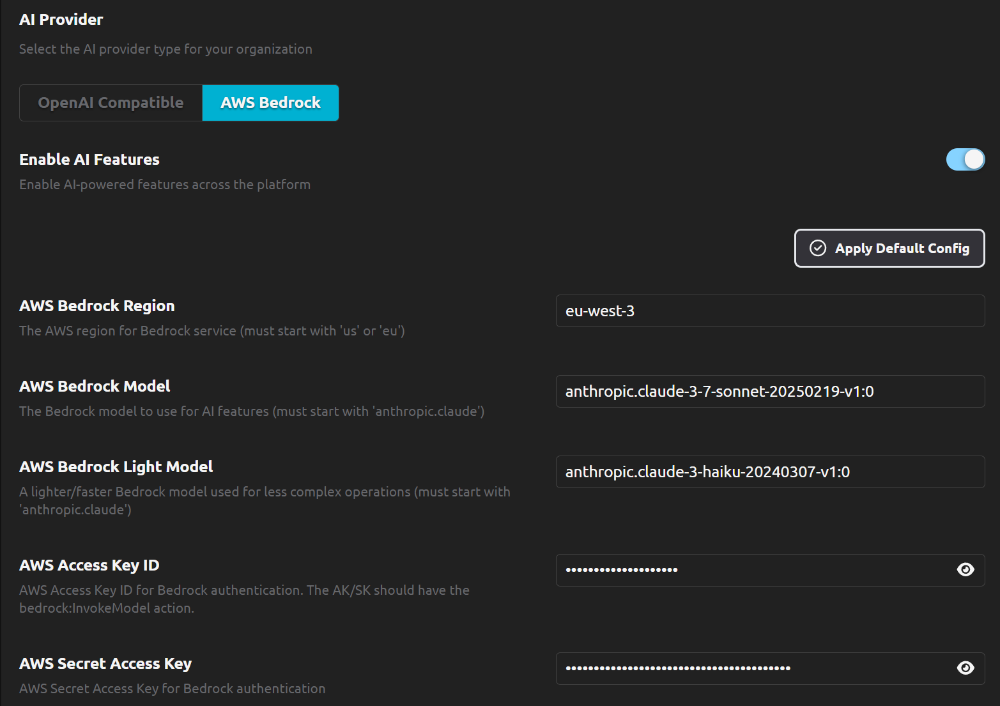
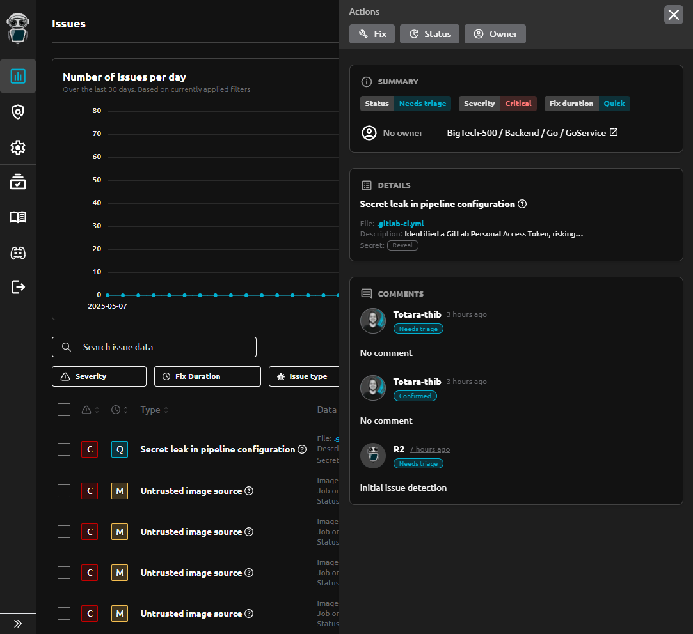
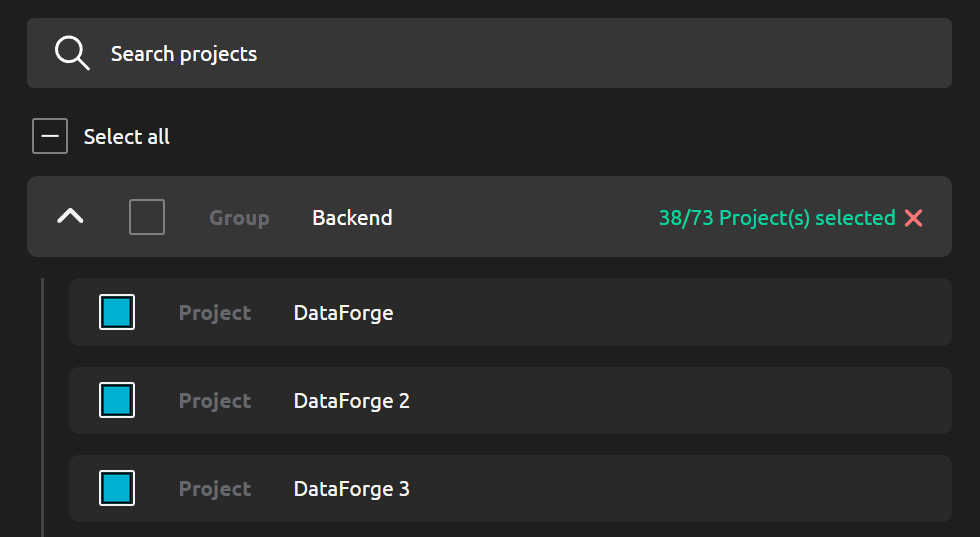

# R2Devops 2.12 Release

import useBaseUrl from '@docusaurus/useBaseUrl';
import ReleaseBottomButton from '@site/src/components/ReleaseBottomButton/ReleaseBottomButton.component';

**We are excited to announce R2Devops 2.12! This release brings comprehensive GitLab CI/CD Catalog integration, AWS Bedrock AI provider support, improved issue readability, and enhanced project selection performance.**

{/* truncate */}

## 📦 Comprehensive GitLab CI/CD Catalog Integration

Discover and manage CI/CD catalog components with enhanced visualization:

- **Organization Overview**: Visualize all catalog components across your organization from the R2Devops catalog page
- **Dedicated Component Pages**: Access comprehensive information for each component including:
  - Quick-use section with copy-paste pipeline integration examples
  - Complete input parameter documentation
  - Full README documentation

## 🤖 AWS Bedrock AI Provider Support

You can now use AWS Bedrock as an AI model provider for R2Devops.

## 📋 Enhanced Issue Readability

We've redesigned the issue page to make it easier for you to understand and resolve issues quickly. The interface is now cleaner and more focused, helping you identify what needs attention without visual clutter.

## 🚀 Enhanced Project Selection for Analysis

We've made it much faster and easier to find and select the projects you want to analyze, especially when working with large organizations that have hundreds of projects.

## ⚙️ Minor Updates

- **Nested Include Detection**: Detect nested include files like templates or components in CI/CD pipeline configuration files
- **In-App License Management**: Add or update your R2Devops license directly from the web interface with instant validation and activation
- **Features Unlocked for All Licenses**: All features are now available for all licenses, including the free version
- **Improved Pipeline Composition Rules**: Project paths of CI/CD components are now displayed in the interface

<ReleaseBottomButton />

---

:::note Versions
- Backend: `v2.19.2`
- Frontend: `v2.19.0`
- Helm chart: `v2.12.3`
:::
