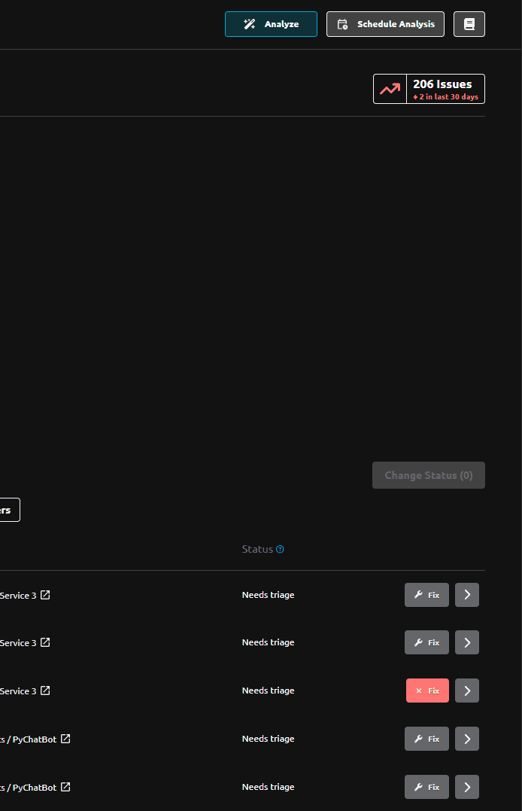
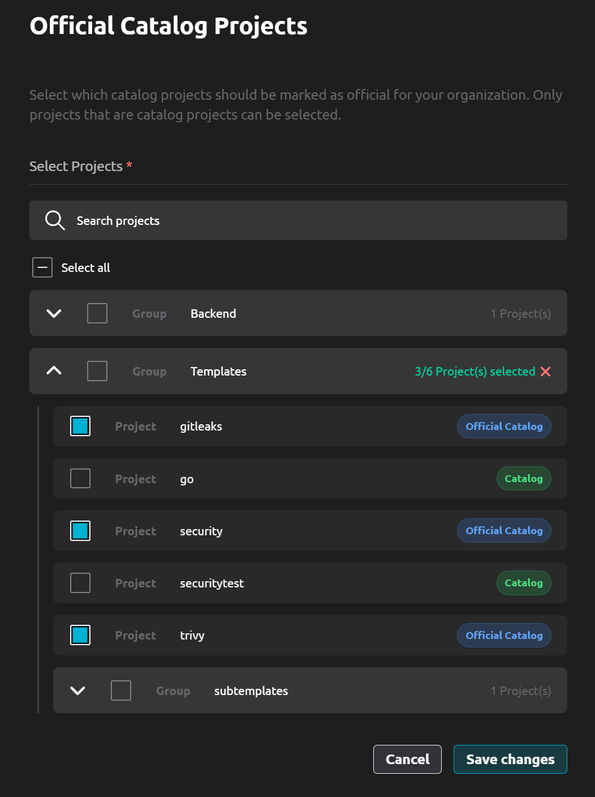

# R2Devops 2.13 Release

import useBaseUrl from '@docusaurus/useBaseUrl';
import ReleaseBottomButton from '@site/src/components/ReleaseBottomButton/ReleaseBottomButton.component';

**We are excited to announce R2Devops 2.13! This release introduces an improved issue fix journey, and the ability to designate official CI/CD catalog projects for your organization.**

{/* truncate */}

## 🔧 Improved Issues Fix Journey

- **Track Fix Status**: Monitor fix progress directly from the issues list with real-time status updates
- **Fix History**: Access complete timeline of all fix attempts and configurations
- **Comprehensive Configuration**: Configure and save detailed fix settings for future reference
- **Merge Request Integration**: Configure merge requests and access pipeline status with quick navigation links

## 📋 Official GitLab CI/CD Catalog Project

Control which GitLab CI/CD Catalog projects your organization can use to ensure consistency and security across all projects.

## ⚙️ Minor Updates

- **Faster Analysis Performance**: Project analysis is now 2x faster
- **Project Scanning Visibility**: Easily identify which projects cannot be scanned due to archival or broken pipeline configurations in the `Details > Pipeline Composition` page
- **Read-Only Policy Indicators**: Clear visual indicators show when `Policies` configuration pages are in read-only mode for users without required permissions
- **Enhanced Project Selection**: Archived and Catalog projects are now clearly distinguished during project selection
- **CI/CD Status Visibility**: Projects without CI/CD configurations are now listed on the `Details > CI Platform` page

<ReleaseBottomButton />

---

:::note Versions
- Backend: `v2.21.0`
- Frontend: `v2.22.0`
- Helm chart: `v2.13.2`
:::
