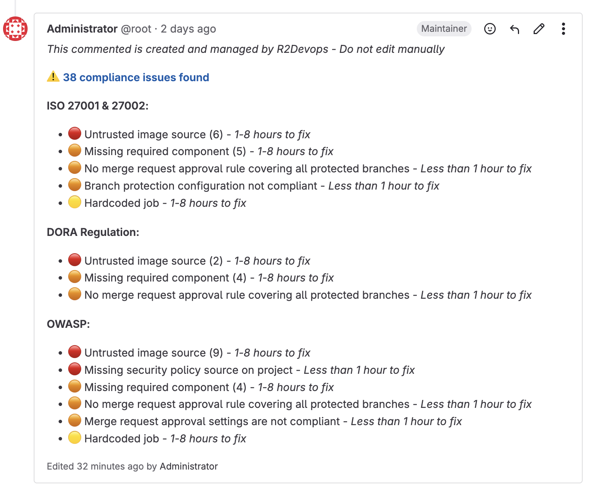

# R2Devops 2.15 Release

import useBaseUrl from '@docusaurus/useBaseUrl';
import ReleaseBottomButton from '@site/src/components/ReleaseBottomButton/ReleaseBottomButton.component';

**We're thrilled to launch R2Devops 2.15, focused on:**

> **📈 Providing clear and relevant compliance levels**

**To make that happen, we've introduced a compliance dashboard, tailored policies, and seamless compliance reporting in GitLab.**

{/* truncate */}

## 📊 Compliance Dashboard

Get immediate visibility into your compliance level. Track your compliance journey over time and identify exactly where to focus your efforts.

## 🎯 Tailored Policies

Now you can create policies that truly match your organization's needs. Design compliance policies focused on what matters most to you and apply them to the right projects.
- **Before**: One universal policy with all controls forced on every project
- **Now**: Create multiple custom policies by selecting specific controls for specific projects

**Ready-to-use policy templates:**
- [ISO 27001 & 27002](https://www.iso.org/standard/27001)
- [OWASP Top 10 CI/CD Risks](https://owasp.org/www-project-top-10-ci-cd-security-risks/)
- [🇫🇷 SecNumCloud](https://cyber.gouv.fr/secnumcloud-pour-les-fournisseurs-de-services-cloud)

## 🦊 Compliance reporting in GitLab

Bring compliance directly into your development workflow. No more switching between tools. Get compliance insights exactly where developers work: in GitLab.
- **Dynamic Project Issues**: Automated compliance status summaries as live GitLab issues that update in real-time
- **Project Compliance Badges**: Visual compliance indicators automatically added to your GitLab projects

    
- **Merge Request Comments**: Instant compliance feedback directly in your MRs
    

## ⚙️ Minor Updates

- **Issue Status Renaming**: For more clarity, issue statuses are now `Detected`, `In Progress`, `Dismissed` and `Fixed`
- **Details Pages Renamed**: `Details` pages are now called `Inventory`
- **UX Improvements**: Enhanced user experience across the platform
- **Bug Fixes**: Various stability and performance improvements

<ReleaseBottomButton />

---

:::note Versions
- Backend: `v2.26.5`
- Frontend: `v2.24.1`
- Helm chart: `v2.15.3`
:::
