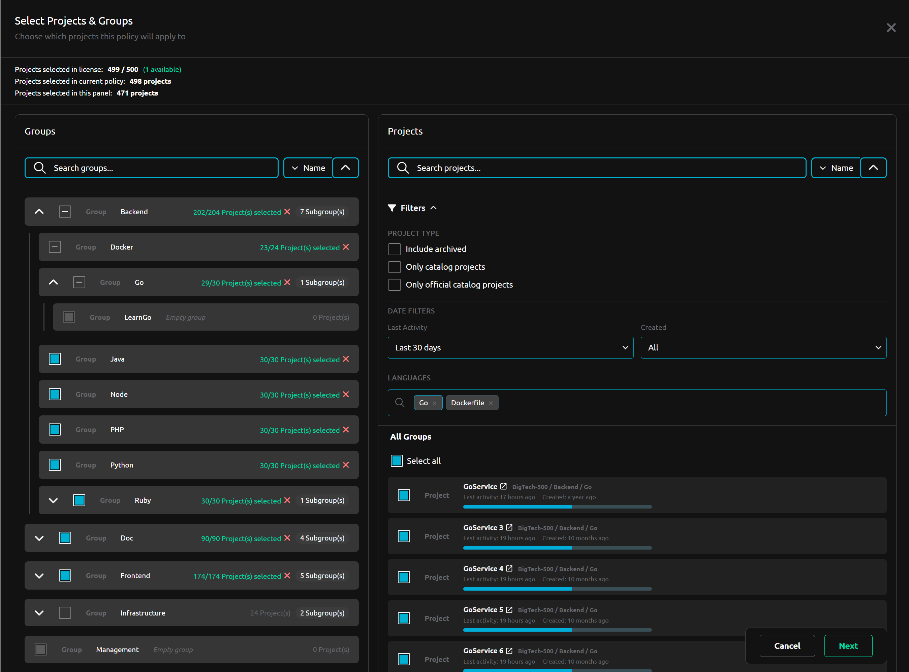
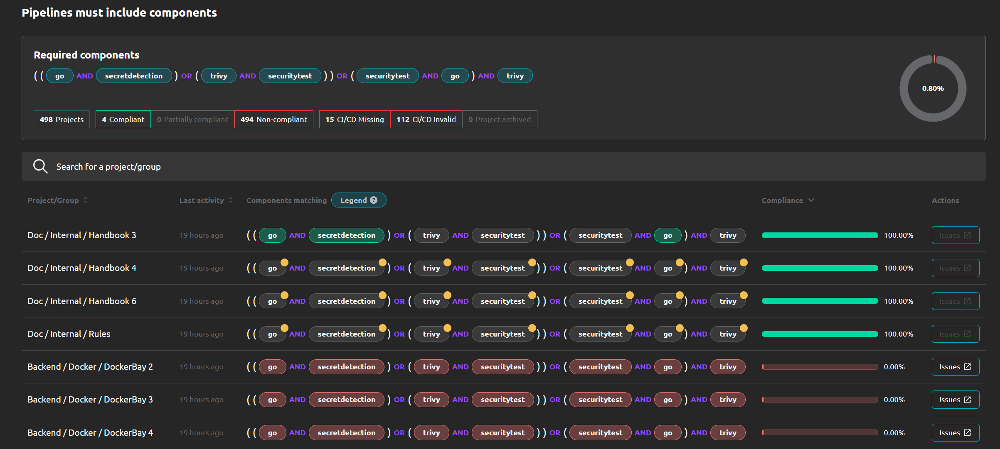
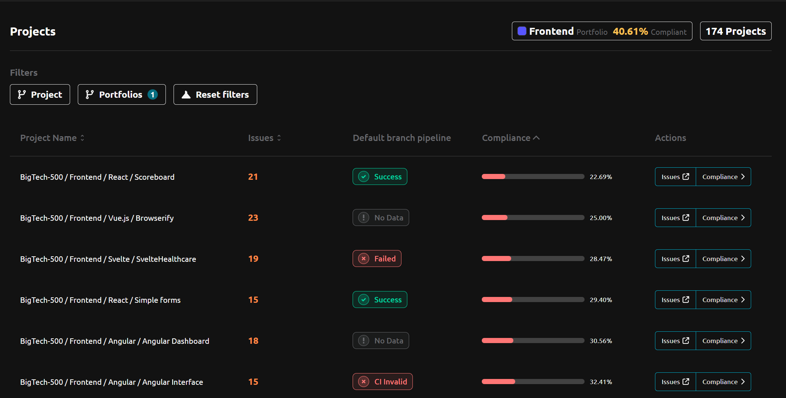

# R2Devops 2.16 Release

import useBaseUrl from '@docusaurus/useBaseUrl';
import ReleaseBottomButton from '@site/src/components/ReleaseBottomButton/ReleaseBottomButton.component';

**We're thrilled to launch R2Devops 2.16, focused on:**

> **🎯 Making it easier to manage and control large project fleets**

**To make that happen, we've introduced simplified project selection with advanced filters, operators in pipeline composition rules, and portfolios to group your projects.**

{/* truncate */}

## 🔍 Simplified Project Selection

Managing large project fleets just got a whole lot easier. We've completely revamped project selection with powerful search and filtering capabilities.

**Advanced filters include:**
- **Language**: Filter by programming languages
- **Date filters**: Find projects by Creation or Last Activity date
- **And more**: Filter by project status: archived, CI/CD catalog, etc.

**No more double selection!** Previously, you had to select projects separately in *Settings > Projects* and *Settings > Policies*. Now, manage everything in one place.

## 🧮 Operators in Pipeline Composition Rules

Use `AND`, `OR`, and parentheses to define globally what your pipelines have to contain.

- **Before**: You had to select one by one all projects for each typology and define all required pipeline includes (components or templates).
- **Now**: Define in one expression what their pipeline should include (components or templates). Example: `secret-detection AND ((maven-build AND junit) OR (go-build AND go-test))`

## 🗂️ Portfolios

Group your projects however you want and track compliance for each group independently. Portfolios give you the flexibility to organize projects by team, language, business unit, or any other criteria that matters to your organization.

**Key benefits:**
- **Flexible grouping**: Create portfolios based on teams, languages, or custom criteria
- **Independent tracking**: Monitor each portfolio's compliance separately
- **Better visibility**: Get a clear view of compliance across different parts of your organization

## ⚙️ Minor Updates

- **Feature**: Add automatic asset synchronization from GitLab
- **Fix**: Detect security policy project even when inherited with more than 2 levels
- **Fix**: Update fix of missing template/component behavior to include only really missing includes
- **Fix**: Update the include resolution to detect jobs coming from any kind of includes
- **Fix**: Various stability and performance improvements
- **Improvement**: Improved token creation instructions
- **Improvement**: Improved onboarding experience
- **Chore**: Remove outdated issue type from filters

<ReleaseBottomButton />

---

:::note Versions
- Backend: `v2.30.1`
- Frontend: `v2.27.1`
- Helm chart: `v2.16.1`
:::

