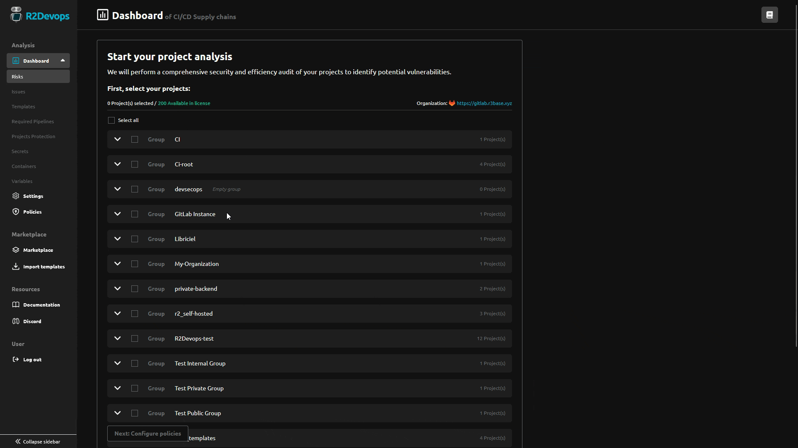

---

title: 2.4 Release
description: R2Devops 2.4 released with dashboard access for everyone, improved pipelines images registry resolution and a simplified onboarding.
tags: [Releases, Analysis, Onboarding, Permissions, Templates, Compliance, Roles]
date: 2025-01-03

---

# R2Devops 2.4 Release

import useBaseUrl from '@docusaurus/useBaseUrl';
import ReleaseBottomButton from '@site/src/components/ReleaseBottomButton/ReleaseBottomButton.component';

**We are thrilled to introduce R2Devops 2.4! This release brings a new dashboard access for everyone, improved pipelines images registry resolution and simplified onboarding.**

<!-- truncate -->

## 📊 Dashboard Access for Everyone

All members of your organization can now access dashboard results. This enables them to monitor the security and compliance status of their pipelines, fostering better adoption of best practices across the entire organization.

Dashboard results are filtered for each members to projects and groups they can access on GitLab.

All R2Devops roles and permissions are described [in the documentation](/docs/use/roles_permissions).

## 🔍 Improved Pipelines Images Registry Resolution

Previously, when a container image used to run a pipeline job contained a variable, it was resolved only using variables explicitly declared in the CI configuration file. Now, variable resolution also includes the following sources:

- Project variables
- Group variables
- Instance variables
- GitLab predefined variables

## 🚀 Simplified Onboarding

The new onboarding process will guide you through configuring your organization and policies. This makes it easy to set up your instance tailored to your CI/CD security and compliance requirements.

## ⚙️ Minor Updates

- Outdated templates are now considered as partially compliant instead of compliant
- Design improvements and bug fixes in project settings
- Improved project selector behavior
- Added actions to select/unselect all projects with the project selector
- Sorted project pipeline actions assigned to a required pipeline rule
- Improved analysis loading behavior
- Added new sidebar navigation for analysis pages
- Fixed various analysis bugs

<ReleaseBottomButton />

---

:::note Versions
- Backend: `v2.4.0`
- Frontend: `v2.3.9`
- Helm chart: `v2.4.2`
:::
