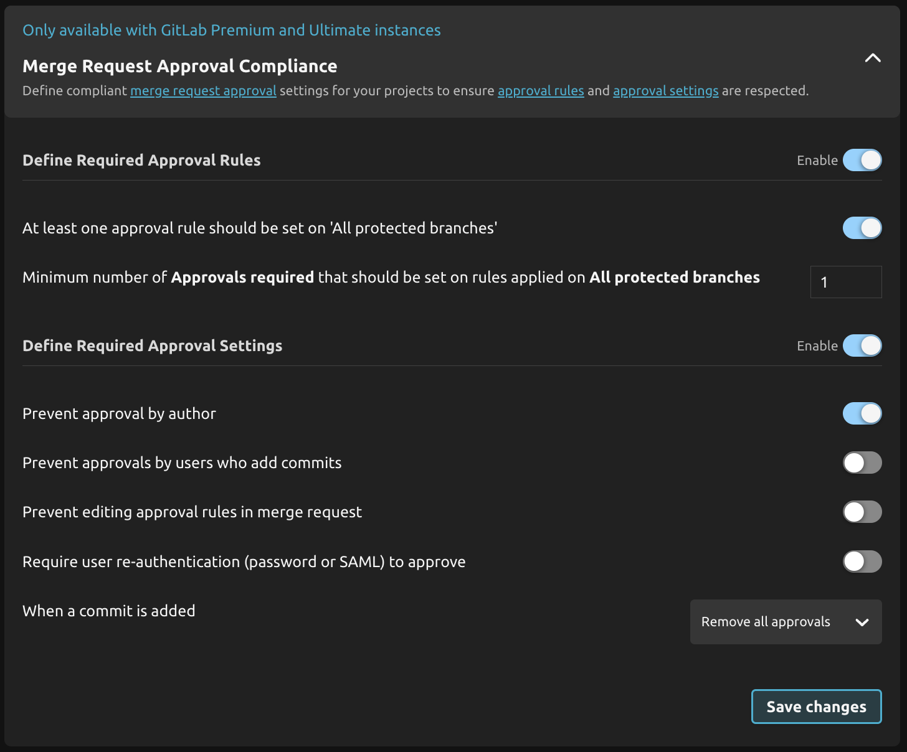

---

title: 2.6 Release
description: R2Devops 2.6 released includes the abilities to schedule automatic analysis, compliance control over merge request approval, and an improved analysis issues experience.
tags: [Releases, Analysis, Onboarding, Permissions, Templates, Compliance, Roles]
date: 2025-02-05

---

# R2Devops 2.6 Release

import useBaseUrl from '@docusaurus/useBaseUrl';
import ReleaseBottomButton from '@site/src/components/ReleaseBottomButton/ReleaseBottomButton.component';
import ReleaseLabels from '@site/src/components/ReleaseLabels/ReleaseLabels.component';

**We are excited to introduce R2Devops 2.6! This release includes the abilities
to schedule automatic analysis, compliance control over merge request approval,
and an improved analysis issues experience.**

<!-- truncate -->

## 📅 Schedule Analysis

<ReleaseLabels licenses={[0, 1, 2]} />

You can now schedule a recurrent analysis run, allowing you to enjoy an always
fresh view of your organization's CI/CD pipelines' compliance with your
policies.

This feature can be enabled by R2Devops Administrators and Maintainers using a
`read_api` GitLab token. The frequency can be set to every hour, twice per day,
once per day, or any custom schedule using cron syntax.

## ✅ Merge Request Approval Compliance

<ReleaseLabels licenses={[0, 1, 2]} />

**Only available with GitLab Premium and Ultimate instances**

This feature ensures that your Merge Request approval
[rules](https://docs.gitlab.com/ee/user/project/merge_requests/approvals/rules.html)
and
[settings](https://docs.gitlab.com/ee/user/project/merge_requests/approvals/settings.html)
align with your expected compliance requirements. By controlling these
configurations, this feature reduces the risk of unauthorized or unreviewed
changes being merged into the codebase.

You can configure it in the **Project Protection** policy:

## 📊 Improved Analysis Issues Experience

<ReleaseLabels licenses={[0, 1, 2]} />

The analysis issues page has been improved to help you easily see,
understand, and fix issues.

### **1. You can now change the issue status**
- Each issue has a status: [`Needs triage`, `Confirmed`, `Dismissed`, or `No longer detected`](/docs/use/issues).
- You can change the status and leave a comment to explain the change.
- You can view the complete status change history for each issue.

These statuses allow you to track and control the lifecycle of an issue,
helping you focus on fixing the most relevant ones.

### **2. You can now filter the issue list**

- By status
- By issue type (*e.g., Branch protection missing, Untrusted image source, etc.*)
- By policy (*e.g., CI/CD Container Images, Pipeline Composition, etc.*)

These filters help you focus on the most important issues and manage their
resolution more efficiently.

## ⚙️ Minor Updates

- Improve the default configuration of `Project protection` policy

<ReleaseBottomButton />

---

:::note Versions
- Backend: `v2.6.0`
- Frontend: `v2.3.9`
- Helm chart: `v2.6.0`
:::
