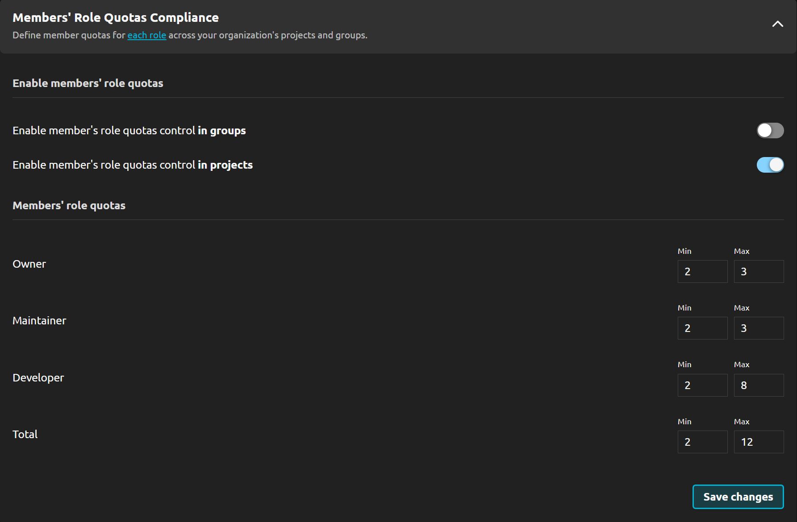

---

title: 2.9 Release
description: R2Devops 2.9 release introduces ISO 27001 compliance control, verification of organization roles count, and an enhanced analysis issues experience to improve your workflow and security.
tags: [Releases, Analysis, Compliance, Roles, Security]
date: 2025-03-11

---

# R2Devops 2.9 Release

import useBaseUrl from '@docusaurus/useBaseUrl';
import ReleaseBottomButton from '@site/src/components/ReleaseBottomButton/ReleaseBottomButton.component';
import ReleaseLabels from '@site/src/components/ReleaseLabels/ReleaseLabels.component';

**We are excited to introduce R2Devops 2.9! This release introduces ISO 27001 compliance control, verification of organization roles quotas, and an enhanced analysis issues experience to improve your workflow and security.**

<!-- truncate -->

## 🔒 ISO 27001 Compliance Control

<ReleaseLabels licenses={[2]} />

Get comprehensive **ISO 27001 compliance controls** for **CI/CD pipelines** to help your organization pass **certification** with automated compliance checks against **ISO 27001 requirements**.

## 👥 Organization Roles Verification

<ReleaseLabels licenses={[0, 1, 2]} />

To enhance security and maintain proper access control, you can now have control over **organization role quotas verifications**. This feature prevents role sprawl by allowing you to set minimum and maximum limits for each role (**Owner**, **Maintainer**, **Developer**, and **Total members**) within **Access and Authorization** policy.

By enforcing these limits, you can ensure your organization follows the **principle of least privilege**, reducing unnecessary access and improving security.

## 📊 Enhanced Analysis Issues Experience

<ReleaseLabels licenses={[0, 1, 2]} />

The analysis issues interface now offers improved **visibility and control** with:

- Chart showing issue count evolution over time
- Filtering by group/project
- Searching through issue data

## ⚙️ Minor Updates

- Prevent modal closure when saving policies during onboarding
- Sort issues list by type by default
- Redirect to related GitLab pages when clicking project/group links in issues list
- Fix GitLab community edition incompatibilities
- Split each issues filters into different tabs

<ReleaseBottomButton />

---

:::note Versions
- Backend: `v2.11.3`
- Frontend: `v2.9.2`
- Helm chart: `v2.9.1`
:::
