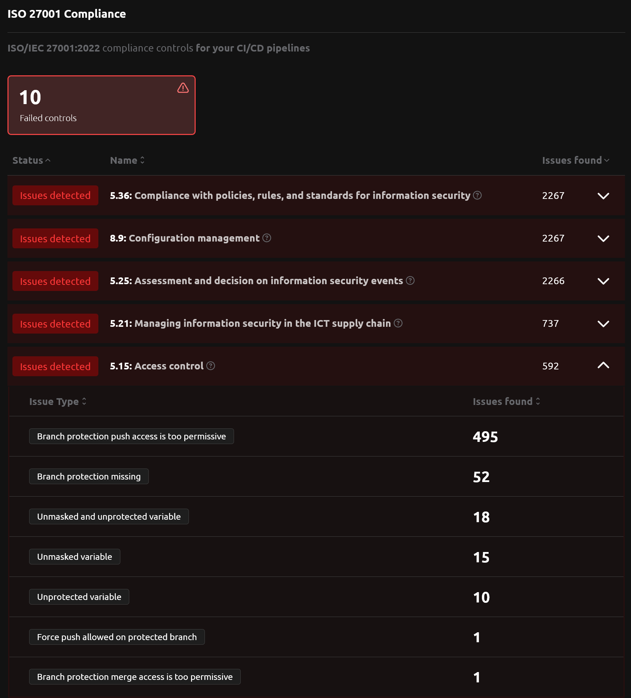
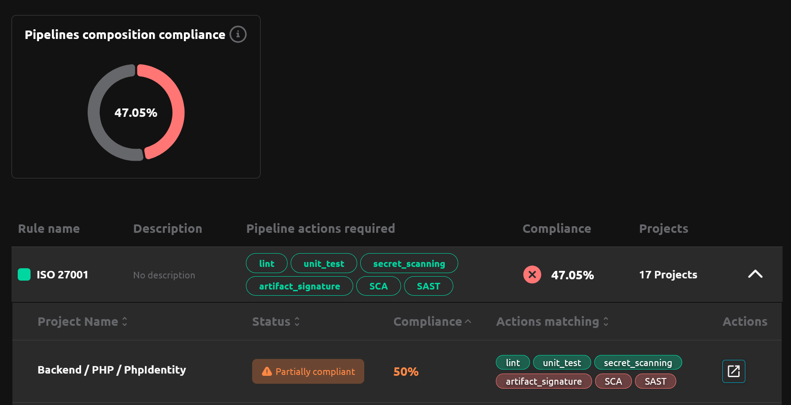

---

title: 2.9 Release
description: R2Devops 2.9 release introduces ISO 27001 compliance controls, AI-powered pipeline compliance, verification of project member role quotas, and an improved experience in issue page.
tags: [Releases, Analysis, Compliance, Roles, Security]
date: 2025-03-11

---

# R2Devops 2.9 Release

import useBaseUrl from '@docusaurus/useBaseUrl';
import ReleaseBottomButton from '@site/src/components/ReleaseBottomButton/ReleaseBottomButton.component';

**We are excited to introduce R2Devops 2.9! This release brings ISO 27001 compliance controls, AI-powered pipeline compliance, verification of project member role quotas, and an improved experience in issue page.**

<!-- truncate -->

## 🔒 ISO/IEC 27001:2022 Compliance Controls

<ReleaseLabels licenses={[2]} />

Get a comprehensive list of **ISO/IEC 27001:2022** compliance controls for your **CI/CD pipelines**. Each control relevant for CI/CD pipelines is listed with its reference and details of any issues found.

## 🤖 AI-Powered Pipeline Composition Compliance

<ReleaseLabels licenses={[2]} />

You can now ensure your CI/CD pipelines contain all required tasks. Define your organization policy and the AI-powered policy will control your pipelines, ensuring no critical tasks are missing.

## 👥 Project Member Role Quotas

<ReleaseLabels licenses={[1, 2]} />

To enhance security and maintain proper access control, you can now have control over **organization role quotas verifications**. This feature prevents role sprawl by allowing you to set minimum and maximum limits for each role (**Owner**, **Maintainer**, **Developer**, and **Total members**) within **Access and Authorization** policy.

It reduces risk ([OWASP - CICD-SEC-2](https://owasp.org/www-project-top-10-ci-cd-security-risks/CICD-SEC-02-Inadequate-Identity-And-Access-Management)) and allows compliance with ISO/IEC 27001:2022 controls 8.2, 8.4, 5.15, and 5.18.

## 📊 Improved Issues Page Experience

<ReleaseLabels licenses={[0, 1, 2]} />

The analysis issues interface now offers improved **visibility and control** with:

- Chart showing issue count evolution over time
- Filtering by group/project
- Searching through issue data

## ⚙️ Minor Updates

- Improvement of the onboarding experience
- Sort issues by type by default
- Add direct links to relevant GitLab pages when clicking project/group in issues list
- Fix GitLab Community Edition incompatibilities
- Split issue filters into separate tabs
- Remove the `Details > Secrets` page since all data is now available on the issues page
- Improve the UX of policy configuration
- Fix analysis workflow errors and improve error handling

<ReleaseBottomButton />

---

:::note Versions
- Backend: `v2.11.7`
- Frontend: `v2.10.7`
- Helm chart: `v2.9.2`
:::
