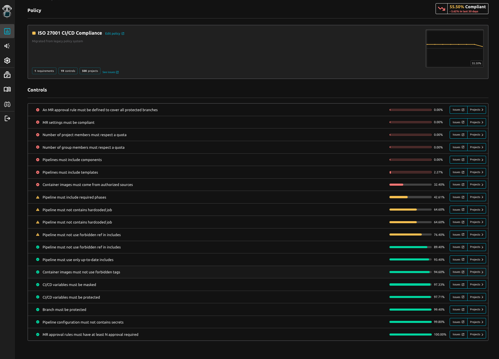

# Shai-Hulud 2.0: When `npm install` Becomes a CI/CD Attack


**Between November 21 and 23, 2025**, attackers compromised maintainer accounts to publish trojanized versions of popular npm packages. Unlike typical malware that might run quietly in the background, this variant is aggressively designed to harvest credentials and establish persistence within build environments.

## What is Shai-Hulud 2.0?

Scale at a glance: ~700 npm packages linked to the campaign, 25k+ malicious GitHub repos auto-created, and large-scale secret leaks (GitHub tokens, AWS/GCP/Azure creds).

{/* truncate */}

### The Attack Vector: `preinstall` Scripts
The malware executes during the `preinstall` phase of `npm install`. This is particularly dangerous because it runs immediately when a developer or a CI runner installs dependencies—often before any tests or security scans have a chance to run.

Once executed, the malware:

1.  **Detects the Environment**: It checks if it is running in a CI environment (looking for variables like `GITHUB_ACTIONS`, `BUILDKITE`, `CIRCLE_SHA1`, etc.) or a local developer machine.
2.  **Exfiltrates Secrets**: It scans for AWS, Azure, and GCP credentials, as well as GitHub tokens and local environment variables.
3.  **Establishes Persistence**: It attempts to create a backdoor workflow (`.github/workflows/discussion.yaml`) that allows attackers to execute arbitrary commands on self-hosted runners simply by opening a GitHub Discussion.

## Why This Matters for CI/CD

This attack is not just stealing data; it is weaponizing the pipeline itself.

### 1. CI-Specific Behavior
The malware behaves differently in CI environments. On local machines, it runs in the background to avoid detection. In CI environments, it runs **synchronously**, ensuring the runner stays active long enough to complete the data exfiltration. This shows a sophisticated understanding of how build agents operate.

### 2. Cross-Victim Exfiltration
Researchers have observed "cross-victim exfiltration," where secrets stolen from one victim are uploaded to public repositories owned by *another* unrelated victim. This obfuscation makes tracing the attack source significantly harder.

### 3. The "Discussion" Backdoor
The introduction of a malicious GitHub workflow (`discussion.yaml`) is a clever persistence mechanism. It turns a standard community feature (Discussions) into a command-and-control channel, specifically targeting self-hosted runners which often have higher privileges or access to internal networks.


## Immediate Action Plan

If your projects use npm, assume you are potentially exposed. We recommend the following immediate steps:

### 🔍 Audit Your Dependencies
Check if you are using any of the impacted packages. Key targets included `@postman/tunnel-agent`, `posthog-node`, and various `@zapier` packages.

### 🛑 Clear Caches & Reinstall
If you suspect exposure:

```bash
npm cache clean --force
rm -rf node_modules
# Regenerate package-lock.json to ensure clean versions
rm package-lock.json && npm install
````

### 🔄 Rotate Credentials
If you ran a compromised build, consider all environment variables and secrets exposed.

Revoke and regenerate npm tokens, GitHub PATs, and SSH keys.
Rotate AWS/Azure/GCP credentials used in your pipelines.

### 🛡️ Harden Your Pipelines
- Disable lifecycle scripts in CI when possible (--ignore-scripts for selected jobs)
- Restrict runner egress to trusted domains
- Audit GitHub workflows for unauthorized files (discussion.yaml)

## And for GitLab CI/CD Teams?

Even though Shai-Hulud targets npm and GitHub, the lesson is universal: **Attackers go where pipelines download, execute, and publish.**

For GitLab users, the same principles apply: lock down what runs during install jobs, scope CI tokens to the minimum, and continuously validate pipelines against your internal standards.


## Prevent and anticipate supply-chain risk with continuous CI/CD compliance

Preventing the next supply-chain incident starts where attackers now hit first: **your CI/CD**.

Instead of relying on periodic audits or last-minute checklists, organizations need a real-time view of what pipelines actually execute, whether they still follow internal standards, and where drift or non-conformities appear.

With [R2Devops](https://r2devops.io) teams use the CI/CD Compliance Dashboard to instantly spot which projects are not compliant with security best practices—before those gaps quietly become open doors for the next attack.

If you want to see what continuous CI/CD compliance looks like in GitLab, you can try R2Devops in minutes.

