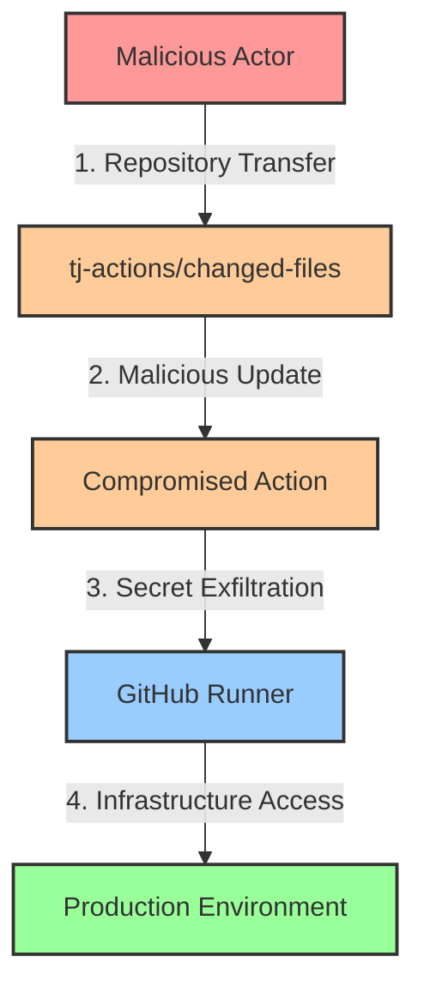
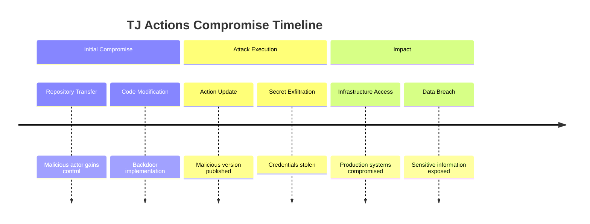
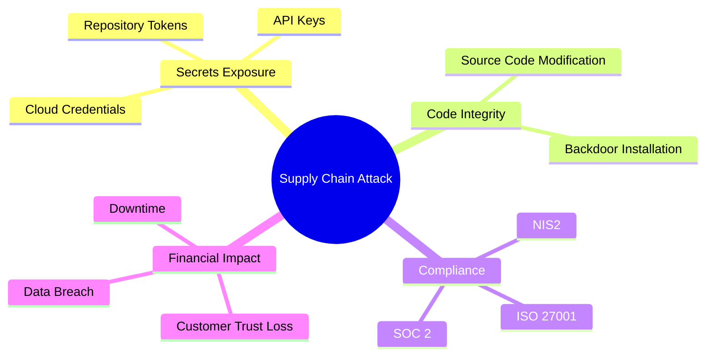
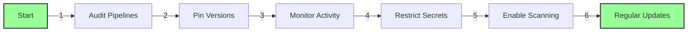
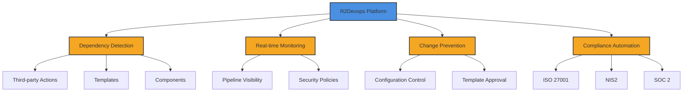

# Supply Chain Attack Diagram

```mermaid
graph TD
    A[Malicious Actor] -->|1. Repository Transfer| B[tj-actions/changed-files]
    B -->|2. Malicious Update| C[Compromised Action]
    C -->|3. Secret Exfiltration| D[GitHub Runner]
    D -->|4. Infrastructure Access| E[Production Environment]
    
    style A fill:#ff9999,stroke:#333,stroke-width:2px
    style B fill:#ffcc99,stroke:#333,stroke-width:2px
    style C fill:#ffcc99,stroke:#333,stroke-width:2px
    style D fill:#99ccff,stroke:#333,stroke-width:2px
    style E fill:#99ff99,stroke:#333,stroke-width:2px
```

# Attack Timeline

```mermaid
timeline
    title TJ Actions Compromise Timeline
    section Initial Compromise
        Repository Transfer : Malicious actor gains control
        Code Modification : Backdoor implementation
    section Attack Execution
        Action Update : Malicious version published
        Secret Exfiltration : Credentials stolen
    section Impact
        Infrastructure Access : Production systems compromised
        Data Breach : Sensitive information exposed
```

# Impact Analysis

```mermaid
mindmap
  root((Supply Chain Attack))
    Secrets Exposure
      API Keys
      Cloud Credentials
      Repository Tokens
    Code Integrity
      Source Code Modification
      Backdoor Installation
    Compliance
      ISO 27001
      NIS2
      SOC 2
    Financial Impact
      Downtime
      Data Breach
      Customer Trust Loss
```

# Protection Steps

```mermaid
graph LR
    A[Start] -->|1| B[Audit Pipelines]
    B -->|2| C[Pin Versions]
    C -->|3| D[Monitor Activity]
    D -->|4| E[Restrict Secrets]
    E -->|5| F[Enable Scanning]
    F -->|6| G[Regular Updates]
    
    style A fill:#99ff99,stroke:#333,stroke-width:2px
    style G fill:#99ff99,stroke:#333,stroke-width:2px
```

# R2Devops Security Features

```mermaid
graph TD
    A[R2Devops Platform] --> B[Dependency Detection]
    A --> C[Real-time Monitoring]
    A --> D[Change Prevention]
    A --> E[Compliance Automation]
    
    B --> F[Third-party Actions]
    B --> G[Templates]
    B --> H[Components]
    
    C --> I[Pipeline Visibility]
    C --> J[Security Policies]
    
    D --> K[Configuration Control]
    D --> L[Template Approval]
    
    E --> M[ISO 27001]
    E --> N[NIS2]
    E --> O[SOC 2]
    
    style A fill:#4a90e2,stroke:#333,stroke-width:2px
    style B fill:#f5a623,stroke:#333,stroke-width:2px
    style C fill:#f5a623,stroke:#333,stroke-width:2px
    style D fill:#f5a623,stroke:#333,stroke-width:2px
    style E fill:#f5a623,stroke:#333,stroke-width:2px
``` 