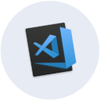
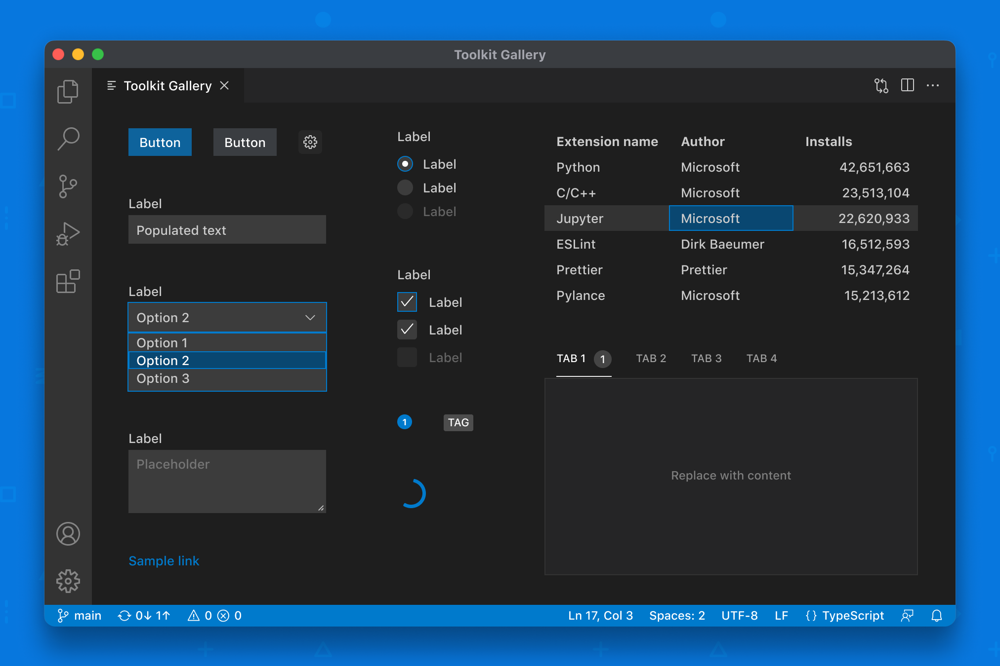

## Introduction



<!-- TODO: Add the VSCode extension link -->

Last week at R2Devops, I had the chance of writing a VSCode extension. Its purpose is to display the Public Marketplace of R2Devops once a `.gitlab-ci.yml` file is opened. This article will describe the process of creating a VSCode extension that shows a React Webview. 
 
### Writing a VSCode extension

The first step to create a VSCode extension is to create the extension folder and run npm init to create the package.json file. Then we can use the VSCode Yeoman extension generator to create the skeleton of the extension.

```bash
$ npm install -g yo generator-code
$ yo code
```

## Anatomy

Here is the basic structure of the extension

```c#
.
├── .vscode
│   ├── launch.json     // Config for launching and debugging the extension
│   └── tasks.json      // Config for build task that compiles TypeScript
├── .gitignore          // Ignore build output and node_modules
├── README.md           // Readable description of your extension's functionality
├── src
│   └── extension.ts    // Extension source code
├── package.json        // Extension manifest
├── tsconfig.json       // TypeScript configuration
├── webview-ui      // The webview directory that contains the React stuff
```

Each VS Code extension must have a `package.json` as its Extension Manifest. The package.json contains a mix of Node.js fields such as `scripts` and `devDependencies` and VS Code specific fields such as `publisher`, `activationEvents` and `contributes`. You can find description of all VS Code specific fields in Extension Manifest Reference. Here are some most important fields:

- `name` and `publisher`: VS Code uses `<publisher>.<name>` as a unique ID for the extension. For example, the Hello World sample has the ID vscode-samples.helloworld-sample. VS Code uses the ID to uniquely identify your extension.

- `main`: The extension entry point.

- `activationEvents` and `contributes`: Activation Events and Contribution Points.

- `engines.vscode`: This specifies the minimum version of VS Code API that the extension depends on.

Here are the basics, for further details, you can check the complete anatomy on the [VSCode documentation](https://code.visualstudio.com/api/get-started/extension-anatomy).

Now that we have our Extension skeleton, we can start the design part with React.

<!-- truncate -->

### Create a webview with React


I created a classical React application with some modifications. As the webview can only takes one file in input, we should specify some options to React to build accordingly. You can find a sample repository that explain the whole process [here](https://github.com/rebornix/vscode-webview-react).


*The components of the VSCode UI Toolkit*


I choose to use the Webview UI Toolkit, a component library for building webview-based extensions to create extensions that have a consistent look and feel with the rest of the editor. The toolkit is built with the VSCode design language and automatically supports color themes. Additionally, I use the `@vscode/codicons` package for all icons.

Now that we have our theme, we can simply define our webview, by defining a panel. The panel will be showed on contain the builded HTML.
A method render is called once the panel should show.
Here is the appropriated code with some comments:

```typescript

export class TemplatePickerPanel {
  public static currentPanel: TemplatePickerPanel | undefined;
  private readonly _panel: WebviewPanel;
  private _disposables: Disposable[] = [];

  private constructor(panel: WebviewPanel, extensionUri: Uri) {
    this._panel = panel;

    // Set an event listener to listen for when the panel is disposed (i.e. when the user closes
    // the panel or when the panel is closed programmatically)
    this._panel.onDidDispose(() => this.dispose(), null, this._disposables);

    // Set the HTML content for the webview panel
    this._panel.webview.html = this._getWebviewContent(this._panel.webview, extensionUri);

    // Set an event listener to listen for messages passed from the webview context
    this._setWebviewMessageListener(this._panel.webview);
  }

  public static render(extensionUri: Uri) {
    if (TemplatePickerPanel.currentPanel) {
      // If the webview panel already exists reveal it
      TemplatePickerPanel.currentPanel._panel.reveal(ViewColumn.Beside);
    } else {
      // If a webview panel does not already exist create and show a new one
      const panel = window.createWebviewPanel(
        // Panel view type
        "showTemplatePicker",
        // Panel title
        "Template Picker",
        // The editor column the panel should be displayed in
        ViewColumn.Beside,
        // Extra panel configurations
        {
          // Enable JavaScript in the webview
          enableScripts: true,
          retainContextWhenHidden: true,
          // Restrict the webview to only load resources from the `out` and `webview-ui/build` directories
          localResourceRoots: [
            Uri.joinPath(extensionUri, "out"),
            Uri.joinPath(extensionUri, "webview-ui/build"),
          ],
        }
      );
      const iconPath = getUri(panel.webview, extensionUri, ["webview-ui", "build", "logo128.png"]);

      panel.iconPath = iconPath;
      TemplatePickerPanel.currentPanel = new TemplatePickerPanel(panel, extensionUri);
    }
  }

```

The `_getWebViewContent` method is crucial as it provides the HTML representation of the Webview. It utilizes the React build output, and we need to manually import all external assets. Specifically, we import the compiled JavaScript and CSS files separately.

```typescript
  private _getWebviewContent(webview: Webview, extensionUri: Uri) {
    // The CSS file from the React build output
    const stylesUri = getUri(webview, extensionUri, [ "webview-ui" "build", "static", "css", "main.css" ]);
    // The JS file from the React build output
    const scriptUri = getUri(webview, extensionUri, ["webview-ui", "build", "static", "js", "main.js" ]);

    const nonce = getNonce();

    // Inject only the authorized configuration
    const configuration = getConfig();

    // Tip: Install the es6-string-html VS Code extension to enable code highlighting below
    return /*html*/ `
      <!DOCTYPE html>
      <html lang="en">
        <head>
          <meta charset="utf-8">
          <meta name="viewport" content="width=device-width,initial-scale=1,shrink-to-fit=no">
          <meta name="theme-color" content="#000000">
          <meta http-equiv="Content-Security-Policy" content="default-src 'self' ${configurMay 19, ation.apiUrl} ; style-src ${webview.cspSource}; script-src 'nonce-${nonce}';">

          <link rel="stylesheet" type="text/css" href="${stylesUri}">
          <title>Hello World</title>
        </head>
        <body>
          <noscript>You need to enable JavaScript to run this app.</noscript>
          <div id="root"></div>
          <script nonce="${nonce}" src="${scriptUri}"></script>
        </body>
      </html>
    `;
  }

```

Now that we have defined our WebView and the extension, we should exchange message between them.

### Link the extension and the Webview

To link the webview and the extension, we used the VSCode API to send messages and show notifications based on events.

To link the webview with the extension, we need to send messages through the VSCode API. We can use the `panel.webview.postMessage` method to send messages from the extension to the webview. We can also use the `window.addEventListener` method to listen to messages from the webview in the extension.

Here's an example of how to send a message from the extension to the webview:

```typescript
panel.webview.postMessage({ command: 'refresh' });
```

Here's an example of how to listen to messages from the webview in the extension:

```typescript
window.addEventListener('message', event => {
    const message = event.data;
    if (message.command === 'refresh') {
        // Do something
    }
});
```

In our case, the React application will send a message when clicking on the `Add this job` button. The extension will retrieve this type of message and perform the needed operation on the file.

### Publish the extension

Once your extension is finished, it needs to be published on the `Microsoft Marketplace`. This can be achieved using the npm package [vsce](https://github.com/microsoft/vscode-vsce). To do so, follow these simple steps:


```bash
$ cd myExtension
$ vsce package
# myExtension.vsix generated
$ vsce publish
# <publisherID>.myExtension published to VS Code Marketplace
```

Additionally, you have the option to set a Personal Access Token, which allows publishing without authentication. This is particularly useful when publishing within CI jobs.

The [vscode_publish](https://r2devops.io/marketplace/gitlab/r2devops/hub/vscode_publish) template provides an easy way to configure this!

You can find more detailed information about the tool on the [official documentation](https://code.visualstudio.com/api/working-with-extensions/publishing-extension).


## Conclusion

In summary, we created a VSCode extension that displays the R2Devops Public Templates Marketplace in a Sidebar using a webview built with React and the Webview UI Toolkit. We used the VSCode API to link the webview and the extension and showed notifications based on events. 

Below you can find the final project hosted on GitLab:

[R2Devops / Template picker](https://gitlab.com/r2devops/template-picker/)