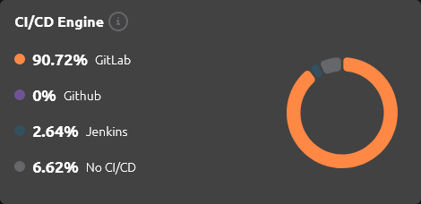
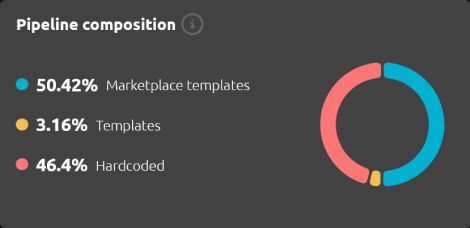
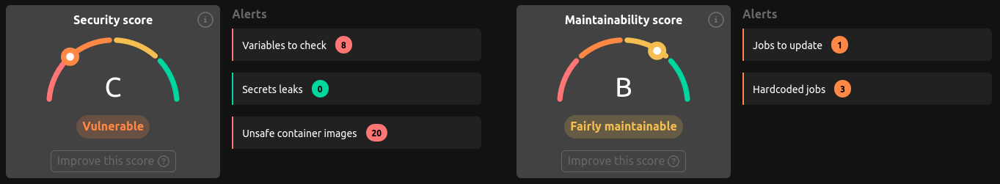

# ❓ How it works

## Summary

The R2Devops Dashboard uses various calculations with GitLab project CI/CD. The following sections will describe how it works.

## CI/CD Engine

The Dashboard provides an overview of the CI/CD engines utilized within your entire GitLab organization.

Its purpose is to identify the CI/CD engines employed within your GitLab Organization and categorize into four different types:

- **GitLab:** When a project contains a `.gitlab-ci.yml` file at its root.
- **Jenkins:** When a project contains a `JenkinsFile` at the root, and/or a `webhook`, and/or a `GitLab integration`.
- **GitHub:** When a project contains a `.github/workflows` directory.
- **No CI/CD:** When a project doesn't match any of the previous cases, it's declared as having `No CI/CD`.

It can assist in:

- Migrating old CI/CD engine implementations
- Preventing drift among the CI/CD engines used
- Identifying projects not utilizing CI/CD

:::info[Example]
A project could have multiple CI/CD engines. For example, `project1` could have:

- `50%` of **GitLab**
- `50%` of **Jenkins**
:::

## Pipeline Composition

The Dashboard provides an overview of your entire organization's CI/CD composition. 

Its aim is to identify the types of templates utilized within your organization.
For every GitLab project's CI/CD, we count all jobs and categorize them into:

- **Hardcoded Job:** A CI/CD job directly hardcoded inside the configuration file.
- **Template:** A CI/CD configuration template remotely included.
- **Marketplace Template:** A CI/CD configuration template remotely included, present within the R2Devops Marketplace.

This insight serves multiple purposes, such as:

- Identifying and reducing hardcoded jobs, which can accumulate technical debt. 
- Transitioning to utilizing solely `Marketplace templates`.
- Follow adoption of `Templates` or `Marketplace templates` of your whole organization.

:::info[Example]
A project could be composed of a mix of multiple types. For example, `project1` could have:

- `13.3%` of **Hardcoded Jobs**
- `24.3%` of **Templates**
- `62.4%` of **Marketplace Templates**
:::

## Scores

The first dashboard tab is the overview page, offering a quick summary of projects within the current organization.

On this page, you'll find two global scores:

### 🛡️ Security Score

The security score is calculated based on the following criteria:

- Visibility and protection of CI/CD variables used in the configuration file (_see Security/Variables tab_)
- Detection of secrets leaks inside the CI/CD configuration file; we also scan the merged configuration (_see Security/Secrets tab_)
- Status of container images used in jobs of the CI/CD configuration file (_see Security/Containers tab_)

### 🏆 Maintainability Score

The maintainability score is calculated based on the following criteria:

- Number of projects using reusable resources, such as templates and R2Devops templates
- Number of projects using up-to-date CI/CD resources (_see Job Usage tab_)

#### Inside the Projects Table

The maintainability status displayed on the projects table is based on the composition of the CI/CD configuration file, calculated according to:

- Compliance with templates and template usage
- Presence of hardcoded jobs and the number of lines

### 🤿 More In-Depth

#### Weight of Each Criterion

Each criterion has a weight used to calculate the global score, signifying that some criteria are more impactful than others.

#### Penalty System

To account for critical criteria, a penalty system is implemented. If a criterion is not met, the score is reduced by a certain percentage.

Current criteria with penalties:

- Secrets leaks inside the CI/CD configuration file
- Container image status declared as unsafe, indicating it comes from a non-official registry inside Docker Hub

