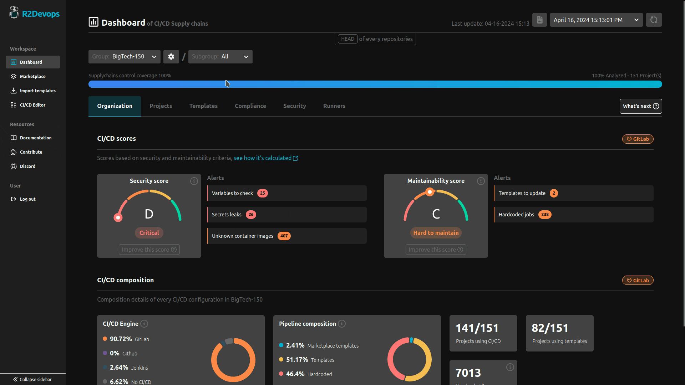

# ⚙️  Settings

## Overview

You can configure the dashboard with the dashboard settings, learn how and what you can configure.

### 📋 Requirements

#### 1. R2Devops Instance

An R2Devops self-managed instance is essential for utilizing the dashboard configuration. If you haven't set up an instance yet, make sure to do so before proceeding.

#### 2. User Rights Necessary

- When your organization is a group in a GitLab instance

If your organization is **a group within a GitLab instance**, the dashboard configuration requires at least **maintainer access** within this group.

- When your organization is the entire GitLab instance

If your organization is **the entire GitLab instance**, the dashboard configuration requires **administrative privileges** for the GitLab instance.

### ⚙️ Configure projects to analyze

Configure which projects within your organization to analyze. This guide provides a step-by-step walkthrough for using the R2Devops Dashboard to tailor the analysis settings to your specific projects.

:::info[How it Works]

Configure the projects you want to analyze directly from the R2Devops Dashboard. Once configured, the platform will automatically trigger a new analysis for the designated projects.

:::

### ⚙️ Configure your trusted registries

Configure your trusted container registries to ensure the security of your entire supply chain.

:::info[How it Works]

Configure the container registries you want to declare as trusted on the R2Devops Dashboard. Once configured, you need to refresh the analysis.

:::

Once a new analysis have been loaded, you can go to the `Security > Containers` tab to quickly identify and secure your supply chain by filtering out untrusted container registries in your projects.

