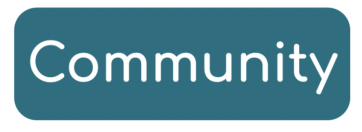
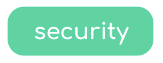

# FAQ

Here you'll find the answer to your questions! If the question you are looking for isn't on the FAQ, you can contact our support or open a ticket to add it 👇🏻

- [Join us on Discord](https://discord.r2devops.io?utm_medium=website&utm_source=r2devopsdocumentation&utm_campaign=homepage)
- [Open a ticket](https://tally.so/r/w5Edvw)

## R2Devops platform

### Organizations & private resources

:::info[How can I add a new organization in R2Devops?]
We get your organizations directly from GitLab, so all you have to do is create a new organization in GitLab!

To add a new organization in GitLab, follow [this tutorial](https://docs.gitlab.com/ee/topics/set_up_organization.html)!
:::

:::info[What is a private template?]
A private template is sourced from a private repository on GitLab scoped to your current organization, where are securely store all the organization CI/CD resources.
:::

:::info[Who can access my organization private template?]
Like on GitLab, only members of the repository where the template is sourced can access it!
:::

## Other

:::info[What will be the next features developed in R2Devops?]
You can take a look to the [roadmap](https://r2devops.io/roadmap) to see the next feature we will develop!
:::

:::info[Will R2Devops always be free?]
The library of open source templates (the SaaS Marketplace) will always be available without license, and will stay free!
:::

## R2Devops Hub

### Use a template

:::info[What are R2Devops' standards of quality and security for official templates?]

When templates have the label "Official", it means they respect standards of quality and safety defined by R2Devops' team.
Regarding the quality, we ensure:

- Fixed tag for docker image and any external tool used inside the template, so they don't break the templates if they change.
- Resources with license compatible with the template license, so anyone can use it.
- Artifacts and logs production, in order to facilitate the comprehension of the template's results.
- Simple customization of the templates, thanks to variables.
- The structure of the template is properly defined, in order to build a clear documentation.

Regarding the security, take a look at our CI pipeline:

:::

:::info[What is a plug and play template?]
We described as Plug and Play the templates that don't need configuration in order to work in your pipeline.

It means you can add the include link of the template in your pipeline and directly run it. And it will work ✨
:::

:::info[How do I include a template in my pipeline?]
In order to include a template in your pipeline, you need to add the template include project, ref and file in your `.gitlab-ci.yml` file.

But first, you need to precise the stage in which your template is supposed to work!
:::

:::info[Why should I use an official template?]
Official templates are checked by R2Devops' team and respect certain standard regarding security and quality. Plus, you can be sure those templates won't be deleted from the hub, and that your pipeline won't broke due to a missing content.
:::

:::info[How can I import a template to the hub ?]
They are 2 ways to import a template into R2Devops. You can:

🔥 [Create your own marketplace](../marketplace/manage-templates.mdx#-create-a-marketplace)

❤️ [Contribute on the official repository](../open-source-marketplace/contribute.md)
:::

:::info[Why my contribution wasn't validated yet?]
Adding your template into the official R2Devops repository will require more time than linking your template.

Why?

Because our team personally review your template and ensure it fits our safety and quality requirements!
Once the first review is done, they'll let you know your work was perfect, and your template is added or if some adjustments are required.
:::

## Labels

:::info[What are the blue labels?]
Blue labels give information about the origin of the templates.

In R2Devops, blue labels look like this:

A template can be added in the hub by someone working for **R2Devops** or by someone from **the community**. If you [import a template](../marketplace/manage-templates.mdx), your template will automatically get the label *community*. If you [contribute following R2Devops guidelines](../open-source-marketplace/contribute.md), your template will get the label *Official*!
:::

:::info[What means the label *Official*?]

If a template carries the "Official" label, it indicates that it meets [certain standards for quality and security](#use-a-template).
:::

:::info[What means the label *Community*?]

The label Community means that the template was added by someone from the community. We don't know which quality standards this template follow, so we can't ensure it's safety.
:::

:::info[What are the green labels?]
Green labels give technical information about a template.

In R2Devops, green labels look like this:

:::

:::info[I can't find the label I want to use]
If you can't find the label you want to use, you can [open a ticket](https://tally.so/r/w5Edvw) and ask our team to create a new label!
:::