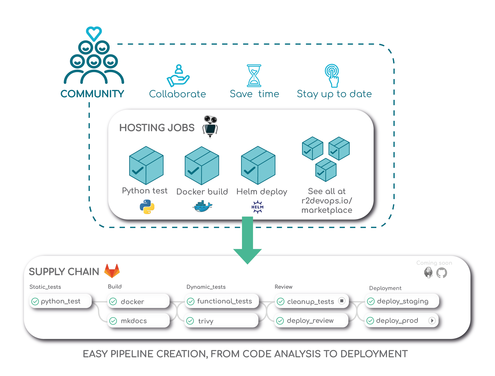

# Concept

The **R2Devops Marketplace** is a collaborative marketplace of CI & CD
**ready to use** templates which helps you to easily build powerful Pipelines for
your projects.

:::info
Currently, the marketplace is focused to provide only **Gitlab 🦊** templates. We plan
to support more CI/CD platforms in the future.
:::

Each templates of the marketplace can be used independently to create fully **customized pipelines.**
You can use them for any kind of software and deployment type. Each templates can be
customized through configuration.

Some templates are **plug and play**, it means that you can used them without
configuration: you just have to include them and they'll work!
