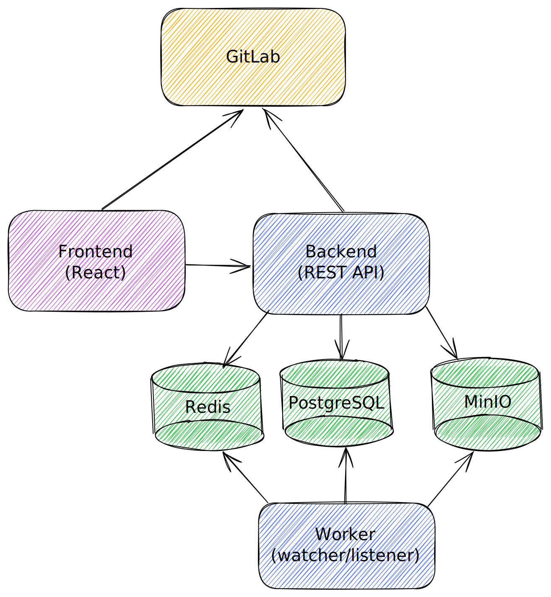

# Infrastructure

The R2Devops Infrastructure is composed of the following components:

- **R2Devops frontend**: the R2Devops interface
- **R2Devops backend**: the R2Devops backend and API
- **R2Devops worker**: used to run the tasks of asynchronous requests
- **[PostgreSQL](https://github.com/postgres/postgres)**: used to store R2Devops backend data
- **[Redis](https://github.com/redis/redis)**: used to cache R2Devops data and create tasks lists for workers
