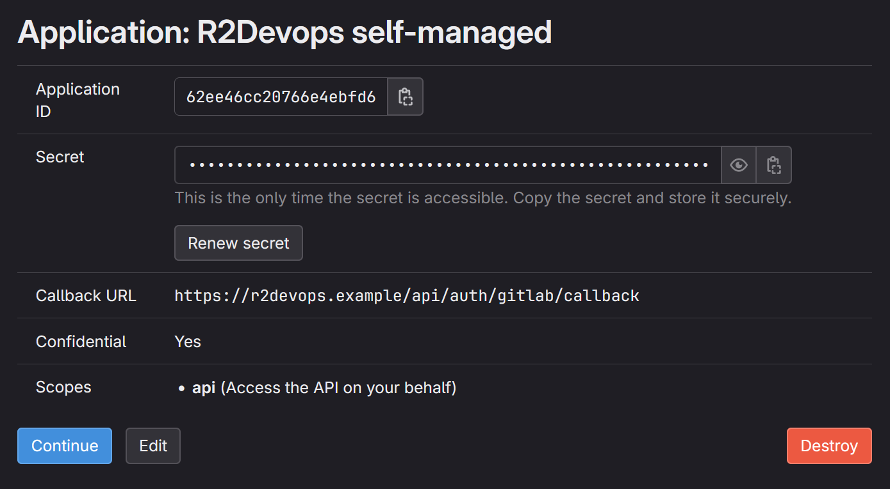

# Kubernetes

This page describes how to run a self-managed instance of R2Devops on
**Kubernetes**.

## 💻 Requirements

- A Kubernetes cluster with:
  - One ingress controller(ex: [Nginx](https://artifacthub.io/packages/helm/ingress-nginx/ingress-nginx) or [Traefik](https://artifacthub.io/packages/helm/traefik/traefik))
  - A certificate manager with a ACME provider: [cert-manager](https://artifacthub.io/packages/helm/cert-manager/cert-manager)
  - _Only if you run external services (PostgreSQL and Redis) in Kubernetes_: the ability to provision persistent volumes in your cluster
- Your local environment with CLI to interact with Kubernetes API:
  - [Helm](https://github.com/helm/helm)
  - [Kubectl](https://github.com/kubernetes/kubectl)
- Write access to the DNS zone of the domain to use with R2Devops
- A user account on the GitLab instance

## 🛠️ Installation

The Helm chart used in this documentation allows installing all these services
embedded in the chart as dependencies or to use external `S3`, `PostgreSQL`
and/or `Redis`. Both alternatives are detailed below.

### 📥 Initialize your cluster

1. Choose a namespace name and set it in a variable
   ```sh
   export R2DEVOPS_NS="r2devops"
   ```
1. Create the namespace
   ```sh
   kubectl create ns $R2DEVOPS_NS
   ```
1. Add R2Devops repo
   ```sh
   helm repo add r2devops https://charts.r2devops.io/
   ```

### 📄 Domain name

:::info
You need a domain to run R2Devops. For example, if you have the domain name
`mydomain.com`:

    - R2Devops URL will be `https://r2devops.mydomain.com`
:::

1. Create DNS record

   - Name: `r2devops.<domain_name>`
   - Type: `A`
   - Content: `<your-cluster-public-ip>`

### 🦊 GitLab OIDC

R2Devops uses GitLab as an OAuth2 provider to authenticate users. Let's see how
to connect it to your GitLab instance.

1. Choose a group on your GitLab instance to create an application. It can be
   any group. Open the chosen group in GitLab interface and navigate through
   `Settings > Applications`:

   

1. Then, create an application with the following information

   - Name: `R2Devops self-managed`
   - Redirect URI :
     `https://r2devops.<domain_name>/api/auth/gitlab/callback`
   - Confidential: `true` (let the box checked)
   - Scopes: `api`

1. Click on `Save Application` and you should see the following screen:

   

1. Store `Application ID` and `Secret` somewhere safe, we will need to use them
   in next step

### ⚙️ Configure `values`

This section describes how to configure your custom values file. The default
`values.yaml` is available
[here](https://github.com/r2devops/self-managed/blob/main/charts/r2devops/values.yaml).
Two examples are available at the end of this documentation:

1. [Using only services embedded in the chart](#-no-external-services)
2. [Using only external services](#-external-services)

:::note
For the following sections, we assume that your custom value file will be
located in your current directory and be named `custom_values.yaml`
:::

#### 🔐 Secrets

**This section is optional**. You need to follow this section only if you want
to store secrets values as kubernetes secrets instead of writing them in your
custom value file.

1. R2Devops secret

   Replace all occurrences of `REDACTED` by your R2Devops secrets encoded in
   base64 and create following secret:

   - `license-key`: your R2Devops license
   - `secret-key`: 256 bit secret key used to encrypt sensitive data (`openssl rand -hex 32`)
   - `gitlab-oauth2-client-id`: Application ID of the GitLab application
   - `gitlab-oauth2-client-secret`: Secret of the GitLab application

   ```yaml
   apiVersion: v1
   kind: Secret
   metadata:
     name: r2devops-secret
     namespace: r2devops
   type: Opaque
   data:
     license-key: REDACTED
     secret-key: REDACTED
     gitlab-oauth2-client-id: REDACTED
     gitlab-oauth2-client-secret: REDACTED
   ```

1. PostgreSQL secret

   Replace `REDACTED` by your postgres password encoded in base64. If you want
   to use postgres embedded in this chart, choose the value.

   ```yaml
   apiVersion: v1
   kind: Secret
   metadata:
     name: postgresql-secret
     namespace: r2devops
   type: Opaque
   data:
     password: REDACTED
   ```

1. Redis secret

   Replace `REDACTED` by your redis password encoded in base64. If you want to
   use redis embedded in this chart, choose the value.

   ```yaml
   apiVersion: v1
   kind: Secret
   metadata:
     name: redis-secret
     namespace: r2devops
   type: Opaque
   data:
     password: REDACTED
   ```

#### 🤖 R2Devops

Add R2Devops related configuration in your new values file `custom_values.yaml`:

1. Add license key (provided by R2Devops) and R2Devops domain

   :::info[License key]
   If you do not have a license key, you can let the variable
   `LICENSE` empty (`value: ""`). Your R2Devops instance will be
   limited to 5 projects.
   :::

   ```yaml
   front:
     host: 'r2devops.mydomain.com'

   jobs:
     host: 'r2devops.mydomain.com'

     # Not using secret for license (comment if you use secret)
     extraEnv:
       - name: LICENSE
         value: '<license-key>'
       - name: SECRET_KEY
         value: '<secret-key>'
       - name: GITLAB_OAUTH2_CLIENT_ID
         value: '<gitlab-oauth2-client-id>'
       - name: GITLAB_OAUTH2_CLIENT_SECRET
         value: '<gitlab-oauth2-client-secret>'

     # Using existing secret for license (uncomment if you use secret)
     #extraEnv:
     #  - name: LICENSE
     #    valueFrom:
     #      secretKeyRef:
     #        name: "r2devops-secret"
     #        key: "license-key"
     #  - name: SECRET_KEY
     #    valueFrom:
     #      secretKeyRef:
     #        name: "r2devops-secret"
     #        key: "secret-key"
     #  - name: GITLAB_OAUTH2_CLIENT_ID
     #    valueFrom:
     #      secretKeyRef:
     #        name: "r2devops-secret"
     #        key: "gitlab-oauth2-client-id"
     #  - name: GITLAB_OAUTH2_CLIENT_SECRET
     #    valueFrom:
     #      secretKeyRef:
     #        name: "r2devops-secret"
     #        key: "gitlab-oauth2-client-secret"

   worker:
     replicaCount: 10 # Default is 5. Increase it depending of your needs
   ```
1. Add your GitLab instance domain and organization

   :::info[Organization]
   If you use a SaaS version of GitLab (like `gitlab.com`): add the name
   of your organization top-level group in `organization`. Else, let it
   empty
   :::
   ```yaml
   gitlab:
     domain: 'https://gitlab.mydomain.com'
     organization: ''
   ```

1. Add your Ingress configuration
   ```yaml
   ingress:
     enabled: true
     className: '' # Add class name for your ingress controller
     annotations: {} # Add annotation required by your ingress controller or certificate manager
   ```

#### 📘 PostgreSQL

You can choose between 2 options: use postgresql embedded in this chart or
use an external postgresql.

Add following configuration (**1 OR 2**) in your `custom_values.yaml` file:

1. Use postgresql embedded in this chart

   ```yaml
   postgresql:
     dependency:
       enabled: true
     global:
       postgresql:
         # Not using secret for auth (comment if you use secret)
         auth:
           password: REPLACE_ME_BY_NEW_POSTGRESQL_PASSWORD
           postgresPassword: REPLACE_ME_BY_NEW_POSTGRESQL_PASSWORD

         # Using existing secret for auth (uncomment if you use secret)
         #auth:
         #  username: r2devops
         #  existingSecret: "postgresql-secret"
         #  secretKeys:
         #    adminPasswordKey: "password"
         #    userPasswordKey: "password"
   ```

2. Use an external postgresql (database must be created)

   ```yaml
   postgresql:
     dependency:
       enabled: false
     custom:
       host: REPLACE_ME_BY_POSTGRES_HOST
       dbName: REPLACE_ME_BY_POSTGRES_DB_NAME
       sslmode: 'require'
       port: 5432
     global:
       postgresql:
         # Not using secret for auth (comment if you use secret)
         auth:
           username: REPLACE_ME_BY_POSTGRES_USERNAME
           postgresPassword: REPLACE_ME_BY_POSTGRES_PASSWORD

         # Using existing secret for auth password (uncomment if you use secret)
         #auth:
         #  username: r2devops
         #  existingSecret: "postgresql-secret"
         #  secretKeys:
         #    adminPasswordKey: "password"
         #    userPasswordKey: "password"
   ```

#### 📕 Redis

You can choose between 2 options: use redis embedded in this chart or
use an external redis.

Add following configuration (**1 OR 2**) in your `custom_values.yaml` file:

1. Use redis embedded in this chart

   ```yaml
   redis:
     dependency:
       enabled: true

     # Not using secret for auth (comment if you use secret)
     auth:
       password: REPLACE_ME_BY_NEW_REDIS_PASSWORD

     # Using existing secret for auth (uncomment if you use secret)
     #auth:
     #  existingSecret: "redis-secret"
     #  existingSecretPasswordKey: "password"
   ```

2. Use an external redis (database must be created)

   ```yaml
   redis:
     dependency:
       enabled: false
     custom:
       port: 6379
       host: REPLACE_ME_BY_REDIS_HOST
       user: REPLACE_ME_BY_REDIS_USENAME
       cert: |
         REPLACE_ME_BY_REDIS_TLS_CERTIFICATE

     # Not using secret for auth (comment if you use secret)
     auth:
       password: REPLACE_ME_BY_REDIS_PASSWORD

     # Using existing secret for auth (uncomment if you use secret)
     #auth:
     #  existingSecret: "redis-secret"
     #  existingSecretPasswordKey: "password"
   ```

### 🚀 Install the chart

Run the following command:

```sh
helm upgrade -n $R2DEVOPS_NS --install r2devops r2devops/r2devops -f custom_values.yaml
```

:::success[Congratulations]
You have successfully installed R2Devops on your Kubernetes cluster 🎉
:::

:::note[What's next]
Now that you have finished this tutorial, here are some simple tasks you should give a try :

    - 📈 Learn how to use the platform by reading the [documentation](https://docs.r2devops.io)
    - 📕 Import your first template, here is the [tutorial](../../marketplace/manage-templates.mdx#-create-a-marketplace)
:::

:::danger[Not the same behavior]
Did you encounter a problem during the installation process ? See the
[troubleshooting](../troubleshooting.md) section.
:::

### 📚 Configuration example

:::info
The following examples run in a Kubernetes cluster using `nginx` as
`ingressController`, `cert-manager` and a `clusterIssuer` named
`letsencrypt-production`
:::

#### 📦 No external services

This is an example of custom `values.yaml` file using all services from chart
dependencies.

:::note[Example]

```yaml
front:
host: "r2devops.mydomain.com"

    jobs:
      host: "r2devops.mydomain.com"
      extraEnv:
        - name: LICENSE
          value: "REDACTED"
        - name: SECRET_KEY
          value: "REDACTED"
        - name: GITLAB_OAUTH2_CLIENT_ID
          value: "REDACTED"
        - name: GITLAB_OAUTH2_CLIENT_SECRET
          value: "REDACTED"

    gitlab:
      domain: "https://gitlab.mydomain.com"

    worker:
      replicaCount: 15

    ingress:
      enabled: true
      className: "nginx"
      annotations:
        cert-manager.io/cluster-issuer: "letsencrypt-production"

    # ref. https://github.com/bitnami/charts/blob/main/bitnami/postgresql/values.yaml
    postgresql:
      dependency:
        enabled: true
      global:
        postgresql:
          auth:
            password: REDACTED
            postgresPassword: REDACTED

    # ref. https://github.com/bitnami/charts/blob/main/bitnami/redis/values.yaml
    redis:
      dependency:
        enabled: true
      auth:
        password: REDACTED
```
:::

#### 📥 External services

This is an example of custom `values.yaml` file using external services for
PostgreSQL and Redis.

:::note[Example]
```yaml
front:
host: "r2devops.mydomain.com"

    jobs:
      host: "r2devops.mydomain.com"
      extraEnv:
        - name: LICENSE
          value: "REDACTED"
        - name: SECRET_KEY
          value: "REDACTED"
        - name: GITLAB_OAUTH2_CLIENT_ID
          value: "REDACTED"
        - name: GITLAB_OAUTH2_CLIENT_SECRET
          value: "REDACTED"

    gitlab:
      domain: "https://gitlab.mydomain.com"

    worker:
      replicaCount: 20

    ingress:
      enabled: true
      className: "nginx"
      annotations:
        cert-manager.io/cluster-issuer: "letsencrypt-production"

    # ref. https://github.com/bitnami/charts/blob/main/bitnami/postgresql/values.yaml
    postgresql:
      dependency:
        enabled: false
      global:
        postgresql:
          auth:
            username: REDACTED
            postgresPassword: REDACTED
      custom:
        host: "database-1.REDACTED.us-east-1.rds.amazonaws.com"
        port: 5432
        dbName: "r2devops"
        sslmode: "require"

    # ref. https://github.com/bitnami/charts/blob/main/bitnami/redis/values.yaml
    redis:
      dependency:
        enabled: false
      auth:
        password: REDACTED
      custom:
        port: 6379
        host: "REDACTED"
        user: "REDACTED"
        cert: |
          -----BEGIN CERTIFICATE-----
          REDACTED
          -----END CERTIFICATE-----
```
:::

## ⏫ Update

1. Update R2Devops Helm repository
    ```sh
    helm repo update
    ```
1. Run the helm upgrade
    ```sh
    helm upgrade -n $R2DEVOPS_NS --install r2devops r2devops/r2devops -f custom_values.yaml
    ```
1. You have successfully updated R2Devops 🎉
