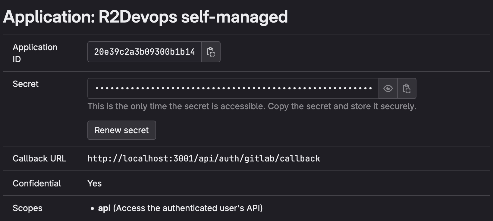

# Local Docker compose

:::warning[Only for testing purposes on your local computer]
This page describes how to quickly setup a self-managed instance of
R2Devops for **testing purposes** using Docker-compose on **your local
computer**. This is not suitable for production

    See production ready methods on [Home page](../index.md)
:::

:::success[Data Confidentiality]
During the analysis, **no data leaves your environment**, ensuring the
confidentiality and security of your information.
:::

## 💻 Requirements

- **GitLab instance version >=17.7**
- [Git](https://git-scm.com/book/en/v2/Getting-Started-Installing-Git)
- [Docker](https://docs.docker.com/engine/install/)

## 🦊 GitLab Application

1. On your GitLab instance, open the `Applications` page: `Your picture >
Preferences > Applications` (example:
   [gitlab.com](https://gitlab.com/-/profile/applications))
1. Create an application with the following information :
   - Name: `R2Devops self-managed`
   - Redirect URI : `http://localhost:3001/api/auth/gitlab/callback`
   - Confidential: `true` (let the box checked)
   - Scopes: `api`
1. Click on `Save Application` and you should see the following screen:
   
1. Keep this GitLab tab open, the `Application ID` and `Secret` will be used in
   the configuration step

## 📥 Setup your environment

1. Clone the repository locally
   ```sh
   git clone https://github.com/r2devops/self-managed.git r2devops
   cd r2devops
   ```
1. Create your configuration file
   ```sh
   cp .env.local.example .env
   ```

## 📚 Update the configuration

1. Edit the `.env` file:

   - Copy/paste the `Application ID` and the `Secret` from
     the GitLab application you just created

      ```bash title=".env"
      GITLAB_OAUTH2_CLIENT_ID="<application-id>"
      GITLAB_OAUTH2_CLIENT_SECRET="<application-secret>"
      ```

   - Replace `<your-gitlab-url>` by domain of your GitLab server

      ```bash title=".env"
      JOBS_GITLAB_URL="https://<your-gitlab-url>"
      ```

   - **If you want to connect R2Devops to a specific GitLab group only**: add the path of the group in `ORGANIZATION` variable (to run the onboarding, you must be at least **Maintainer in this group**)
      ```bash title=".env"
      ORGANIZATION="<group-path>"
      ```

   - **If you want to connect R2Devops to the whole GitLab instance**: let the `ORGANIZATION` variable empty (to run the onboarding, you must be a **GitLab instance Admin**)
      ```bash title=".env"
      ORGANIZATION=""
      ```

1. Run the following commands to generate random secrets for all components:

   ```bash
   sed -i."" "s/REPLACE_ME_BY_SECRET_KEY/$(openssl rand -hex 32)/g" .env
   sed -i."" "s/REPLACE_ME_BY_JOBS_DB_PASSWORD/$(openssl rand -hex 16)/g" .env
   sed -i."" "s/REPLACE_ME_BY_JOBS_REDIS_PASSWORD/$(openssl rand -hex 16)/g" .env
   ```

## 🚀 Launch R2Devops!

1. Start R2Devops
   ```bash
   docker compose -f compose.local.yml up -d
   ```
1. Open your R2Devops test instance 👉 [click here 🎉](http://localhost:3000)

## ⏫ Update R2Devops

Follow these steps to update your self-managed instance to a new version:

1. Navigate to the location of your
   [`self-managed`](https://github.com/r2devops/self-managed/) git repository
1. Update it
   ```sh
   git pull
   ```
1. Open the `.env.local.example` file and copy the values of
   `FRONTEND_IMAGE_TAG` and `BACKEND_IMAGE_TAG` variables
1. Edit the `.env` file by updating values of `FRONTEND_IMAGE_TAG` and
   `BACKEND_IMAGE_TAG` variables with the values previously copied
   ```sh title=".env" hl_lines="1-2"
   FRONTEND_IMAGE_TAG="<new frontend version>"
   BACKEND_IMAGE_TAG="<new backend version>"
   ```
1. Restart your containers
   ```sh
   docker compose -f compose.local.yml up -d
   ```
1. You have successfully updated R2Devops on your server 🎉
