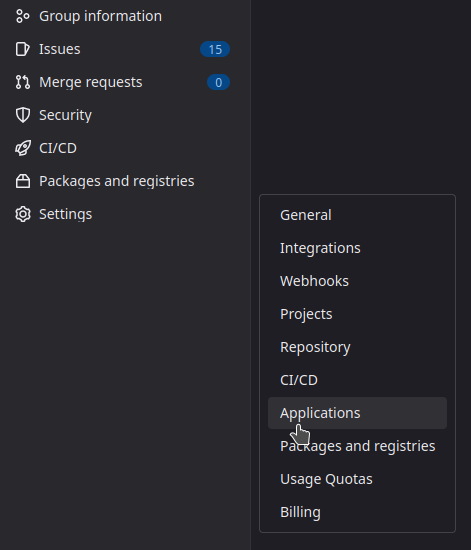

# Podman

:::info
This method is supported by [R2DevOps community](https://discord.r2devops.io/).
:::

This page describes how to set up a self-managed instance of R2Devops using
**podman**.

## 💻 Requirements

- **GitLab instance version >=17.7**
- The system requires a Linux server. It runs in 🕸 podman containers using a
   yaml configuration. Specifications:
  - OS: Ubuntu or Debian
  - Hardware
    - CPU x86_64/amd64 with at least 2 cores
    - 4 GB RAM
    - 250 GB of storage for R2Devops
  - Network
   - Users must be able to reach the R2Devops server on TCP ports 80 and 443
   - The R2Devops server must be able to access internet
   - The R2Devops server must be able to communicate with GitLab instance
   - The installation process requires write access to the DNS Zone
      to set up R2Devops domain
   - If the server is not reachable from internet or if you want to use your
      own certificate for HTTPS, you need to be able to generate certificate
      during the installation process for R2Devops domain
   - Installed software
      - [Git](https://git-scm.com/book/en/v2/Getting-Started-Installing-Git)
      - [podman](https://https://podman.io/docs/installation)- Docker hub registry
         must be resolved by podman in file **/etc/containers/registries.conf**
```bash title="/etc/containers/registries.conf" hl_lines="1"
unqualified-search-registries = ["docker.io"]
```

## 🛠️ Installation

### 📥 Setup your environment

1. Clone the repository on your server
   ```sh
   git clone https://github.com/r2devops/self-managed.git r2devops
   cd r2devops
   ```
1. Create your configuration file
   ```sh
   cp .env.example .env
   ```

### 📋 Organization

**In your `.env` file:**

- **If you want to connect R2Devops to a specific GitLab group only**: add the path of the group in `ORGANIZATION` variable (to run the onboarding, you must be at least **Maintainer in this group**)
   ```bash title=".env" hl_lines="1"
   ORGANIZATION="<group-path>"
   ```

- **If you want to connect R2Devops to the whole GitLab instance**: let the `ORGANIZATION` variable empty (to run the onboarding, you must be a **GitLab instance Admin**)
   ```bash title=".env" hl_lines="1"
   ORGANIZATION=""
   ```

### 📄 Domain name

1. Edit the `.env` file by updating value of `DOMAIN_NAME` and `JOBS_GITLAB_URL` variables

   ```bash title=".env" hl_lines="1-3"
   DOMAIN_NAME="<r2devops_domain_name>"
   JOBS_GITLAB_URL="https://<url_of_your_gitlab_instance>"
   ```

   ```bash title="Example with domain name 'r2devops.mydomain.com' for R2Devops and 'gitlab.mydomain.com' for GitLab" hl_lines="1-3"
   DOMAIN_NAME="r2devops.mydomain.com"
   JOBS_GITLAB_URL="https://gitlab.mydomain.com"
   ```

1. Create DNS record

   - Name: `<r2devops_domain_name>`
   - Type: `A`
   - Content: `<your-server-public-ip>`

:::info[Certificate]
A certificate will be auto-generated using Let's encrypt at the application
launch
:::
### 🦊 GitLab OIDC

R2Devops uses GitLab as an OAuth2 provider to authenticate users. Let's see how
to connect it to your GitLab instance.

#### Create an application

Choose a group on your GitLab instance to create an application. It can be any
group. Open the chosen group in GitLab interface and navigate through
`Settings > Applications`:



Then, create an application with the following information :

- Name: `R2Devops self-managed`
- Redirect URI : `https://<r2devops_domain_name>/api/auth/gitlab/callback`
- Confidential: `true` (let the box checked)
- Scopes: `api`

Click on `Save Application` and you should see the following screen:


#### Update the configuration

In `.env` file:

1. Copy/paste the `Application ID` and the `Secret` from the application you
   just created
   ```bash title=".env" hl_lines="1-2"
   GITLAB_OAUTH2_CLIENT_ID="<application-id>"
   GITLAB_OAUTH2_CLIENT_SECRET="<application-secret>"
   ```

### 🔐 Generate secrets

Generate random secrets for all components:

```bash
sed -i "s/REPLACE_ME_BY_SECRET_KEY/$(openssl rand -hex 32)/g" .env
sed -i "s/REPLACE_ME_BY_JOBS_DB_PASSWORD/$(openssl rand -hex 16)/g" .env
sed -i "s/REPLACE_ME_BY_JOBS_REDIS_PASSWORD/$(openssl rand -hex 16)/g" .env
```

### 📋 (Optional) Add your custom CA

If your GitLab instance is using a TLS certificate signed with your own
Certificate authority (CA):

# TEST-AND-EDIT
- Add the CA certificate file in `podman ?`

### 📄 Prepare podman for launch

Generate podman network:

```bash
podman network create intranet
```

Generate podman socket

```bash
systemctl --user start podman.socket
systemctl --user enable podman.socket
```

If you encounter this error **Failed to connect to bus: No medium found**
 use these commands with your user as sudoer:

```bash
sudo loginctl enable-linger <your_local_user>
sudo systemctl --user -M <your_local_user>@ start podman.socket
sudo systemctl --user -M <your_local_user>@ enable podman.socket
```

Generate podman config files:

```bash
set -a; source .env; set +a
export uid=$(id -u)
envsubst < podman.yml.example > podman.yml
envsubst < configmap.yml.example > configmap.yml
```

Allow port 80 and above in system for local user:
1. Add this line to **/etc/sysctl.conf** file as sudo user or root:
   ```title="/etc/sysctl.conf" hl_lines="1-2"
   net.ipv4.ip_unprivileged_port_start=80
   ```
1. Restart sysctl
   ```sh
   sudo systemctl restart systemd-sysctl
   ```

### 🚀 Launch the application

:::success[Congratulations]
You have successfully installed R2Devops on your server 🎉

    Now you can launch the application and ensure everything works as expected.

Run the following command to start the system:

```bash
podman play kube podman.yml --configmap configmap.yml --network intranet
```
:::

:::info[Reconfigure]
If you need to reconfigure some files and relaunch the application,
after your updates you can simply run the command again to do so.
```bash
podman play kube podman.yml --replace --configmap configmap.yml --network intranet
```
:::

:::danger[Not the same behavior]
Did you encounter a problem during the installation process ? See the
[troubleshooting](../troubleshooting.md) section.
:::

## ⏫ Update

Follow these steps to update your self-managed instance to a new version:

1. Navigate to the location of your
   [`self-managed`](https://github.com/r2devops/self-managed/) git repository
1. Update it
   ```sh
   git pull
   ```
1. Open the `.env.example` file and copy the values of  `FRONTEND_IMAGE_TAG`
   and `BACKEND_IMAGE_TAG` variables
1. Edit the `.env` file by updating values of `FRONTEND_IMAGE_TAG` and
   `BACKEND_IMAGE_TAG` variables with the values previously copied
   ```sh title=".env" hl_lines="1-2"
   FRONTEND_IMAGE_TAG="<new frontend version>"
   BACKEND_IMAGE_TAG="<new backend version>"
   ```
1. Restart your containers
   ```sh
   set -a; source .env; set +a
   export uid=$(id -u)
   envsubst < podman.local.yml.example > podman.yml
   envsubst < configmap.local.yml.example > configmap.yml
   ```
1. You have successfully updated R2Devops on your server 🎉

## 🔄 Backup and restore

Data required to fully backup and restore a R2Devops system are the following:

- Configuration file: `.env`
- Databases:
  - PostgreSQL database of Jobs service
- Files data:
  - File storing data about certificate for Traefik service

All these data can be easily backup and restored using 2 scripts from the
installation git repository:

- `scripts/backup_podman.sh`
- `scripts/restore_podman.sh`

### 💽 Backup

To backup the system, go to your installation git repository and run the
following command:

```bash
./scripts/backup_podman.sh 13
```

The script will create a `backups` directory and create a backup archive inside
it prefixed with the date (`backup_r2-$DATE`)

:::note[Regular backup]
You can use a cron job to perform regular backups.
Here is a cron job that launch a backup every day at 2am:
```bash
0 2 * * * /r2devops/scripts/backup_podman.sh 13
```
It can be added to your crontab with the command `crontab -e`. Check more
information about cron jobs
[here](https://help.ubuntu.com/community/CronHowto).
:::

### 🛳️ Restore

To restore a backup from scratch on a new system, follow this process:

1. Be sure that your new system is compliant with
   [requirements](#-requirements)
1. Copy the backup file on your new server
1. Clone the installation repository
   ```bash
   git clone https://gitlab.com/r2devops/self-managed.git r2devops
   cd r2devops
   ```
1. If the IP address of your server changed from your previous installation,
   update your DNS records. See [section
   2](#-domain-name) of domain configuration
1. Launch the restore script
   ```bash
   ./scripts/restore_podman.sh 13 <path_to_your_backup_file>
   ```

:::danger[Any errors during the restore process ?]
Did you encounter a problem during the restore process ? See the
[troubleshooting](../troubleshooting.md) section.
:::
