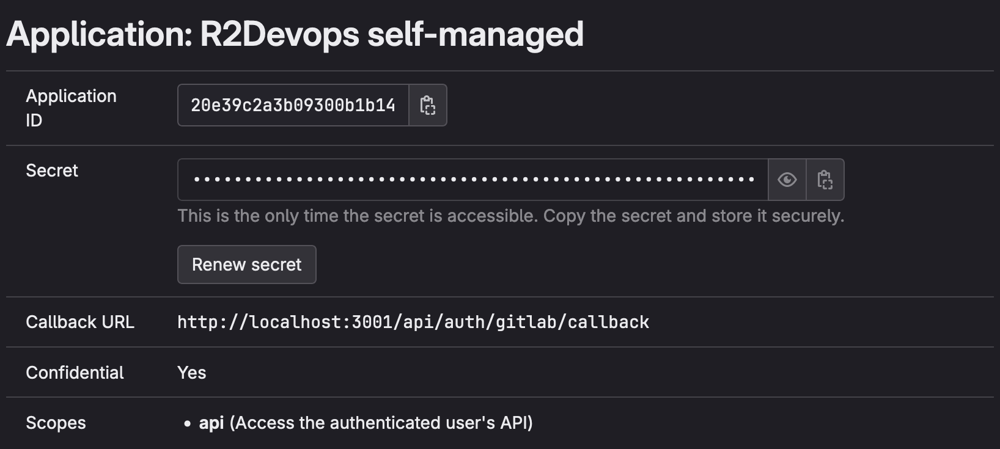

# Local Docker compose

!!! warning "Only for testing purposes on your local computer"
This page describes how to quickly setup a self-managed instance of
R2Devops for **testing purposes** using Docker-compose on **your local
computer**. This is not suitable for production

    See production ready methods on [Home page](..)

!!! success "Data Confidentiality"
During the analysis, **no data leaves your environment**, ensuring the
confidentiality and security of your information.

## 💻 Requirements

- [Git](https://git-scm.com/book/en/v2/Getting-Started-Installing-Git)
- [Docker](https://docs.docker.com/engine/install/)

## 🦊 GitLab Application

1. On your GitLab instance, open the `Applications` page: `Your picture >
Preferences > Applications` (example:
   [gitlab.com](https://gitlab.com/-/profile/applications))
1. Create an application with the following information :
   - Name: `R2Devops self-managed`
   - Redirect URI : `http://localhost:3001/api/auth/gitlab/callback`
   - Confidential: `true` (let the box checked)
   - Scopes: `api`
1. Click on `Save Application` and you should see the following screen:
   
1. Keep this GitLab tab open, the `Application ID` and `Secret` will be used in
   the configuration step

## 📥 Setup your environment

1. Clone the repository locally
   ```sh
   git clone https://github.com/r2devops/self-managed.git r2devops
   cd r2devops
   ```
1. Create your configuration files
   ```sh
   cp .env.local.example .env
   cp .docker/r2devops/config.local.json.example .docker/r2devops/config.json
   ```

## 📚 Update the configuration

1. Edit the `.env` file: copy/paste the `Application ID` and the `Secret` from
   the application you just created

   ```bash title=".env" hl_lines="1-2"
   GITLAB_OAUTH2_CLIENT_ID="<application-id>"
   GITLAB_OAUTH2_CLIENT_SECRET="<application-secret>"
   ```

1. **Only if you use a SaaS version of GitLab (like `gitlab.com`):** edit the
   `.env` file to add the name of your top-level group in `ORGANIZATION`
   variable (else, let it empty):

   ```bash title=".env" hl_lines="1"
   ORGANIZATION="<top-level-group-name>"
   ```

1. Replace `<your-gitlab-url>` by domain of your GitLab server in the
   following command and run it:
   ```bash
   export GITLAB_INSTANCE_URL="https://<your-gitlab-url>"
   ```
1. Run the following commands to update configuration:
   ```bash
   sed -i."" "s|GITLAB_INSTANCE_URL|${GITLAB_INSTANCE_URL}|g" .env
   sed -i."" "s|GITLAB_INSTANCE_URL|${GITLAB_INSTANCE_URL}|g" .docker/r2devops/config.json
   ```
1. Run the following commands to generate random secrets for all components:
   ```bash
   sed -i."" "s/REPLACE_ME_BY_SECRET_KEY/$(openssl rand -hex 32)/g" .env
   sed -i."" "s/REPLACE_ME_BY_JOBS_DB_PASSWORD/$(openssl rand -hex 16)/g" .env
   sed -i."" "s/REPLACE_ME_BY_JOBS_REDIS_PASSWORD/$(openssl rand -hex 16)/g" .env
   sed -i."" "s/REPLACE_ME_BY_S3_SECRET_KEY/$(openssl rand -hex 16)/g" .env
   ```

## 🔐 (Optional) Add your license

!!! info "License key"
If you do not have a license key, you can let the variable `LICENSE` empty
(`value: ""`). Your R2Devops instance will be limited to 5 projects.

Add your license key (provided by R2Devops): edit the `.env` file by updating
value of `LICENSE` variable:

```bash title=".env" hl_lines="1"
LICENSE="<license-key>"
```

## 🚀 Launch R2Devops !

1. Start R2Devops
   ```bash
   docker compose -f compose.local.yml up -d
   ```
1. Open your R2Devops test instance 👉 [click here 🎉](http://localhost:3000)
