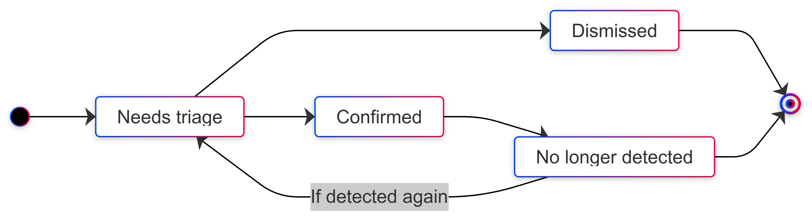

# Issue Status

An issue status can be:
- **Needs triage:** The default state for a newly discovered issue. 
- **Confirmed:** A user has seen this issue and confirmed it to be accurate. 
- **Dismissed:** A user has evaluated this issue and dismissed it. Dismissed issue are ignored if detected in subsequent analyses. 
- **No longer detected:** The issue has been fixed or is no longer detected. If an issue no longer detected is reintroduced and detected again, its status is set back to **Needs triage**.

A issue typically goes through the following lifecycle: 

